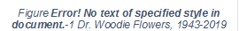

1 Introduction
##############

1.1 About FIRST®
****************

*FIRST* \ :sup:`®`\ (For Inspiration and Recognition of Science and Technology) was founded by inventor Dean Kamen to inspire young people’s interest in science and technology. Based in Manchester, New Hampshire, *FIRST* is a 501(c)(3) not-for-profit public charity.

*FIRST* provides four programs:

• *FIRST* \ :sup:`®`\Robotics Competition for grades 9-12, ages 14-18

• *FIRST* \ :sup:`®`\ Tech Challenge for grades 7-12, ages 12-18

• *FIRST* \ :sup:`®`\ LEGO\ :sup:`®`\ League for grades 4-8, ages 9-14 (ages 9-16 outside of North America)

• *FIRST* \ :sup:`®`\ LEGO\ :sup:`®`\ League Jr. for grades K-4, ages 6-10

Please visit our website: `www.firstinspires.org <http://www.firstinspires.org/>`_ for more information about *FIRST* programs.

1.1 In Memoriam
***************

In October 2019, Dr. Woodie Flowers, an innovator in design and engineering education and an incredible advisor to *FIRST* and supporter of our mission (see right), passed away. As thousands of heartfelt tributes to Woodie have poured in from around the world, it is clear his legacy will live on indefinitely through the gracious nature of our community and our ongoing commitment to empowering educators and building global citizens.

1.2 FIRST Robotics Competition
******************************

*FIRST* Robotics Competition pairs high school students with adult mentors (primarily engineers and teachers) to design and build robots that compete against one another in a high-energy environment.

This varsity Sport for the Mind™ combines the excitement of sport with the rigors of science and technology. Under strict rules, limited resources and time limits, teams of students are challenged to raise funds, design a team “brand,” hone teamwork skills, and build and program robots to perform prescribed tasks against a field of competitors. It’s as close to “real-world” engineering as a student can get.

Each January at an event known as “Kickoff,” a new, challenging game is introduced. These exciting competitions combine the practical application of science and technology with the fun, intense energy and excitement of a championship-style sporting event. Teams are encouraged to display *Gracious Professionalism* \ :sup:`®`\, help other teams, and cooperate while competing. This is known as *Coopertition* \ :sup:`®`\.

In 2020, *FIRST* Robotics Competition will reach 100,000 high-school students representing approximately 4,000 teams. Teams come from nearly every state in the United States, as well as many other countries.

*FIRST* Robotics Competition teams will participate in 66 Regional Competitions, 105 District Competitions, and 11 District Championships. In addition, approximately 800 teams will qualify to attend the *FIRST* Championship in one of two locations in April and May 2020.

This year’s game, and this manual, were presented at the 2020 *FIRST* Robotics Competition Kickoff on Saturday, January 4, 2020.

At the Kickoff, all teams:

• saw the 2020 game, INFINITE RECHARGE\ :sup:`SM`\, for the first time

• learned about the 2020 game rules and regulations

• received a Kickoff Kit that provides a starting point for robot build

1.3 Gracious Professionalism®, a FIRST® Credo
*********************************************

*Gracious Professionalism* \ :sup:`®`\ is part of the ethos of *FIRST* . It’s a way of doing things that encourages high quality work, emphasizes the value of others, and respects individuals and the community.

*Gracious Professionalism* is not clearly defined for a reason. It can and should mean different things to everyone.

Some possible meanings of *Gracious Professionalism* include:

• Gracious attitudes and behaviors are win-win

• Gracious folks respect others and let that respect show in their actions

• Professionals possess special knowledge and are trusted by society to use that knowledge responsibly

• Gracious Professionals make a valued contribution in a manner pleasing to others and to themselves

In the context of *FIRST* , this means that all teams and participants should:

• Learn to be strong competitors, but also treat one another with respect and kindness in the process

• Avoid leaving anyone feeling as if they are excluded or unappreciated

Knowledge, pride and empathy should be comfortably and genuinely blended.

In the end, *Gracious Professionalism* is part of pursuing a meaningful life. When professionals use knowledge in a gracious manner and individuals act with integrity and sensitivity, everyone wins and society benefits.

The FIRST spirit encourages doing high-quality, well-informed work in a manner that leaves everyone feeling valued. Gracious Professionalism seems to be a good descriptor for part of the ethos of FIRST. It is part of what makes FIRST different and wonderful.

- Dr. Woodie Flowers, (1943 – 2019)

Distinguished Advisor to FIRST

It is a good idea to spend time going over this concept with your team and reinforcing it regularly. We recommend providing your team with real-life examples of *Gracious Professionalism* in practice, such as when a team loans valuable materials or expertise to another team that they will later face as an opponent in competition. Routinely highlight opportunities to display *Gracious Professionalism* at events and encourage team members to suggest ways in which they can demonstrate this quality themselves and through outreach activities.

1.4 Coopertition®
*****************

At *FIRST* , *Coopertition* \ :sup:`®`\ is displaying unqualified kindness and respect in the face of fierce competition. *Coopertition* is founded on the concept and philosophy that teams can and should help and cooperate with one another even as they compete. *Coopertition* involves learning from teammates and mentors. *Coopertition* means competing always but assisting and enabling others when you can.

A Message **from** Woodie Flowers Award Recipients

The Woodie Flowers Award is the most prestigious mentoring award in FIRST. The award recipients as of the 2015 FIRST Championship created an important message for all FIRST Robotics Competition teams to consider as we tackle each season.

Performing at your best is important. Winning is important. This is a competition.

However, winning the right way and being proud of what you have accomplished and how you have accomplished it is more important. FIRST could create rules and penalties to cover almost any scenario or situation, but we prefer an understandable game with simpler rules that allow us to think and be creative in our designs.

We want to know that our partners and opponents are playing at their best in every match. We want to know they are playing with integrity and not using strategies based on questionable behaviors.

As you create your robots and award presentations, prepare for competition and match play, create and implement game strategies, and live your daily lives, remember what Woodie said time and time again, and let’s ‘Make your Grandmother proud.’

Woodie Flowers

Liz Calef (88)

Mike Bastoni (23)

Ken Patton (51, 65)

Kyle Hughes (27)

Bill Beatty (71)

Dave Verbrugge (5110, 67)

Andy Baker (3940, 45)

Dave Kelso (131)

Paul Copioli (3310, 217)

Rob Mainieri (812, 64, 498, 2735, 6833)

Dan Green (111)

Mark Breadner (188)

John Novak (16, 323)

Chris Fultz (234)

John Larock (365)

Earl Scime (2614)

Fredi Lajvardi (842)

Lane Matheson (932)

Mark Lawrence (1816)

Eric Stokely (258, 360, 2557, & 5295)

Glenn Lee (359)

Gail Drake (1885)

*Allen Gregory (3847)*

1.5 Spirit of Volunteering
**************************

A Message from the Chief Volunteers to the FIRST Community:

“Giving Back” and “Pay It Forward” - these words are what motivates those who mentor, coach, and volunteer their time for FIRST.

We know that volunteering - whether at events or with a team - has enormous, lifelong impacts for everyone involved. Each and every student, teacher, event volunteer, mentor, coach, and family member learns and grows through each season as they interact with each other.

As you attend events and interface with the volunteers there, remember that they are giving up their most precious asset - their time - to ensure that each and every team has a fulfilling, fun, and memorable competition. Volunteers are the lifeblood of FIRST and without them, FIRST would not be where it’s at today. We encourage you to remember that “Gracious Professionalism is part of the ethos of FIRST. It's a way of doing things that encourages high-quality work, emphasizes the value of others, and respects individuals and the community.” At your next event, give a volunteer a High Five or a Fist Bump and say “Thank You”.

Volunteering at events is a rewarding experience, and we encourage everyone to take a break from the daily grind and join us at one in your community.

What makes volunteering at events so much fun:

· Seeing capable students learning and growing

· Making new friends with other awesome volunteers

· Being a part of the magic that makes an event happen

· Sharing FIRST with folks who didn’t know about it

· Taking event experiences back to your team

Please join us and walk a few miles in a volunteer’s shoes - YOURS! Come take the opportunity to Pay It Forward and Give Back; we can’t wait to see you soon. The `FIRST <https://www.firstinspires.org/ways-to-help/volunteer/event-volunteers>`_ `Website <https://www.firstinspires.org/ways-to-help/volunteer/event-volunteers>`_ is a great resource for finding events that need help and what roles you can fulfill.

*Chief Field Supervisors – Paul George & Scott Goering*

*Chief Judge Advisors – Allen Bancroft & Cindy Stong*

*Chief Referees – Aidan Browne & Jon Zawislak*

*Chief Robot Inspectors - Al Skierkiewicz & Chuck Dickerson*

*Chief Volunteer Coordinators – Laurie Shimizu & Sarah Plemmons*

1.6 This Document & Its Conventions
***********************************

The *2020 Game and Season Manual* is a resource for all *FIRST* Robotics Competition teams for information specific to the 2020 season and the INFINITE RECHARGE game. Its audience will find the following detail:

• a general overview of the INFINITE RECHARGE game

• detail about the INFINITE RECHARGE playing field

• description of how to play the INFINITE RECHARGE game

• all season rules (e.g. safety, conduct, game play, inspection, etc.)

• description of how teams advance at 2020 tournaments and throughout the season

All participants should also study the `Event Rules Manual <https://firstfrc.blob.core.windows.net/frc2020/EventRules/EventRulesManual.pdf>`_ as it details event rules and expectations that perpetuate from season to season. That content complements, and carries the same weight as, this document.

The intent of this manual is that the text means exactly, and only, what it says. Please avoid interpreting the text based on assumptions about intent, implementation of past rules, or how a situation might be in “real life.” There are no hidden requirements or restrictions. If you’ve read everything, you know everything.

Specific methods are used throughout this section to highlight warnings, cautions, key words and phrases. These conventions are used to alert the reader to important information and are intended help teams in constructing a robot that complies with the rules in a safe manner.

Links to other section headings in this manual and external articles appear in blue underlined text.

Key words that have a particular meaning within the context of the *FIRST* Robotics Competition and INFINITE RECHARGE are defined in the `Glossary <https://firstfrc.blob.core.windows.net/frc2020/Manual/HTML/2020FRCGameSeasonManual.htm#_Toc527469289>`_ section and indicated in ALL CAPS throughout this document.

The rule numbering scheme uses an indication of the section in which the rule is stated plus a serial numbering system (e.g. safety rules begin with “S,” game rules begin with “G,” etc.). References to specific rules use this scheme (e.g. “S1” is the `Safety Rules <https://firstfrc.blob.core.windows.net/frc2020/Manual/HTML/2020FRCGameSeasonManual.htm#_Toc524784133>`_ section).

.. note::
    Warnings,
    cautions and notes appear in blue boxes. Pay close attention to their contents
    as they’re intended to provide insight into the reasoning behind a rule,
    helpful information on understanding or interpreting a rule, and/or possible
    “best practices” for use when implementing systems affected by a rule.

    While blue boxes
    are part of the manual, they do not carry the weight of the actual rule (if
    there is an inadvertent conflict between a rule and its blue box, the rule
    supersedes the language in the blue box).

Imperial dimensions are followed by comparable metric dimensions in parentheses to provide metric users with the approximate size, weight, etc. Metric conversions for non-rules (e.g. FIELD dimensions) round to the nearest whole unit, e.g. "17 in. (~43 cm)” and “6 ft. 4 in. (~193 cm).” Metric conversions in rules round such that the metric dimension is compliant with the rule (i.e. maximums round down, minimums round up). The metric conversions are offered for convenient reference only and do not overrule or take the place of the imperial dimensions presented in this manual and the field drawings (i.e. field dimensions and rules will always defer to measurements using imperial units).

Some sections and rules include colloquial language, also called headlines, in an effort to convey an abbreviated intent of the rule or rule set. This language is differentiated using bold blue text. Any disagreement between the specific language used in the rules and the colloquial language is an error, and the specific rule language is the ultimate authority. If you discover a disparity, please `let us know <mailto:firstroboticscompetition@firstinspires.org?subject=FRC%20Game%20Manual%20disparity>`_ and we will correct it.

Team resources that aren’t generally season specific (e.g. what to expect at an event, communication resources, team organization recommendations, robot transportation procedures, and award descriptions) can be found on the `FIRST Robotics Competition website <https://www.firstinspires.org/>`_ .

1.7 Translations & Other Versions
*********************************

The INFINITE RECHARGE manual is originally and officially written in English and is occasionally translated into other languages for the benefit of *FIRST* Robotics Competition teams whose native language may not be English.

A text-based English version can be provided only for use with assistive devices for visually and hearing-impaired persons, and not for redistribution. For more information, please contact `frcteamadvocate@firstinspires.org <mailto:frcteamadvocate@firstinspires.org?subject=Text%20Version%20of%20the%20Game%20Manual>`_ .

In the event that a rule or description is modified in an alternate version of this manual, the English pdf version as published on the `FIRST Game and Season Materials webpage <https://www.firstinspires.org/resource-library/frc/competition-manual-qa-system>`_ is the commanding version.

1.8 Team Updates
****************

Team updates are used to notify the *FIRST* Robotics Competition community of revisions to the official season documentation (e.g. the manual, drawings, etc.) or important season news. Between Kickoff and February 21, 2020, Team Updates are posted each Tuesday and Friday. Between February 21, 2020 and April 7, 2020, Team Updates are posted each Tuesday. Team updates are posted on the INFINITE RECHARGE `Game and Season Materials web page <https://www.firstinspires.org/resource-library/frc/competition-manual-qa-system>`_ and are generally posted before 5 pm, Eastern.

Generally, Team Updates follow the following convention:

• Additions are highlighted in yellow. This is an example.

• Deletions are indicated with a strikethrough. This is an example.

• Notes that are added for clarity or explanation for the change but are not retained as part of the manual appear in bold. **This is an example** .

1.9 Question and Answer System
******************************

Questions about any **2020 Game and Season Manual** content and `FIRST Robotics Competition Event Experience web page <https://www.firstinspires.org/resource-library/frc/event-experience>`_ content may be asked to *FIRST* using the official `Question and Answer System <http://frc-qa.firstinspires.org/>`_ (i.e. “the Q&A”), which opens on January 8, 2020, 12:00 PM Eastern. Details on the Q&A can be found on the INFINITE RECHARGE `Game and Season Materials web page <https://www.firstinspires.org/resource-library/frc/competition-manual-qa-system>`_ . The Q&A is intended to help clarify rules, and sometimes the responses result in revisions to the text in the official document (which is communicated using Team Updates).

The Q&A is not a resource for

• rulings on hypothetical strategies or vague situations,

• challenging decisions made at past events, or

• design reviews of a robot system for legality.

The responses in the Q&A do not supersede the text in the manual, although every effort will be made to eliminate inconsistencies between the two. While responses provided in the Q&A may be used to aid discussion at each event, per `Inspection & Eligibility Rules <https://firstfrc.blob.core.windows.net/frc2020/Manual/HTML/2020FRCGameSeasonManual.htm#_Inspection_&_Eligibility>`_ and `REFEREE Interaction <https://firstfrc.blob.core.windows.net/frc2020/Manual/HTML/2020FRCGameSeasonManual.htm#_REFEREE_Interaction>`_ sections, REFEREES and Inspectors are the ultimate authority on rules. If you have concerns about enforcement trends by volunteer authorities, please notify *FIRST* at `firstroboticscompetition@firstinspires.org <mailto:firstroboticscompetition@firstinspires.org?subject=Event%20rule%20enforcement%20concern>`_ .

Weak questions are overly broad, vague, and/or include no rule references. Some examples of questions that will not be answered in the Q&A are:

• Is this part/design legal?

• How should the REFEREE have ruled when this specific game play happened?

• Duplicate questions

• Nonsense questions

Good questions ask generically about features of parts or designs, gameplay scenarios, or rules, and often reference one or more relevant rules within the question. Some examples of questions that will likely be answered in the Q&A are:

• A device we are considering using on the ROBOT comes with purple AWG 40 wire, does this comply with R?? and R??

• We’re not sure how to interpret how Rule G?? applies if Blue ROBOT A does X and Red ROBOT B does Y, can you please clarify?

