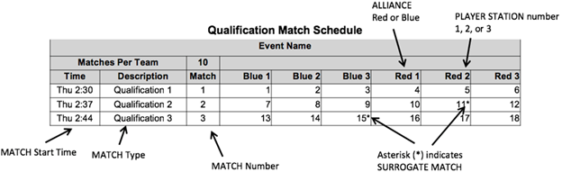
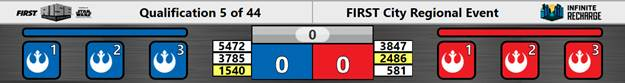
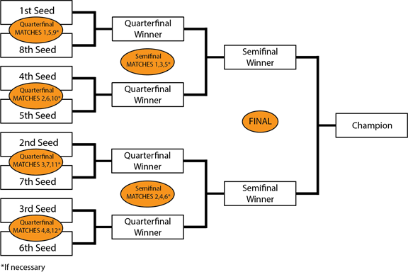
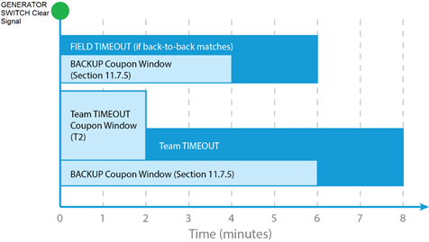
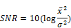
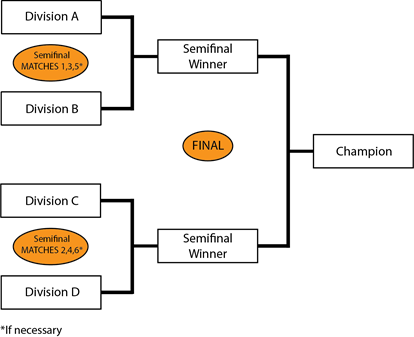
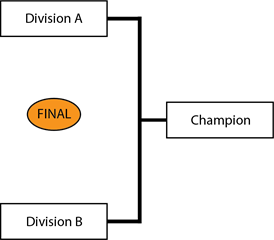

11 Tournaments
##############

Each 2020 *FIRST* \ :sup:`®`\ Robotics Competition event is played in a tournament format. Each tournament consists of three sets of MATCHES called Practice MATCHES (not necessarily played at all District Events), Qualification MATCHES, and Playoff MATCHES.

Practice MATCHES provide each team with an opportunity to operate its ROBOT on the FIELD prior to the start of the Qualification MATCHES.

Qualification MATCHES allow each team to earn Ranking Points which determine their seeding position and may qualify them for participation in the Playoff MATCHES.

Playoff MATCHES determine the event Champions.

11.1 MATCH Schedules
********************

A MATCH schedule is used to coordinate MATCHES at an Event. Figure 11‑1 details information shown on each schedule.

Figure 11‑1 Sample MATCH Schedule

11.2 REFEREE Interaction
************************

The Head REFEREE has the ultimate authority in the ARENA during the event, but may receive input from additional sources, e.g. Game Designers, *FIRST* personnel, FTA, and technical staff. The Head REFEREE rulings are final. No event personnel, including the Head REFEREE, will review video, photos, artistic renderings, etc. of any MATCH, from any source, under any circumstances.

If a DRIVE TEAM needs clarification on a ruling or score, per C9, one (1) pre-college student from that DRIVE TEAM should address the Head REFEREE after the ARENA Reset Signal (e.g. FIELD lights turn green). A DRIVE TEAM member signals their desire to speak with the Head REFEREE by standing in the corresponding Red or Blue Question Box, which are located on the floor near each end of the scoring table. Depending on timing, the Head REFEREE may postpone any requested discussion until the end of the subsequent MATCH as necessary.

While FMS tracks quantities of FOULS, *FIRST* instructs REFEREES to not self-track details about FOULS; as a result, we don’t expect REFEREES to recall details about what FOULS were made, when they occurred, and against whom.

.. note::
    Any reasonable
    question is fair game in the Question Box, and Head REFEREES will do good faith
    efforts to provide helpful feedback (e.g. how/why certain FOULS are being
    called, why a particular ROBOT may be susceptible to certain FOULS based on its
    design or game play, how specific rules are being called or interpreted), but
    please know that they will likely not be able to supply specific details

11.2.1 YELLOW and RED CARDS
===========================

In addition to rule violations explicitly listed throughout the 2020 Game and Season Manual, YELLOW CARDS and RED CARDS are used in *FIRST* Robotics Competition to address team and ROBOT behavior that does not align with the mission, values, and culture of *FIRST* .

As noted in `Rule Violations <https://firstfrc.blob.core.windows.net/frc2020/Manual/HTML/2020FRCGameSeasonManual.htm#_Rule_Violations_1>`_ and C1, the Head REFEREE may assign a YELLOW CARD as a warning, or a RED CARD for DISQUALIFICATION in MATCH for egregious behavior inappropriate at a *FIRST* Robotics Competition event.

A YELLOW or RED CARD is indicated by the Head REFEREE standing in front of the team’s PLAYER STATION and holding a YELLOW and/or RED CARD in the air.

YELLOW CARDS are additive, meaning that a second YELLOW CARD is automatically converted to a RED CARD. A team is issued a RED CARD for any subsequent incident in which they receive an additional YELLOW CARD, including earning a second YELLOW CARD during a single MATCH. A second YELLOW CARD is indicated by the Head REFEREE standing in front of the team’s PLAYER STATION and holding a YELLOW CARD and RED CARD in the air simultaneously after the completion of the MATCH. A team that has received either a YELLOW CARD or a RED CARD carries a YELLOW CARD into subsequent MATCHES, except as noted below.

Once a team receives a YELLOW or RED CARD, its team number is presented with a yellow background on the Audience Screen at the beginning of all subsequent MATCHES, including any replays, as a reminder to the team, the REFEREES, and the audience that they carry a YELLOW CARD.

Figure 11‑2 Audience Screen graphic showing YELLOW CARD Indicators

All YELLOW CARDS are cleared in FMS at the conclusion of Practice, Qualification, and Division Playoff MATCHES. The Head REFEREE may opt to perpetuate a YELLOW CARD earned during Practice MATCHES through to Qualification MATCHES for particularly egregious behavior.

During the Playoff MATCHES, a team receives a YELLOW or RED CARD for their entire ALLIANCE. If two (2) YELLOW CARDS are accrued by an ALLIANCE, the entire ALLIANCE is issued a RED CARD. A RED CARD results in DISQUALIFICATION and the ALLIANCE loses the MATCH. If both ALLIANCES receive RED CARDS, the ALLIANCE which committed the action earning the RED CARD first chronologically is DISQUALIFIED and loses the MATCH.

YELLOW and RED CARDS are applied based on the following:

Table 11‑1 YELLOW and RED CARD application

+---------------------------------------------------------------------------+-------------------------------------------------------------------------------------------------------------------------------------------------------------------------------------------------------------------------------------------+
| Time YELLOW or RED CARD earned:                                           | MATCH to which CARD is applied:                                                                                                                                                                                                           |
+---------------------------------------------------------------------------+-------------------------------------------------------------------------------------------------------------------------------------------------------------------------------------------------------------------------------------------+
| prior to the start of Qualification MATCHES                               | Team’s first Qualification MATCH                                                                                                                                                                                                          |
+---------------------------------------------------------------------------+-------------------------------------------------------------------------------------------------------------------------------------------------------------------------------------------------------------------------------------------+
| during the Qualification MATCHES                                          | Team’s current (or just-completed) MATCH. In the case where the team participated as a SURROGATE in the current (or just completed) MATCH, the card is applied to the team’s previous MATCH (i.e. the team’s second Qualification MATCH.) |
+---------------------------------------------------------------------------+-------------------------------------------------------------------------------------------------------------------------------------------------------------------------------------------------------------------------------------------+
| between the end of Qualification MATCHES and the start of Playoff MATCHES | ALLIANCE’S first Playoff MATCH                                                                                                                                                                                                            |
+---------------------------------------------------------------------------+-------------------------------------------------------------------------------------------------------------------------------------------------------------------------------------------------------------------------------------------+
| during the Playoff MATCHES                                                | ALLIANCE’S current (or just-completed) MATCH.                                                                                                                                                                                             |
+---------------------------------------------------------------------------+-------------------------------------------------------------------------------------------------------------------------------------------------------------------------------------------------------------------------------------------+

.. note::
    Please see examples of the application of YELLOW AND RED CARDS
    as shown in  `Violation Details <https://firstfrc.blob.core.windows.net/frc2020/Manual/HTML/2020FRCGameSeasonManual.htm#_Violation_Details>`_  .

11.3 MATCH Replays
******************

Over the course of the Tournament it may be necessary for a MATCH to be replayed. Typical causes for replays are MATCHES that end in a tie during the Playoffs, MATCHES that are stopped because FIELD STAFF anticipated FIELD damage or personal injury, or if there is an ARENA FAULT. An ARENA FAULT is an error in ARENA operation that includes, but is not limited to:

A. broken FIELD elements due to

a. normal, expected game play or

b. ROBOT abuse of FIELD elements that affects the outcome of the MATCH for their opponents.

.. note::
    A broken FIELD
    element caused by ROBOT abuse that affects the outcome of the MATCH for their ALLIANCE
    is not an ARENA FAULT.

B. power failure to a portion of the FIELD (tripping the circuit breaker in the PLAYER STATION is not considered a power failure)

C. improper activation by the FMS

D. errors by FIELD STAFF (except those listed in `Other Logistics <https://firstfrc.blob.core.windows.net/frc2020/Manual/HTML/2020FRCGameSeasonManual.htm#_Other_Logistics>`_ )

If, in the judgment of the Head REFEREE, an ARENA FAULT occurs that affects the outcome of the MATCH and any team on the affected ALLIANCE desires a replay, the MATCH will be replayed.

.. note::
    The outcome of
    the MATCH is affected if an error occurs that, in the judgement of the Head REFEREE,
    changes which ALLIANCE would have won the MATCH and/or the assignment of
    Ranking Points.

All reasonable effort is made to create the same conditions when replaying a MATCH. This means, for example, that a team that was BYPASSED prior to the start of the MATCH which is to be replayed, is BYPASSED for the replay MATCH. ROBOT and DRIVE TEAM starting locations do not need to be replicated when replaying a MATCH.

.. note::
    Note that an ARENA
    FAULT that does not affect MATCH outcome in the judgement of the Head REFEREE
    does not lead to a MATCH replay. Examples include, but are not limited to:

    a.     a piece of FIELD plastic falls into the FIELD, far away
    from any human or ROBOT activity, and in such a way that it does not affect MATCH
    outcome

    b.     delay in the playing of an ARENA sound

    c.     mismatch between the timer on the Audience Screen and the ARENA
    Timer

    d.     any adjustment or delay in assignment of a penalty
    (including those made after the MATCH)

11.4 Measurement
****************

At each event, the ARENA will be open for at least thirty (30) minutes prior to the start of Qualification MATCHES, during which time teams may survey and/or measure the ARENA and bring ROBOTS on the FIELD to perform sensor calibration. The specific time that the FIELD is open will be communicated to teams at the event. Teams may bring specific questions or comments to the FTA.

**T1.** Freeze, ROBOT. During the period when the ARENA is open for measurement, ROBOTS can be enabled, but cannot move (i.e. neither the ROBOT, nor anything on the ROBOT, can move), nor can they interact with (e.g. shoot, push, pickup, etc.) POWER CELLS, POWER PORTS, GENERATOR SWITCHES, CONTROL PANELS, or other FIELD elements.

Violation: Verbal warning. If repeated at any point during the event or egregious YELLOW CARD.

11.5 Practice MATCHES
*********************

Practice MATCHES are played before Qualification Matches. The Practice MATCH schedule is available as soon as possible, but no later than the start of Practice MATCHES. For Regional events, it will also be published and available online at the `FIRST Robotics Event Results site <https://frc-events.firstinspires.org/>`_ , except during exceptional circumstances. Practice MATCHES are randomly assigned, and teams may not switch scheduled Practice MATCHES. Each team is assigned an equal number of Practice MATCHES unless the number of teams multiplied by number of Practice MATCHES is not divisible by six. In this case, the Field Management System (FMS) randomly selects some teams to play an extra Practice MATCH.

Practice MATCHES are not guaranteed at District Events due to event schedule constraints.

11.5.1 Filler Line
==================

A Filler Line is used to fill open slots at events that employ scheduled Practice MATCHES or all slots at events with an open Practice MATCH schedule. Teams from the Filler Line are used on a first come, first served basis to fill empty spots in Practice MATCHES left by other teams that do not report to Queueing. The number of teams in the Filler Line is dependent upon space at venues.

Only teams that meet all criteria below qualify for the Filler Line:

**A.** ROBOTS in the Filler Line must have passed Inspection (this requirement may be waived for events with open Practice MATCH schedules);

**B.** DRIVE TEAMS must join the Filler Line with their ROBOT;

**C.** Teams may not work on their ROBOT while in the Filler Line;

**D.** Teams may not occupy more than one spot in the Filler Line; and

**E.** If a team is queued for their Practice MATCH, they may not also join the Filler Line.

11.6 Qualification MATCHES
**************************

11.6.1 Schedule
===============

The Qualification MATCH schedule is made available as soon as possible, but no later than one (1) hour before Qualification MATCHES are scheduled to begin. Teams receive one (1) hard copy and it is available at the `FIRST Robotics Event Results site <https://frc-events.firstinspires.org/>`_ , except during exceptional circumstances. Each Qualification schedule consists of a series of rounds in which each team plays one (1) MATCH per round.

11.6.2 MATCH Assignment
=======================

FMS assigns each team two (2) ALLIANCE partners for each Qualification MATCH using a predefined algorithm, and teams may not switch Qualification MATCH assignments. The algorithm employs the following criteria, listed in order of priority:

1. maximize time between each MATCH played for all teams

2. minimize the number of times a team plays opposite any team

3. minimize the number of times a team is allied with any team

4. minimize the use of SURROGATES (teams randomly assigned by the FMS to play an extra Qualification MATCH)

5. provide even distribution of MATCHES played on Blue and Red ALLIANCE

6. provide even distribution of MATCHES played in each PLAYER STATION number.

All teams are assigned the same number of Qualification MATCHES, equal to the number of rounds, unless the number of teams multiplied by number of MATCHES is not divisible by six. In this case, the FMS randomly selects some teams to play an extra MATCH. For the purpose of seeding calculations, those teams are designated as SURROGATES for the extra MATCH. If a team plays a MATCH as a SURROGATE, it is indicated on the MATCH schedule, it is always their third Qualification MATCH, and the outcome of the MATCH has no effect on the team’s ranking. YELLOW and RED CARDS assigned to SURROGATES, however, do carry forward to subsequent MATCHES.

11.6.3 Qualification Ranking
============================

Ranking Points (RP) are units credited to a team based on their ALLIANCE’S performance in Qualification MATCHES. Ranking Points are awarded to each eligible team at the completion of each Qualification MATCH per Table 4‑2.

Exceptions to Ranking Point assignment are as follows:

**A.** A SURROGATE receives zero (0) Ranking Points.

**B.** A DISQUALIFIED team, as determined by the Head REFEREE, receives zero (0) Ranking Points in a Qualification MATCH or causes their ALLIANCE to receive zero (0) MATCH points in a Playoff MATCH.

**C.** A “no-show” team is either DISQUALIFIED from or issued a RED CARD for that MATCH (see C6). A team is declared a no-show if no member of the DRIVE TEAM is in the ALLIANCE STATION at the start of the MATCH.

The total number of Ranking Points earned by a team throughout their Qualification MATCHES divided by the number of MATCHES they’ve been scheduled to play (minus any SURROGATE MATCH), then truncated to two (2) decimal places, is their Ranking Score (RS).

All teams participating in Qualification MATCHES are ranked by Ranking Score. If the number of teams in attendance is ‘n’, they are ranked ‘1’ through ‘n’, with ‘1’ being the team with the highest Ranking Score and ‘n’ being the team with the lowest Ranking Score.

Teams are ranked in order, using the sorting criteria defined in Table 11‑2.

Table 11‑2 Qualification MATCH ranking criteria

+------------+-------------------------------------------------------+
| Order Sort | Criteria                                              |
+------------+-------------------------------------------------------+
| 1st        | Ranking Score                                         |
+------------+-------------------------------------------------------+
| 2nd        | Cumulative AUTO points                                |
+------------+-------------------------------------------------------+
| 3rd        | Cumulative ENDGAME points                             |
+------------+-------------------------------------------------------+
| 4th        | Cumulative TELEOP POWER CELL and CONTROL PANEL points |
+------------+-------------------------------------------------------+
| 5th        | Random sorting by the FMS                             |
+------------+-------------------------------------------------------+

11.7 Playoff MATCHES
********************

In Playoff MATCHES, teams do not earn Ranking Points; they earn a Win, Loss or Tie. Within each series of the `Playoff MATCH Bracket <https://firstfrc.blob.core.windows.net/frc2020/Manual/HTML/2020FRCGameSeasonManual.htm#PlayoffMatchBracketSection>`_ , the first ALLIANCE to win two (2) MATCHES advances.

In the case where the Quarterfinal or Semifinal MATCH scores for both ALLIANCES are equal, the Win is awarded to the ALLIANCE per criteria listed in Table 11‑3. A DISQUALIFIED team, as determined by the Head REFEREE, causes their ALLIANCE to receive zero (0) MATCH points in a Playoff MATCH.

In Finals MATCHES, the Champion ALLIANCE is the first ALLIANCE to win two (2) MATCHES. In the case where an ALLIANCE hasn’t won two (2) MATCHES after three (3) MATCHES, the Playoffs proceed with up to three (3) additional Finals MATCHES, called Overtime MATCHES, until an ALLIANCE has won two (2) Finals MATCHES. In the case where the Overtime MATCH scores for both ALLIANCES are equal, the win for that Overtime MATCH is awarded based on the criteria listed in Table 11‑3.

Table 11‑3 Playoff MATCH Tiebreaker Criteria

+------------+----------------------------------------------------------------------+
| Order Sort | Criteria                                                             |
+------------+----------------------------------------------------------------------+
| 1st        | Cumulative FOUL and TECH FOUL points due to opponent rule violations |
+------------+----------------------------------------------------------------------+
| 2nd        | Cumulative AUTO points                                               |
+------------+----------------------------------------------------------------------+
| 3rd        | Cumulative ENDGAME points                                            |
+------------+----------------------------------------------------------------------+
| 4th        | Cumulative TELEOP POWER CELL and CONTROL PANEL points                |
+------------+----------------------------------------------------------------------+
| 5th        | MATCH is replayed                                                    |
+------------+----------------------------------------------------------------------+

11.7.1 ALLIANCE Selection Process
=================================

At the end of the Qualification MATCHES, the top eight (8) seeded teams become the ALLIANCE Leads. The seeded ALLIANCES are designated, in order, ALLIANCE One, ALLIANCE Two, etc., down to ALLIANCE Eight. Using the ALLIANCE selection process described in this section, each ALLIANCE Lead chooses two (2) other teams to join their ALLIANCE.

If a team declines the ALLIANCE Lead position or doesn’t send a student representative for ALLIANCE selection, they are ineligible to participate in the Playoff Tournament. If the declining/absent team would have been an ALLIANCE Lead, all lower ranked ALLIANCE Leads are promoted one spot. The next highest-ranked team moves up to become the ALLIANCE Eight Lead.

Each team chooses a student team representative who proceeds to the ARENA at the designated time (typically before the lunch break on the final day of the event) to represent their team. The designated student representative from each ALLIANCE in a Playoff MATCH is called the ALLIANCE CAPTAIN.

The ALLIANCE selection process consists of two (2) rounds during which each ALLIANCE CAPTAIN invites a team seeded below them in the standings to join their ALLIANCE. The invited team must not already have declined an invitation.

Round 1: In descending order (ALLIANCE One to ALLIANCE Eight), each ALLIANCE CAPTAIN invites a single team. The invited team’s representative steps forward and either accepts or declines the invitation.

If the team accepts, it becomes a member of that ALLIANCE. If an invitation from a top eight ALLIANCE to another ALLIANCE Lead is accepted, all lower ALLIANCE Leads are promoted one spot. The next highest-seeded, unselected team moves up to become the ALLIANCE Eight Lead.

If the team declines, that team is not eligible to be picked again or to be a BACKUP TEAM (see `Playoff MATCH Bracket <https://firstfrc.blob.core.windows.net/frc2020/Manual/HTML/2020FRCGameSeasonManual.htm#PlayoffMatchBracketSection>`_ ), and the ALLIANCE CAPTAIN extends another invitation to a different team. If an invitation from a top eight ALLIANCE to another ALLIANCE Lead is declined, the declining team may still invite teams to join their ALLIANCE; however, it cannot accept invitations from other ALLIANCES.

The process continues until ALLIANCE Eight makes a successful invitation.

Round 2: The same method is used for each ALLIANCE CAPTAIN’S second choice except the selection order is reversed, with ALLIANCE Eight picking first and ALLIANCE One picking last. This process results in eight (8) ALLIANCES of three (3) teams each.

Of the remaining eligible teams, the highest seeded teams must either accept or decline to be included in a pool of available teams until there are up to eight (8) teams that accept to be added into the pool. FIELD STAFF will coordinate the assembly of this BACKUP pool immediately after the top ranked ALLIANCE has made their final pick. If a team is not available to accept inclusion in the BACKUP pool, it will be assumed they have declined the invitation.

11.7.2 Playoff MATCH Bracket
============================

The Playoff MATCHES take place following the completion of the Qualification MATCHES and the ALLIANCE selection process. Playoff MATCHES are played in a bracket format as shown in Figure 11‑3.

ALLIANCE Leads are assigned to PLAYER STATION 2, the first picks are assigned to their left in PLAYER STATION 1, and second picks are assigned to the ALLIANCE Lead’s right in PLAYER STATION 3. If a BACKUP TEAM is in play, they will be assigned to the PLAYER STATION that was assigned to the DRIVE TEAM they’re replacing. Teams cannot change assignments.

For Quarterfinal MATCHES, the higher seeded ALLIANCE is assigned to the Red ALLIANCE. Beyond the Quarterfinal MATCHES, the ALLIANCE on the top of each MATCH in Figure 11‑3 is assigned to the Red ALLIANCE, regardless of whether they are the higher seeded ALLIANCE in that particular MATCH.

Figure 11‑3 Playoff MATCH Bracket

In order to allow time between MATCHES for all ALLIANCES, the order of play is as follows:

Table 11‑4 Playoff Order

+----------------+----------------+----------------+-------------------------+----------------+
| Quarterfinal   | Quarterfinal   | Quarterfinal   | Semifinals              | Finals         |
|                |                |                |                         |                |
| Round 1        | Round 2        | Round 3        |                         |                |
+----------------+----------------+----------------+-------------------------+----------------+
| Quarterfinal 1 | Quarterfinal 5 | Quarterfinal   | Semifinal 1             | Final 1        |
|                |                |                |                         |                |
| (1 vs.8)       | (1 vs.8)       | Tiebreaker     |                         |                |
|                |                |   11           |                         |                |
+----------------+----------------+----------------+-------------------------+----------------+
| Quarterfinal 2 | Quarterfinal 6 | Quarterfinal   | Semifinal 2             | FIELD TIMEOUT  |
|                |                |                |                         |                |
| (4 vs.5)       | (4 vs.5)       | Tiebreaker 21  |                         |                |
+----------------+----------------+----------------+-------------------------+----------------+
| Quarterfinal 3 | Quarterfinal 7 | Quarterfinal   | Semifinal 3             | Final 2        |
|                |                |                |                         |                |
| (2 vs.7)       | (2 vs.7)       | Tiebreaker     |                         |                |
|                |                |   31           |                         |                |
+----------------+----------------+----------------+-------------------------+----------------+
| Quarterfinal 4 | Quarterfinal 8 | Quarterfinal   | Semifinal 4             | FIELD TIMEOUT  |
|                |                |                |                         |                |
| (3 vs.6)       | (3 vs.6)       | Tiebreaker 41  |                         |                |
+----------------+----------------+----------------+-------------------------+----------------+
|                | FIELD TIMEOUT1 | FIELD TIMEOUT1 | Semifinal               | Final          |
|                |                |                |                         |                |
|                |                |                | Tiebreaker              | Tiebreakers    |
|                |                |                |   11                    |   (Overtime) 1 |
+----------------+----------------+----------------+-------------------------+----------------+
|                |                | Any Replays    | Semifinal Tiebreaker 21 | Any Replays    |
|                |                |                |                         |                |
|                |                | due to ties1   |                         | due to ties1   |
+----------------+----------------+----------------+-------------------------+----------------+
|                |                |                | FIELD TIMEOUT1          |                |
+----------------+----------------+----------------+-------------------------+----------------+
|                |                |                | Any Replays             |                |
|                |                |                |                         |                |
|                |                |                | due to ties1            |                |
+----------------+----------------+----------------+-------------------------+----------------+

\ :sup:`1`\ - if required

11.7.3 Pit Crews
================

During the Playoff MATCHES, extra team members may be needed to maintain the ROBOT between MATCHES because of the distance between the FIELD and the pit area. Each team is permitted to have three (3) additional pit crew members who can also help with needed ROBOT repairs/maintenance.

11.7.4 TIMEOUTS
===============

A TIMEOUT is a period of up to six (6) minutes between MATCHES which is used to pause Playoff MATCH progression.

During a TIMEOUT, the ARENA Timer displays the time remaining in the TIMEOUT. Both ALLIANCES enjoy the complete six (6) minute window. If an ALLIANCE completes their repairs before the ARENA Timer expires, the ALLIANCE CAPTAIN is encouraged to inform the Head REFEREE that they are ready to play. If both ALLIANCES are ready to play before the TIMEOUT expires, the next MATCH will start.

There are no TIMEOUTS for Practice or Qualification MATCHES.

If circumstances require an ALLIANCE to play in back-to-back MATCHES during the Playoff MATCHES, the Head REFEREE will issue a FIELD TIMEOUT to allow teams to prepare for the next MATCH. FIELD TIMEOUTS are the same time duration as TIMEOUTS.

Figure 11‑4 TIMEOUT Timeline

Each ALLIANCE in the Playoff tournament is issued (1) TIMEOUT.

.. note::
    Teams are
    expected to have their ROBOTS staged on the FIELD by the end of the TIMEOUT.
    Teams that cause a delay to the start of a MATCH after a TIMEOUT are at risk of
    being in violation of C7.

**T2.** If an ALLIANCE wishes to use their TIMEOUT, the ALLIANCE CAPTAIN must submit their TIMEOUT coupon to the Head REFEREE within two (2) minutes of the GENERATOR SWITCH Clear signal preceding their MATCH. If there is no preceding MATCH, the TIMEOUT coupon must be submitted no later than two (2) minutes before the scheduled MATCH time. The TIMEOUT will begin two (2) minutes after the GENERATOR SWITCH Clear signal (i.e. at the end of the Team TIMEOUT Coupon Window depicted in Figure 11‑4)

.. note::
    A request
    presented outside the defined parameters in T2 will be denied.

There are no cascading TIMEOUTS. If an ALLIANCE calls a TIMEOUT during a FIELD TIMEOUT, the FIELD TIMEOUT will expire two (2) minutes after the GENERATOR SWITCH Clear signal and the ALLIANCE’S TIMEOUT will begin.

If an ALLIANCE wishes to call a TIMEOUT during a FIELD TIMEOUT, it must still do so within two (2) minutes of the GENERATOR SWITCH Clear signal preceding their MATCH, per T2.

TIMEOUTS are not transferrable between ALLIANCES, meaning an ALLIANCE cannot hand their designated TIMEOUT coupon to another ALLIANCE to use, however an ALLIANCE may use their own coupon for any purpose they wish.

If a Playoff MATCH is replayed because of an ARENA FAULT which rendered a ROBOT inoperable, the Head REFEREE has the option of calling a FIELD TIMEOUT.

11.7.5 BACKUP TEAMS
===================

In the Playoff MATCHES, it may be necessary for an ALLIANCE to replace one of its members due to a faulty ROBOT. ROBOT faults include but are not limited to:

1. mechanical damage,

2. electrical issues, or

3. software problems.

In this situation, the ALLIANCE CAPTAIN has the option to bring in only the highest seeded team from the pool of available teams to join its ALLIANCE. The team whose ROBOT and DRIVE TEAM replaces another ROBOT and DRIVE TEAM on an ALLIANCE during the Playoff MATCHES is called the BACKUP TEAM.

The resulting ALLIANCE is then composed of four (4) teams. The replaced team remains a member of the ALLIANCE for awards, but cannot return to play, even if their ROBOT is repaired.

Each ALLIANCE is allotted one (1) BACKUP TEAM Coupon during the Playoff MATCHES. If a second ROBOT from the ALLIANCE becomes inoperable, then the ALLIANCE must play the following MATCHES with only two (2) (or even one (1)) ROBOTS.

.. note::
    Example: Three
    (3) teams, A, B and C, form an ALLIANCE going into the Playoff MATCHES. The
    highest seeded team not on one of the eight (8) ALLIANCES is Team D. During one
    of the Playoff MATCHES, Team C’s ROBOT suffers damage to its mechanical arm.
    The ALLIANCE CAPTAIN decides to bring in Team D to replace Team C. Team C and
    their ROBOT are not eligible to play in any subsequent Playoff MATCHES. The new
    ALLIANCE of Teams A, B, and D are successful in advancing to the Finals and win
    the event. Teams A, B, C, and D are all recognized as members of the Winning ALLIANCE
    and receive awards

In the case where a BACKUP TEAM is part of the Winning or Finalist ALLIANCE, there will be a four (4)- team Winning or Finalist ALLIANCE.

If during a TIMEOUT an ALLIANCE CAPTAIN determines that they need to call up a BACKUP TEAM, they must submit their BACKUP TEAM coupon to the Head REFEREE while there are still at least two (2) minutes remaining on the ARENA Timer. After that point, they will not be allowed to utilize the BACKUP TEAM.

Alternatively, an ALLIANCE CAPTAIN may choose to call up a BACKUP TEAM without using their TIMEOUT by informing the Head REFEREE directly within two (2) minutes of the Head REFEREE issuing the GENERATOR SWITCH Clear signal preceding their MATCH. If there is no preceding MATCH, the BACKUP TEAM coupon must be submitted no later than two (2) minutes before the scheduled MATCH time.

In the case where the ALLIANCE CAPTAIN’S ROBOT is replaced by a BACKUP TEAM, the ALLIANCE CAPTAIN is allowed as a sixteenth ALLIANCE DRIVE TEAM member. This additional representative may only serve in an advisory role and is considered a COACH (e.g. can’t be a HUMAN PLAYER)

The Head REFEREE will not accept the BACKUP TEAM coupon unless it lists the number of the team whose ROBOT is being replaced and is initialed by the ALLIANCE CAPTAIN. Once a BACKUP TEAM coupon is submitted and accepted by the Head REFEREE, the BACKUP TEAM coupon may not be withdrawn by the ALLIANCE.

**T3.** An ALLIANCE may not request a TIMEOUT or a BACKUP TEAM after a Playoff MATCH is stopped by the Head REFEREE (e.g. due to an ARENA FAULT or a safety issue). The sole exception is if the replay is due to an ARENA FAULT that rendered a ROBOT inoperable.

Violation: A request presented outside parameters defined will be denied.

.. note::
    If a Playoff MATCH
    is replayed per T3, the Head REFEREE has the option of calling a FIELD TIMEOUT.

11.8 Advancement Through the District Model
*******************************************

Teams advance through the season depending on the events at which they compete: Regional or District. This section details how teams advance from Regional events to the *FIRST* Championship, or from District qualifying events, to their District Championship, to the *FIRST* Championship.

11.8.1 District Events
======================

District teams are ranked throughout the season based on the points they earn at their first two (2) home District events they attend, as well as at their District Championship. Points are awarded to teams as follows:

Table 11‑5 District Point Assignment

+---------------------------------+---------------------------------------------------------------------------------------------------------------------------------------------------------------------------------------------------------------------------+
| Category                        | Points                                                                                                                                                                                                                    |
+---------------------------------+---------------------------------------------------------------------------------------------------------------------------------------------------------------------------------------------------------------------------+
| Qualification Round Performance | (For a typically sized District event, this will result in a minimum of four (4) points being awarded for Qualification round performance. For events of all sizes, a maximum of twenty-two (22) points will be awarded.) |
+---------------------------------+---------------------------------------------------------------------------------------------------------------------------------------------------------------------------------------------------------------------------+
| ALLIANCE CAPTAINS               | Equal to 17 minus the ALLIANCE CAPTAIN number (e.g. 14 points for ALLIANCE #3 Captain)                                                                                                                                    |
+---------------------------------+---------------------------------------------------------------------------------------------------------------------------------------------------------------------------------------------------------------------------+
| Draft Order Acceptance          | Equal to 17 minus the                                                                                                                                                                                                     |
|                                 |   Draft Order Acceptance Number (e.g. 12 points for the team that is 5th                                                                                                                                                  |
|                                 |   to accept an invitation)                                                                                                                                                                                                |
+---------------------------------+---------------------------------------------------------------------------------------------------------------------------------------------------------------------------------------------------------------------------+
| Playoff Advancement             | Points awarded based on team participation in individual playoff rounds, and whether or not the ALLIANCE advances. See details below.                                                                                     |
+---------------------------------+---------------------------------------------------------------------------------------------------------------------------------------------------------------------------------------------------------------------------+
| Judged Team Awards              | 10 points for Chairman’s Award                                                                                                                                                                                            |
|                                 |                                                                                                                                                                                                                           |
|                                 | 8 points each for Engineering Inspiration and Rookie All Star Awards                                                                                                                                                      |
|                                 |                                                                                                                                                                                                                           |
|                                 | 5 points each for all other judged team awards                                                                                                                                                                            |
+---------------------------------+---------------------------------------------------------------------------------------------------------------------------------------------------------------------------------------------------------------------------+
| Team Age                        | 10 points for Rookie teams                                                                                                                                                                                                |
|                                 |                                                                                                                                                                                                                           |
|                                 | 5 points for second-year teams                                                                                                                                                                                            |
+---------------------------------+---------------------------------------------------------------------------------------------------------------------------------------------------------------------------------------------------------------------------+

Points earned at District Championships are multiplied by three (3) and then added to points earned at District events, to determine the final season point total for the team.

If there is a tie in the season point total between teams, those items are broken using the following sorting criteria:

Table 11‑6 District team sort criteria

+------------+-----------------------------------------------------------------------------------------------------------------------+
| Order Sort | Criteria                                                                                                              |
+------------+-----------------------------------------------------------------------------------------------------------------------+
| 1st        | Total Playoff Round Performance Points                                                                                |
+------------+-----------------------------------------------------------------------------------------------------------------------+
| 2nd        | Best Playoff Round Finish at a single event                                                                           |
+------------+-----------------------------------------------------------------------------------------------------------------------+
| 3rd        | Total ALLIANCE Selection Results Points                                                                               |
+------------+-----------------------------------------------------------------------------------------------------------------------+
| 4th        | Highest Qualification Round Seed or Draft Order Acceptance (i.e. Highest ALLIANCE Selection points at a single event) |
+------------+-----------------------------------------------------------------------------------------------------------------------+
| 5th        | Total Qualification Round Performance Points                                                                          |
+------------+-----------------------------------------------------------------------------------------------------------------------+
| 6th        | Highest Individual MATCH Score, regardless of whether that score occurred in a Qualification or Playoff MATCH         |
+------------+-----------------------------------------------------------------------------------------------------------------------+
| 7th        | Second Highest Individual MATCH Score, regardless of whether that score occurred in a Qualification or Playoff MATCH  |
+------------+-----------------------------------------------------------------------------------------------------------------------+
| 8th        | Third Highest Individual MATCH Score, regardless of whether that score occurred in a Qualification or Playoff MATCH   |
+------------+-----------------------------------------------------------------------------------------------------------------------+
| 9th        | Random Selection                                                                                                      |
+------------+-----------------------------------------------------------------------------------------------------------------------+

11.8.1.1 Qualification Round Performance
----------------------------------------

The calculation of Qualification performance points is done using the equation (an inverse error function) in the table above. The equation utilizes the following variables:

• R – the qualification rank of the team at the event at the conclusion of Qualification MATCHES (as reported by FMS)

• N – the number of *FIRST* Robotics Competition teams participating in the Qualification rounds at the event

• Alpha (α) – a static value (1.07) used to standardize the distribution of points at events

This formula generates an approximately normal distribution of Qualification Round Performance points at an event, based on rank, with most teams getting a moderate number of points, and fewer teams getting the highest or lowest numbers of points available.

Table 11‑7 displays sample Qualification Round Performance points for variously ranked teams at a forty (40) team event. The system will automatically generate the appropriate points for each team based on their rank and the number of teams at the event.

Table 11‑7 Sample Qualification Round point assignments

+--------+----+----+----+----+---+----+----+----+---+----+----+----+----+
| Rank   | 1  | 2  | 3  | 4  | … | 19 | 20 | 21 | … | 37 | 38 | 39 | 40 |
+--------+----+----+----+----+---+----+----+----+---+----+----+----+----+
| Points | 22 | 21 | 20 | 19 | … | 13 | 13 | 12 | … | 6  | 6  | 5  | 4  |
+--------+----+----+----+----+---+----+----+----+---+----+----+----+----+

11.8.1.2 ALLIANCE Selection Results
-----------------------------------

This attribute measures both individual team qualification round seeding performance and recognition by peers.

ALLIANCE CAPTAINS are recognized based on their qualification round seeding rank. This rank is a result of the rules of the game, which typically incorporate several team performance attributes, and are designed to eliminate ties in rank. Non-ALLIANCE CAPTAINS are rewarded based on peer recognition. To be invited to join an ALLIANCE, a team’s peers have decided that the team has attributes that are desirable. Giving points for ALLIANCE selection also supports come-from-behind teams. A team taking several MATCHES to optimize their performance may be recognized as a late bloomer by a top seeded team, even if that performance isn’t reflected in the rankings because of poor performance in early MATCHES. These points also have the potential to recognize teams employing a minority strategy with their ROBOT. Teams with unique or divergent ROBOT capabilities that complement the strengths of other ALLIANCE members may be selected to fill a strategic niche.

Note also that ALLIANCE CAPTAINS are given the same number of points as the team drafted in the same sequence. For example, the third ALLIANCE CAPTAIN gets the same number of points as the third draft. Numerical analysis supports the idea that ALLIANCE CAPTAINS are about as strong in ROBOT performance as equivalently drafted teams. As an additional minor benefit, awarding the same points for ALLIANCE CAPTAINS and equivalent drafts lubricates the acceptance of draft offers between ALLIANCE CAPTAINS, which gives teams out of the top eight the chance to experience being ALLIANCE CAPTAINS themselves.

11.8.1.3 Playoff Round Performance
----------------------------------

This attribute measures team performance as part of an ALLIANCE.

All teams on the ALLIANCE winning a particular playoff series, who participate in MATCHES with their ROBOTS, receive five (5) points per MATCH won. In most cases, teams receive ten (10) points at each of the Quarterfinal, Semifinal, and Final levels, unless a BACKUP ROBOT is called in to play.

11.8.1.4 Awards
---------------

This attribute measures team performance with respect to team awards judged at the event.

The points earned for team awards in this system are not intended to capture the full value of the award to the team winning the award, or to represent the full value of the award to *FIRST* . In many ways, the team’s experience in being selected for awards, especially the Chairman’s Award, the Engineering Inspiration Award, and the Rookie All Star Award, is beyond measure, and could not be fully captured in its entirety by any points-based system. Points are being assigned to awards in this system only to help teams recognize that *FIRST* continues to be “More than Robots\ :sup:`SM`\,” with the emphasis on our cultural awards, and to assist in elevating award-winning teams above non-award-winning teams in the ranking system.

Teams only get points for team awards judged at the event. If an award is not judged, e.g. Rookie Highest Seed, is not for a team, e.g. the Dean’s List Award, or is not judged at the event, e.g. Safety Animation Award, sponsored by UL, no points are earned.

11.8.1.5 Team Age
-----------------

This attribute recognizes the difficulty in being a rookie or second-year team.

Points are awarded to rookie and second year teams in recognition of the unique challenges teams face in those early years, and to increase the chance that they will make it to the District Championship to compete with their ROBOTS. Like our dedicated Rookie awards, these additional points are intended to recognize and motivate newer participants in *FIRST* Robotics Competition. These points are awarded once at the beginning of the season. Rookie year is calculated based on the year in which *FIRST* recognizes the team as a rookie.

11.8.1.6 Regional Participation
-------------------------------

District teams do not earn points for their actions at any Regionals they may attend, nor are eligible for *FIRST* Championship qualifying judged awards at those events. However, if a District team does earn a slot at the *FIRST* Championship while attending a Regional event, that slot does count as part of the total Championship allocation the District is receiving for the season.

11.8.2 District Championship Eligibility
========================================

A team competing in a District qualifies for their District Championship by meeting one of the following criteria:

**A.** District Chairman’s Award Winner

**B.** District Ranking; based on total points earned at their first two home District events as detailed in `District Events <https://firstfrc.blob.core.windows.net/frc2020/Manual/HTML/2020FRCGameSeasonManual.htm#DistrictEventsSection>`_ .

.. note::
    Teams do not earn
    points at third or subsequent District events, nor at any inter-district or
    Regional events at which they compete during the season.

    If a team
    declines an invitation to the District Championship, the next highest uninvited
    team on the list is invited, and so on, until the event capacity is filled.

**C.** District Engineering Inspiration winner (qualifies to compete for the award only)

**D.** District Rookie All Star winner (qualifies to compete for the award only)

The capacity of each District Championship is shown in Table 11‑8. Each District determines the number of teams that qualify for their District Championship. These limits are based on factors including but not limited to the total number of teams in the District, available venue capacity, etc.

Table 11‑8 2020 District Championship Capacities

+-----------------------------------------+----------+
| District Championship                   | Capacity |
+-----------------------------------------+----------+
| *FIRST* Chesapeake                      | 80       |
|   District Championship                 |          |
+-----------------------------------------+----------+
| *FIRST*                                 | 45       |
|   Israel District Championship          |          |
+-----------------------------------------+----------+
| *FIRST* Mid-Atlantic                    | 60       |
|   District Championship                 |          |
+-----------------------------------------+----------+
| *FIRST*                                 | 32       |
|   North Carolina State Championship     |          |
+-----------------------------------------+----------+
| *FIRST* Ontario                         | 80       |
|   Provincial Championship               |          |
+-----------------------------------------+----------+
| *FIRST*                                 | 64       |
|   in Texas District Championship        |          |
+-----------------------------------------+----------+
| Indiana State Championship              | 32       |
+-----------------------------------------+----------+
| Michigan State Championship             | 200      |
+-----------------------------------------+----------+
| New England District Championship       | 64       |
+-----------------------------------------+----------+
| Pacific Northwest District Championship | 64       |
+-----------------------------------------+----------+
| Peachtree District State Championship   | 45       |
+-----------------------------------------+----------+

11.8.3 District Championships with Multiple Divisions
=====================================================

Some District Championships have a sufficient number of teams to justify using more than one division. Teams are assigned divisions by *FIRST* using a process developed by *FIRST* in Michigan.

The process employs a “brute force iterative randomizer” and is executed as follows:

1. The district team list is sorted in order of cumulative district points earned as described in `District Events <https://firstfrc.blob.core.windows.net/frc2020/Manual/HTML/2020FRCGameSeasonManual.htm#DistrictEventsSection>`_ .

2. The list is divided into quartiles based on rank (e.g. the 1st quartile has the top 25% ranked teams)

3. Division assignments are randomly generated using equal contribution from each quartile

4. Three (3) criteria are calculated for each division:

a. Average strength: The arithmetic mean of the district point values of teams in a division

b. Distribution of strength: The Signal to Noise Ratio (SNR) of the district point values of teams in a division. SNR is calculated as follows:

= arithmetic mean of the district points in a division

σ = standard deviation of the district points in a division

c. Distribution of strength for “top” teams: The SNR of the district point values of teams in the 1st quartile of a division.

5. The three (3) criteria for each division are compared to the other division(s). If the difference between the division’s value and any other division’s value exceeds the limits in Table 11‑9, the criteria is not met.

Table 11‑9 District Championship Division Evaluation Limits

+------------------------------------------+-------------------+--------------------+
|                                          | Two (2) Divisions | Four (4) Divisions |
+------------------------------------------+-------------------+--------------------+
| Average strength                         | 1                 | 2                  |
+------------------------------------------+-------------------+--------------------+
| Distribution of strength                 | 1                 | 2.5                |
+------------------------------------------+-------------------+--------------------+
| Distribution of strength for “top” teams | 1.5               | 2                  |
+------------------------------------------+-------------------+--------------------+

6. If all three (3) criteria met, event organizers publish the assignments. If any of the three (3) criteria are not met, assignments are rejected, and the process returns to Step 3.

In these cases:

• Division winning ALLIANCES play each other in District Championship Playoffs, employing the bracket below that corresponds to their District, until a winning ALLIANCE for the event is determined.

Figure 11‑5 FIRST in Michigan District Championship Playoff Bracket

Figure 11‑6 Chesapeake District Championship Playoff Bracket

• Teams participating in District Championship Playoffs earn Playoff round performance District points as described in `Playoff Round Performance <https://firstfrc.blob.core.windows.net/frc2020/Manual/HTML/2020FRCGameSeasonManual.htm#PlayoffRoundPerformanceSection>`_ .

• If an ALLIANCE in a District Championship Playoff has not yet adopted a BACKUP ROBOT per `BACKUP TEAMS <https://firstfrc.blob.core.windows.net/frc2020/Manual/HTML/2020FRCGameSeasonManual.htm#BackupTeamsSection>`_ , the ALLIANCE CAPTAIN may bring in only the highest seeded team from their Division’s pool of available teams to join its ALLIANCE.

11.9 Advancement to the FIRST Championship
******************************************

*FIRST* invites teams listed below the *FIRST* Championship:

**A.** Prequalified teams

members of the *FIRST* Hall of Fame

original and sustaining teams since 1992

2019 *FIRST* Championship winners

2019 *FIRST* Championship Engineering Inspiration Award winners

2019 *FIRST* Championship Chairman’s Award Finalists

**B.** 2020 Regional Qualifying teams

Qualifying Award Winners (excluding District teams participating at the Regional)

a) Regional Chairman’s Award

b) Engineering Inspiration Award

c) Rookie All-Star Award

Regional Winners

Wild Card recipients

**C.** 2020 District Championship Qualifying teams

Qualifying Award Winners

a) Chairman’s Award

b) Engineering Inspiration Award

c) Rookie All Star winners

District Championship Winners

Teams on the final District ranking list, as deep in the ranking list as the District needs to go to fill their allocation.

11.9.1 Wild Cards
=================

Wild cards are used to qualify additional teams for the *FIRST* Championship from Regional events.

All Regional events have a minimum of one (1) Wild Card slot. Additional Wild Cards are generated as follows:

**A.** any team that has already qualified for the *FIRST* Championship (per `Advancement to the FIRST Championship <https://firstfrc.blob.core.windows.net/frc2020/Manual/HTML/2020FRCGameSeasonManual.htm#_Toc530413038>`_ , parts A and B) that earns an additional spot (per `Advancement to the FIRST Championship <https://firstfrc.blob.core.windows.net/frc2020/Manual/HTML/2020FRCGameSeasonManual.htm#_Toc530413038>`_ , part B) generates one (1) Wild Card.

**B.** any team earning two (2) qualifying spots at a single Regional (per `Advancement to the FIRST Championship <https://firstfrc.blob.core.windows.net/frc2020/Manual/HTML/2020FRCGameSeasonManual.htm#_Toc530413038>`_ , part B, e.g. by being on the Winning ALLIANCE and earning the Chairman’s Award) generates one (1) Wild Card.

**C.** any team that has already qualified for the *FIRST* Championship (per `Advancement to the FIRST Championship <https://firstfrc.blob.core.windows.net/frc2020/Manual/HTML/2020FRCGameSeasonManual.htm#_Toc530413038>`_ , parts A and B), and earns two (2) qualifying spots (per `Advancement to the FIRST Championship <https://firstfrc.blob.core.windows.net/frc2020/Manual/HTML/2020FRCGameSeasonManual.htm#_Toc530413038>`_ , part B) generates two (2) Wild Card slots.

Wild Card slots are distributed to the Finalist ALLIANCE, in the order of team selection per `ALLIANCE Selection Process <https://firstfrc.blob.core.windows.net/frc2020/Manual/HTML/2020FRCGameSeasonManual.htm#AllianceSelectionProcessSection>`_ , until either all Wild Card slots generated at that event are distributed or the Finalist ALLIANCE is out of teams, whichever comes first.

If a member of the Finalist ALLIANCE has already qualified for the *FIRST* Championship they are skipped and the next member of the ALLIANCE is awarded the available Wild Card.

Unused Wild Card slots are neither backfilled nor replaced.

.. note::
    A team may
    decline a Wild Card, but this does not pass the Wild Card slot down to the next
    available team. The Wild Card goes unused.

Teams selected from the *FIRST* Championship Waitlist to participate at the *FIRST* Championship do not generate Wild Cards.

11.9.2 FIRST Championship Eligibility for District Teams
========================================================

Districts receive the percentage of 'available slots' at their assigned *FIRST* Championship location, rounded up to the nearest whole slot, equal to the percentage of teams they have in their District compared to the total of all *FIRST* Robotics Competition teams in the current season who would normally be assigned to their *FIRST* Championship location. 'Available slots' are calculated by taking the total number of slots at each *FIRST* Championship location, subtracting the number of pre-qualified teams assigned to that location, and also subtracting a 10% allowance for waitlisted teams, as Districts are still allowed to send waitlisted teams to the *FIRST* Championship. Further, this overall calculation uses a ‘snapshot’ of teams that have registered and paid as of a specific day a week or so after season payment due.

If a District team earns a slot to the *FIRST* Championship within the season, but is not able to attend, the top ranked team who has not yet been offered a slot is given the opportunity, and so on, until all slots are filled. Slots for pre-qualified teams will not be backfilled.

Table 11‑10 outlines the District Championship allocations for 2020. Districts determine the number of Dean’s List, Chairman’s, Rookie All Star, and Engineering Inspiration Awards to present at their Championship, within a range established by *FIRST* . The team counts are based on the team representation of the respective District at the respective Championship. For the awards, ranges are developed by using ratios agreed upon by *FIRST* and District Leadership. These ranges allow each District to represent their own community as they see fit.

For the Chairman’s Award, the ratios range from one (1) Chairman’s Award team for every eighteen (18) Championship District teams to one (1) Chairman’s Award team for every nine (9) Championship District teams.

For the Dean’s List Award, the ratios range from one (1) Dean’s List Finalist for every nine (9) Championship District teams to one (1) Dean’s List Finalist for every six (6) Championship District teams.

Table 11‑10 District slot allocation for FIRST Championship

+----------------------+--------------------------+-------------------------------------+--------------------------------------------------+--------------------------------------+--------------------------------+--------------------------------+
|                      |                          |                                     | Chairman’s Award                                 | Dean’s List Award                    | Engineering Inspiration Award  | Rookie All Star Award          |
+----------------------+--------------------------+-------------------------------------+-----------+-----------+--------------------+-----------+-----------+--------------------+-----+-----+--------------------+-----+-----+--------------------+
|                      | FIRST Championship Slots | FIRST Championship Normalized Slots | Max Ratio | Min Ratio | District Selection | Max Ratio | Min Ratio | District Selection | Min | Max | District Selection | Min | Max | District Selection |
+----------------------+--------------------------+-------------------------------------+-----------+-----------+--------------------+-----------+-----------+--------------------+-----+-----+--------------------+-----+-----+--------------------+
|                      |                          |                                     | 18        | 9         |                    | 9         | 6         |                    |     |     |                    |     |     |                    |
+----------------------+--------------------------+-------------------------------------+-----------+-----------+--------------------+-----------+-----------+--------------------+-----+-----+--------------------+-----+-----+--------------------+
| FIRST Championship: Detroit                                                                                                                                                                                                                       |
+----------------------+--------------------------+-------------------------------------+-----------+-----------+--------------------+-----------+-----------+--------------------+-----+-----+--------------------+-----+-----+--------------------+
| FIRST Chesapeake     | 20                       |                                     | 1         | 2         | 2                  | 2         | 3         | 3                  | 1   | 2   | 2                  | 1   | 2   | 1                  |
+----------------------+--------------------------+-------------------------------------+-----------+-----------+--------------------+-----------+-----------+--------------------+-----+-----+--------------------+-----+-----+--------------------+
| FIRST in Michigan    | 90                       |                                     | 5         | 10        | 5                  | 10        | 15        | 15                 | 1   | 2   | 1                  | 1   | 2   | 2                  |
+----------------------+--------------------------+-------------------------------------+-----------+-----------+--------------------+-----------+-----------+--------------------+-----+-----+--------------------+-----+-----+--------------------+
| FIRST Mid-Atlantic   | 21                       |                                     | 1         | 2         | 2                  | 2         | 4         | 4                  | 1   | 2   | 2                  | 1   | 2   | 1                  |
+----------------------+--------------------------+-------------------------------------+-----------+-----------+--------------------+-----------+-----------+--------------------+-----+-----+--------------------+-----+-----+--------------------+
| Indiana FIRST        | 10                       |                                     | 1         | 1         | 1                  | 2         | 2         | 2                  | 1   | 2   | 1                  | 1   | 2   | 1                  |
+----------------------+--------------------------+-------------------------------------+-----------+-----------+--------------------+-----------+-----------+--------------------+-----+-----+--------------------+-----+-----+--------------------+
| NE FIRST             | 33                       |                                     | 2         | 4         | 4                  | 4         | 6         | 6                  | 1   | 2   | 2                  | 1   | 2   | 1                  |
+----------------------+--------------------------+-------------------------------------+-----------+-----------+--------------------+-----------+-----------+--------------------+-----+-----+--------------------+-----+-----+--------------------+
| Ontario              | 27                       |                                     | 2         | 3         | 3                  | 3         | 5         | 5                  | 1   | 2   | 1                  | 1   | 2   | 1                  |
+----------------------+--------------------------+-------------------------------------+-----------+-----------+--------------------+-----------+-----------+--------------------+-----+-----+--------------------+-----+-----+--------------------+
| FIRST Championship: Houston                                                                                                                                                                                                                       |
+----------------------+--------------------------+-------------------------------------+-----------+-----------+--------------------+-----------+-----------+--------------------+-----+-----+--------------------+-----+-----+--------------------+
| FIRST Israel         | 13                       | 11                                  | 1         | 1         | 1                  | 1         | 2         | 2                  | 1   | 2   | 1                  | 1   | 2   | 1                  |
+----------------------+--------------------------+-------------------------------------+-----------+-----------+--------------------+-----------+-----------+--------------------+-----+-----+--------------------+-----+-----+--------------------+
| FIRST in Texas       | 37                       | 32                                  | 2         | 4         | 4                  | 4         | 5         | 5                  | 1   | 2   | 2                  | 1   | 2   | 2                  |
+----------------------+--------------------------+-------------------------------------+-----------+-----------+--------------------+-----------+-----------+--------------------+-----+-----+--------------------+-----+-----+--------------------+
| FIRST North Carolina | 14                       | 11                                  | 1         | 1         | 1                  | 2         | 2         | 2                  | 1   | 2   | 2                  | 1   | 2   | 1                  |
+----------------------+--------------------------+-------------------------------------+-----------+-----------+--------------------+-----------+-----------+--------------------+-----+-----+--------------------+-----+-----+--------------------+
| Pacific Northwest    | 28                       | 12                                  | 1         | 3         | 3                  | 3         | 4         | 4                  | 1   | 2   | 2                  | 1   | 2   | 1                  |
+----------------------+--------------------------+-------------------------------------+-----------+-----------+--------------------+-----------+-----------+--------------------+-----+-----+--------------------+-----+-----+--------------------+
| Peachtree            | 16                       | 24                                  | 1         | 2         | 2                  | 2         | 2         | 2                  | 1   | 2   | 2                  | 1   | 2   | 2                  |
+----------------------+--------------------------+-------------------------------------+-----------+-----------+--------------------+-----+-----+-----------+--------------------+-----+-----+--------------------+-----+-----+--------------------+
|                      |                          |                                     |           |           |                    |     |     |           |                    |     |     |                    |     |     |                    |
+----------------------+--------------------------+-------------------------------------+-----------+-----------+--------------------+-----+-----+-----------+--------------------+-----+-----+--------------------+-----+-----+--------------------+

All Districts, regardless of Championship Slot allocation, may award one (1) or two (2) Engineering Inspiration and Rookie All-Star Awards.

Chairman’s Award and Dean’s List Award maximums and minimums are determined by ratios applied to a given District’s Championship Slot allocations. However, Districts assigned to Houston have relatively larger Championship slot allocations for a given team count compared to Districts assigned to Detroit, and we did not want these larger allocations to skew award allocations. So, for the purposes of award allocations only, Championship slots for Houston Districts were ‘normalized’, as shown in the table, reducing the slots allocated to what they would have been if both Championship geographies had the same total number of *FIRST* Robotics Competition teams. This ‘normalized’ slot allocation was then used to determine award minimums and maximums. As noted, these normalized slot values are used only for award allocations. The Houston-assigned Districts still retain the full Championship Slots Allocated (the larger number) shown in the table.

11.10 FIRST Championship: Additions and Exceptions
**************************************************

At the 2020 *FIRST* Championship events, teams are split into six (6) Divisions. The process used to assign teams to their Division is as follows:

1. Rookies are assigned randomly, team by team, sequentially to Divisions (i.e. a team in Division 1, a team in Division 2, a team in Division 3, a team in Division 4, a team in Division 5, a team in Division 6, then back to Division 1 again, until Rookies are all assigned to a Division.

2. Step 1 is repeated with Veteran teams.

Each Division plays a standard Tournament as described in `Qualification MATCHES <https://firstfrc.blob.core.windows.net/frc2020/Manual/HTML/2020FRCGameSeasonManual.htm#_Toc526422693>`_ and `Playoff MATCHES <https://firstfrc.blob.core.windows.net/frc2020/Manual/HTML/2020FRCGameSeasonManual.htm#PlayoffMatchesSection>`_ to produce the Division Champions. Those six (6) Division Champions proceed to the Championship Playoffs, on the Einstein FIELDS, to determine the 2020 *FIRST* Robotics Competition Championship Winners, per `FIRST Championship Playoffs <https://firstfrc.blob.core.windows.net/frc2020/Manual/HTML/2020FRCGameSeasonManual.htm#FIRSTCMPPlayoffs>`_ .

11.10.1 Four ROBOT ALLIANCES
============================

There is no provision for BACKUP TEAMS at the Championship.

Instead, before each Division Playoff Tournament, ALLIANCES are selected per the process as described in `ALLIANCE Selection Process <https://firstfrc.blob.core.windows.net/frc2020/Manual/HTML/2020FRCGameSeasonManual.htm#AllianceSelectionProcessSection>`_ , however the process continues with a 3\ :sup:`rd`\ round of selection as follows.

Round 3: The same method is used for each ALLIANCE CAPTAIN’S third choice except the selection order is reversed again, with ALLIANCE One picking first and ALLIANCE Eight picking last. This process results in eight (8) ALLIANCES of four (4) teams each.

ALLIANCES may start with any three (3) of the four (4) ROBOTS on their ALLIANCE during Division Playoff MATCHES and during the Championship Playoffs. The list of three (3) teams participating in the MATCH and their selected PLAYER STATIONS is called the LINEUP. One representative from the team not on the LINEUP is allowed as a sixteenth ALLIANCE member. This additional representative may only serve in an advisory role and will be considered a COACH (e.g. can’t be a HUMAN PLAYER).

The LINEUP is kept confidential until the FIELD is set for the MATCH, at which point each ALLIANCE’S LINEUP appears on the Team Signs.

If an ALLIANCE does not submit a LINEUP for their first of the Division Playoffs or the Championship Playoffs within two (2) minutes before the scheduled MATCH time, the LINEUP is the ALLIANCE Lead, 1\ :sup:`st`\ ALLIANCE selection, and 2\ :sup:`nd`\ ALLIANCE selection. If any of these three (3) ROBOTS are unable to play, the ALLIANCE must play the MATCH with only two (2) (or even one (1)) ROBOT(S).

If an ALLIANCE would like to change their LINEUP after their 1\ :sup:`st`\ Division Playoff or Championship Playoff MATCH, the ALLIANCE CAPTAIN must report the LINEUP to the Head REFEREE, or their designee, in writing prior to end of the preceding MATCH (e.g. the LINEUPS for Quarterfinal 2 must be submitted before the end of Quarterfinal 1). If the HEAD REFEREE is busy and there is no designee defined, the ALLIANCE CAPTAIN waits in the question box to report the LINEUP.

Once the LINEUP is declared, it cannot be changed unless there is a team or FIELD TIMEOUT. If there is a TIMEOUT, the ALLIANCE CAPTAIN may submit a different LINEUP, but must do so while there are still more than two (2) minutes remaining in the TIMEOUT.

.. note::
    Example: Four (4)
    teams, A, B, C and D, form an ALLIANCE going into the Playoff MATCHES on their Division
    FIELD. During one of the Playoff MATCHES, Team C’s ROBOT becomes inoperable.
    The ALLIANCE decides to bring in Team D to replace Team C. Team C repairs their
    ROBOT and may play in any subsequent Playoff MATCHES replacing Team A, B, or D.
    All four (4) ALLIANCE members are also eligible to play MATCHES during the Championship
    Playoffs should the ALLIANCE win the Division Tournament.

If a MATCH must be replayed due to an ARENA FAULT, the LINEUP for the replayed MATCH is the same as the original MATCH. The sole exception is if the ARENA FAULT rendered a ROBOT inoperable, in which case the LINEUP can be changed.

11.10.2 FIRST Championship Pit Crews
====================================

*FIRST* distributes buttons to the ALLIANCE CAPTAINS during the ALLIANCE CAPTAIN meeting, which takes place on the Division FIELDS. These buttons provide the necessary access to the ARENA for pit crew members.

**T4.** Only team members wearing proper buttons are allowed on the ARENA floor during Division and Championship Playoff MATCHES.

Violation: MATCH will not start until the situation is corrected. Those not displaying identification must leave the ARENA.

.. note::
    Teams should
    assume they may be chosen for an ALLIANCE and think about the logistics of
    button distribution and set a plan prior to the ALLIANCE selection process. It
    is each ALLIANCE CAPTAIN’S responsibility to distribute buttons to their pit
    crew members.

11.10.3 FIRST Championship Playoffs
===================================

The six (6) Division Champions play a round-robin style tournament to determine the 2020 *FIRST* Robotics Competition Champions. In this format, each Division Champion plays one MATCH against each of the other Division Champions. The order of MATCHES is shown in Table 11‑11.

Table 11‑11 Championship MATCH order

+-------+-------+------------------------------------------+---------------------------------------------------+
| Round | MATCH | Houston                                  | Detroit                                           |
|       |       +--------------------+---------------------+-------------------------+------------+------------+
|       |       | Mass               | Energy              | Mass                    | Energy     |            |
|       |       +---------+----------+----------+----------+------------+------------+------------+------------+
|       |       | Red     | Blue     | Red      | Blue     | Red        | Blue       | Red        | Blue       |
+-------+-------+---------+----------+----------+----------+------------+------------+------------+------------+
| 1     | 1     | Carver  | Turing   |          |          | Archimedes | Tesla      |            |            |
|       +-------+---------+----------+----------+----------+------------+------------+------------+------------+
|       | 2     |         |          | Galileo  | Roebling |            |            | Carson     | Darwin     |
|       +-------+---------+----------+----------+----------+------------+------------+------------+------------+
|       | 3     | Hopper  | Newton   |          |          | Curie      | Daly       |            |            |
+-------+-------+---------+----------+----------+----------+------------+------------+------------+------------+
| 2     | 4     |         |          | Carver   | Roebling |            |            | Archimedes | Darwin     |
|       +-------+---------+----------+----------+----------+------------+------------+------------+------------+
|       | 5     | Turing  | Newton   |          |          | Tesla      | Daly       |            |            |
|       +-------+---------+----------+----------+----------+------------+------------+------------+------------+
|       | 6     |         |          | Galileo  | Hopper   |            |            | Carson     | Curie      |
+-------+-------+---------+----------+----------+----------+------------+------------+------------+------------+
| 3     | 7     | Carver  | Newton   |          |          | Archimedes | Daly       |            |            |
|       +-------+---------+----------+----------+----------+------------+------------+------------+------------+
|       | 8     |         |          | Roebling | Hopper   |            |            | Darwin     | Curie      |
|       +-------+---------+----------+----------+----------+------------+------------+------------+------------+
|       | 9     | Turing  | Galileo  |          |          | Tesla      | Carson     |            |            |
+-------+-------+---------+----------+----------+----------+------------+------------+------------+------------+
| 4     | 10    |         |          | Hopper   | Carver   |            |            | Curie      | Archimedes |
|       +-------+---------+----------+----------+----------+------------+------------+------------+------------+
|       | 11    | Newton  | Galileo  |          |          | Daly       | Carson     |            |            |
|       +-------+---------+----------+----------+----------+------------+------------+------------+------------+
|       | 12    |         |          | Roebling | Turing   |            |            | Darwin     | Tesla      |
+-------+-------+---------+----------+----------+----------+------------+------------+------------+------------+
| 5     | 13    | Galileo | Carver   |          |          | Carson     | Archimedes |            |            |
|       +-------+---------+----------+----------+----------+------------+------------+------------+------------+
|       | 14    |         |          | Hopper   | Turing   |            |            | Curie      | Tesla      |
|       +-------+---------+----------+----------+----------+------------+------------+------------+------------+
|       | 15    | Newton  | Roebling |          |          | Daly       | Darwin     |            |            |
+-------+-------+---------+----------+----------+----------+------------+------------+------------+------------+

In the Championship Playoffs, ALLIANCES do not earn Ranking Points; they earn Championship Points. Championship Points are units credited to an ALLIANCE based on their performance in each MATCH and are awarded at the completion of each Round Robin tournament MATCH.

**A.** The winning ALLIANCE receives two (2) Championship Points

**B.** The losing ALLIANCE receives zero (0) Championship Points

**C.** In the event of a tied score, each ALLIANCE receives one (1) Championship Point

Exceptions to A-C are as follows:

**D.** A DISQUALIFIED team, as determined by the Head REFEREE, causes their ALLIANCE to receive zero (0) Championship points.

The total number of Championship Points earned by a team throughout the round robin MATCHES divided by the number of round robin MATCHES in which they’ve been scheduled is their Championship Score (CS).

All teams participating in round robin MATCHES are ranked by Championship Score. If the number of teams in attendance is ‘n’, they are ranked ‘1’ through ‘n’, with ‘1’ being the team with the highest Championship Score and ‘n’ being the team with the lowest Championship Score.

Table 11‑12 Einstein Tournament Ranking Criteria

+------------+-------------------------------------------------------------------------------------------------------------------+
| Order Sort | Criteria                                                                                                          |
+------------+-------------------------------------------------------------------------------------------------------------------+
| 1st        | Championship Score                                                                                                |
+------------+-------------------------------------------------------------------------------------------------------------------+
| 2nd        | Cumulative AUTO points                                                                                            |
+------------+-------------------------------------------------------------------------------------------------------------------+
| 3rd        | Cumulative ENDGAME points                                                                                         |
+------------+-------------------------------------------------------------------------------------------------------------------+
| 4th        | Cumulative TELEOP POWER CELL and CONTROL PANEL points                                                             |
+------------+-------------------------------------------------------------------------------------------------------------------+
| 5th        | If tie affects which ALLIANCES advance to Playoffs, a tiebreaker MATCH is played between the affected ALLIANCES.  |
|            |                                                                                                                   |
|            | If tie is between ALLIANCES advancing to Playoffs, FMS randomly seeds tied ALLIANCES to determine ALLIANCE color. |
+------------+-------------------------------------------------------------------------------------------------------------------+

The two (2) ALLIANCES with the highest Championship Scores at the conclusion of the round robin tournament advance to the Einstein Finals. In the Einstein Finals, ALLIANCES do not earn points, they earn a Win, Loss or Tie. The first ALLIANCE to win two (2) MATCHES is declared the 2020 *FIRST* Robotics Competition Champions.

During the Einstein Finals, if the MATCH score of each ALLIANCE is equal, the MATCH is replayed. In this circumstance, the LINEUP may be changed

11.10.4 FIRST Championship TIMEOUTS
===================================

There are no TIMEOUTS for teams in the Einstein tournament.

.. image:: ../game_manual/html_files/image067.png

