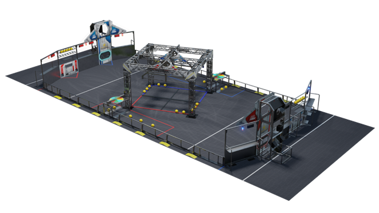

2 Game Overview
###############

In INFINITE RECHARGE\ :sup:`SM`\, two alliances work to protect *FIRST* City from approaching asteroids caused by a distant space skirmish. Each Alliance, along with their trusty droids, race to collect and score Power Cells in order to energize their Shield Generator for maximum protection. To activate stages of the Shield Generator, droids manipulate their Control Panels after scoring a specific number of Power Cells. Near the end of the match, droids race to their Rendezvous Point to get their Shield Generator operational in order to protect the city!

During the 15 second Autonomous Period, droids follow pre-programmed instructions. Alliances score points by:

In the final 2 minutes and 15 seconds of the match, drivers take control of the droids. Alliances score points by:

The Alliance with the highest score at the end of the Match wins.

.. image:: ../game_manual/html_files/image006.png

