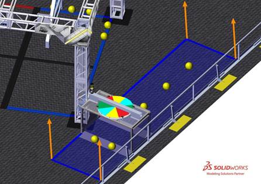
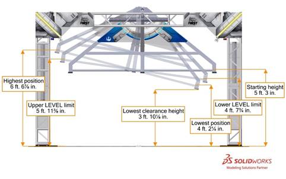

3 ARENA
#######

The ARENA includes all elements of the game infrastructure that are required to play INFINITE RECHARGE\ :sup:`SM`\: the FIELD, POWER CELLS, and all equipment needed for FIELD control, ROBOT control, and scorekeeping.

The ARENA is modular and assembled, used, disassembled, and shipped many times during the competition season. It will undergo wear and tear. The ARENA is designed to withstand rigorous play and frequent shipping. Every effort is made to ensure that ARENAs are consistent from event to event. However, ARENAs are assembled in different venues by different event staff and some small variations occur. For details regarding assembly tolerances, please refer to the `2020 ARENA Layout and Marking Diagram <https://firstfrc.blob.core.windows.net/frc2020/PlayingField/LayoutandMarkingDiagram.pdf>`_ . Successful teams will design ROBOTS that are insensitive to these variations.

Illustrations included in this section are for a general visual understanding of the INFINITE RECHARGE ARENA, and dimensions included in the manual are nominal. Please refer to the official drawings for exact dimensions, tolerances, and construction details. The official drawings, CAD models, and drawings for low-cost versions of important elements of the INFINITE RECHARGE FIELD are posted on the `2020 INFINITE RECHARGE Game & Season Materials page <https://www.firstinspires.org/resource-library/frc/competition-manual-qa-system>`_ on the *FIRST®* website.

3.1 FIELD
*********

Figure 3‑1 INFINITE RECHARGE

Each FIELD for INFINITE RECHARGE is 26 ft. 11¼ in. (~821 cm) by 52 ft. 5¼ in. (~1598 cm) carpeted area bound by and including the inward- and upward-facing surfaces of the guardrails and inward-facing surfaces of the ALLIANCE WALLS (except Chute surfaces and any surface beyond the face of the POWER PORT). It is populated with a SHIELD GENERATOR, TRENCHES, LOADING BAYS, and POWER PORTS.

The SHIELD GENERATOR is located in the center of the FIELD. The SHIELD GENERATOR consists of the structure, the GENERATOR SWITCHES, the BOUNDARIES, and the floor protection.

One (1) Red TRENCH and one (1) Blue TRENCH are located along the guardrail, each spanning the gap between a vertical leg of the SHIELD GENERATOR and the guardrail. Each TRENCH contains a CONTROL PANEL.

One (1) Red POWER PORT and one (1) Blue POWER PORT are located in the ALLIANCE WALLS. The Red POWER PORT is part of the Blue ALLIANCE WALL, and the Blue POWER PORT is part of the Red ALLIANCE WALL.

One (1) Red LOADING BAY and one (1) Blue LOADING BAY are located in their respective ALLIANCE WALLS.

The surface of the FIELD is low pile carpet, Shaw Floors, Philadelphia Commercial, Neyland II 20, “66561 Medallion” (please note that Neyland II carpet is not available for team purchase and the closest equivalent is Neyland III). The edge of the carpet is secured to the venue floor using `3M™ Premium Matte Cloth (Gaffers) Tape (GT2) <http://multimedia.3m.com/mws/media/1217295O/gaffers-tape.pdf>`_ or comparable gaffers tape.

Guardrails form the long edges of the FIELD and are a 1 ft. 7 in. (~48 cm) tall system of transparent polycarbonate supported on the top and bottom by aluminum extrusion. Guardrails, along with the ALLIANCE WALLS, prevent ROBOTS from inadvertently exiting the FIELD during a MATCH. There are four (4) gates in the guardrail that allow access to the FIELD for placement and removal of ROBOTS. The gate passthrough, when open, is 3 ft. 2 in. (~97 cm) wide. Gates are closed and shielded during the MATCH.

Figure 3‑2 Gate locations

There are two versions of guardrails and PLAYER STATIONS used for competitions. One design matches the `2020 Official FIRST FIELD Drawings & Models <https://www.firstinspires.org/robotics/frc/playing-field#FIRSTDrawings>`_ . The other is designed and sold by AndyMark. While the designs are slightly different, the critical dimensions, performance, and expected user experience between the two are the same. Detailed drawings for the AndyMark design are posted on the `AndyMark website <http://www.andymark.com/Field-p/am-2800.htm>`_ . All illustrations in this manual show the traditional FIELD design.

3.2 Zones and Markings
**********************

FIELD Zones and markings of consequence are described below. Unless otherwise specified, the tape used to mark lines and zones throughout the FIELD is 2-in. (~5cm) `3M™ Premium Matte Cloth (Gaffers) Tape (GT2) <http://multimedia.3m.com/mws/media/1217295O/gaffers-tape.pdf>`_ or comparable gaffers tape.

Figure 3‑3 INFINITE RECHARGE FIELD

ALLIANCE STATION: a 30-ft. (~914 cm) wide by 10 ft. 9⅛ in. (~328 cm) to 12 ft. 10⅞ in. (~393 cm) deep infinitely tall volume formed by, and including the ALLIANCE WALL, the edge of the carpet, and ALLIANCE colored tape.

INITIATION LINE: a white tape line spanning the width of the FIELD and located 10 ft. (~305 cm) from the face of PLAYER STATION 2 to the near edge of the tape. An ALLIANCE’S INITIATION LINE is located in the opponent’s SECTOR.

LOADING ZONE: a 5 ft. (~152 cm) wide, 2 ft. 6 in. (~76 cm) deep infinitely tall volume with a triangular base bounded by the LOADING BAY and ALLIANCE colored tape. The LOADING ZONE includes the ALLIANCE colored tape.

RENDEZVOUS POINT: a 5 ft. 6¾ in. (~170 cm) wide, 12 ft. 6¾ in. (~383 cm) deep, infinitely tall volume formed by the ALLIANCE colored BOUNDARIES and the black BOUNDARY pair that divides the Red and the Blue BOUNDARIES. The RENDEZVOUS POINT includes the ALLIANCE colored BOUNDARIES.

Figure 3‑4 Red RENDEZVOUS POINT

SECTOR: A 26 ft. 11¼ in. (~821 cm) wide by 10 ft. 2 in. (~310 cm) deep infinitely tall volume formed by an ALLIANCE’S ALLIANCE WALL, guardrail, and INITIATION LINE. The SECTOR includes the INITIATION LINE.

STARTING LINE: a white tape line spanning the width of the carpet and located 2 ft. 4 in. (~71 cm) from the back of the PLAYER STATION 2 diamond plate panel to the near edge of the tape.

TARGET ZONE: a 4 ft. (~122 cm) wide, 2 ft. 6 in. (~76 cm) deep infinitely tall volume with a triangular base bounded by the POWER PORT and ALLIANCE colored tape. The TARGET ZONE includes the ALLIANCE colored tape.

TRENCH RUN: a 4 ft. 7 ½ in. (~141 cm) wide, 18 ft. (~549 cm) deep, infinitely tall volume that is bounded by the guardrail, the edge of the TRENCH vertical support closest to the center of the FIELD, and ALLIANCE colored tape. The TRENCH RUN includes the ALLIANCE colored tape.

Figure 3‑5 Blue TRENCH RUN

3.3 SHIELD GENERATOR
********************

Figure 3‑6 SHIELD GENERATOR

The SHIELD GENERATOR is a 14 ft. 1½ in. (~431 cm) wide, 15 ft. ¾ in. (~459 cm) deep, and 9 ft. 6½ in. (~291 cm) tall structure located in the center of the field, oriented at a 22.5 degree angle relative to the guardrails. The SHIELD GENERATOR has one (1) GENERATOR SWITCH per ALLIANCE. BOUNDARIES divide the floor of the SHIELD GENERATOR into sections. Spaces between BOUNDARIES include flooring protection to prevent floor damage. All flooring between BOUNDARIES is part of the SHIELD GENERATOR.

3.3.1 SHIELD GENERATOR Structure
================================

The SHIELD GENERATOR structure consists of 1 ft. x 1 ft. (~30 cm x ~30 cm) square truss. The truss structure is 13 ft. 1½ in. (~400 cm) wide, 14 ft. ¾ in. (~429 cm) deep, and 9 ft. 2¼ in. (~280 cm) tall. Each of the four vertical truss legs sits on a base. The baseplate extends 6 in. (~15 cm) from each square face and is ⅛ in. (~3 mm) thick.

Figure 3‑7 SHIELD GENERATOR structure

3.3.2 GENERATOR SWITCH
======================

Each SHIELD GENERATOR has one (1) GENERATOR SWITCH per ALLIANCE. A GENERATOR SWITCH is a 7 ft. 6 in. (~229 cm) wide, 10 ft. 1½ in. deep (~309 cm), and 4 ft. 6 in. (~137 cm) tall assembly that swings from the top of the SHIELD GENERATOR. Each GENERATOR SWITCH has a HANDLE. The HANDLE is a structure that consists of a RUNG and the supporting structure below the horizontal beam of the GENERATOR SWITCH. A RUNG is a 1¼ in. schedule 40 aluminum pipe (1.66 in. (~4 cm) outer diameter) with two (2) exposed 4 ft. 7⅝ in. (~141 cm) long sections. The amount of clearance above the RUNG varies from a minimum of 3½ in (~9 cm) to a maximum of 12 in (~30 cm). For safety, foam corner cushions line the lowest edges of the HANDLE. The HANDLE (green and yellow) and RUNG (yellow) are highlighted in Figure 3‑8 for clarity.

Figure 3‑8 GENERATOR SWITCH

At the start of the MATCH, the top of the RUNG is parallel to and 5 ft 3 in. (~160 cm) above the floor protection carpet. The GENERATOR SWITCH can tilt and rest in different positions depending on the number and location of ROBOTS pulling on the HANDLE. For the purposes of scoring (see `GENERATOR SWITCH Scoring <https://firstfrc.blob.core.windows.net/frc2020/Manual/HTML/2020FRCGameSeasonManual.htm#_GENERATOR_SWITCH_Scoring>`_ ), LEVEL is evaluated by the magnitude of its tilt as shown in Figure 3‑9. The GENERATOR SWITCH is LEVEL if the RUNG is within 8 degrees of horizontal. Hard stops prevent the GENERATOR SWITCH from rotating more than 14.5 degrees in either direction. The rotating portion of the GENERATOR SWITCH has a weight of approximately 93 lbs. (~42 kg) and a center of mass approximately 2 ft. 2 in. (~66 cm) below the center of the shaft from which it is suspended.

Figure 3‑9 GENERATOR SWITCH range of motion. (note: dimensions are to the top of the flooring protection carpet)

ALLIANCE colored stack lights on the SHIELD GENERATOR display information about the status of the ALLIANCE’S GENERATOR SWITCH. See `SHIELD GENERATOR Lighting <https://firstfrc.blob.core.windows.net/frc2020/Manual/HTML/2020FRCGameSeasonManual.htm#AllianceStationSection>`_ for more information.

3.3.3 BOUNDARIES
================

BOUNDARIES are 3 in. (~8 cm) wide, 1 in. (~3 cm) tall steel barriers that divide the area inside the SHIELD GENERATOR into four (4) equal sized rectangles that are 5 ft. 3¾ in. (~162 cm) wide by 5 ft. 10⅞ in. (~180 cm) deep. BOUNDARIES are secured to the carpet using hook fastener which increases the height to approximately 1¹⁄₁₆ in. (~3 cm). The Red and Blue BOUNDARIES feature 1-in. (~3 cm) diameter holes spaced every 1 ft 4½ in. (~42 cm) for staging of POWER CELLS. A pair of black BOUNDARIES divide the Red and Blue RENDEZVOUS POINTS. Each truss base has two shorter steel barriers, black with ALLIANCE colored tape, mounted to them. These barriers are ALLIANCE colored BOUNDARIES.

Figure 3‑10 BOUNDARY dimensions.

A layer of ⅛ in. (~3 mm) thick hardboard is installed on top of the FIELD carpet and covered with another layer of carpet to protect venue flooring. This flooring protection adds approximately ⅜ in. (~10 mm) of height to the this area.

Figure 3‑11 Floor protection cross-section

3.3.4 SHIELD GENERATOR Lighting
===============================

The SHIELD GENERATOR has a set of stack lights for each ALLIANCE which are enabled from the start of the END GAME until five (5) seconds after the MATCH. These lights illuminate when the corresponding GENERATOR SWITCH is LEVEL.

Each half of the SHIELD GENERATOR features three (3) ALLIANCE colored light bars inside of the truss structure.

• The first light bar, inside the vertical truss section adjacent to the ALLIANCE’S TRENCH, turns on once Stage 1 is ACTIVATED.

• The second light bar, inside the vertical truss section closest to the ALLIANCE’S POWER PORT, turns on once Stage 2 is ACTIVATED.

• The third light bar, inside the horizontal truss connecting the two (2) previous truss sections, turns on once Stage 3 is ACTIVATED.

3.4 ALLIANCE STATION
********************

3.4.1 ALLIANCE WALL
===================

The ALLIANCE WALL is the structure that separates ROBOTS from DRIVERS, COACHES, and HUMAN PLAYERS. It consists of three (3) PLAYER STATIONS, the LOADING BAY, and the POWER PORT. ALLIANCE WALLS define the short edges of the FIELD and, along with the guardrails, prevent ROBOTS from exiting the FIELD during the MATCH.

Figure 3‑12 ALLIANCE WALL

3.4.1.1 PLAYER STATION
----------------------

A PLAYER STATION is one (1) of three (3) assigned positions in an ALLIANCE WALL from where a DRIVE TEAM operates their ROBOT. Each PLAYER STATION is made from a 3 ft. (~91 cm) tall diamond plate base topped with a 3 ft. 6 in. (~107 cm) tall transparent plastic sheet and a top rail. An aluminum shelf is attached to each PLAYER STATION to support an OPERATOR CONSOLE. The shelf is 5 ft. 9 in. (~175 cm) wide and 1 ft. ¼ in. (~31 cm) deep. There is a 4 ft. 6 in. (~137 cm) long by 2 in. (nominal) wide strip of hook-and-loop tape (“loop” side) along the center of the support shelf that may be used to secure the OPERATOR CONSOLE to the shelf. PLAYER STATION 1 and PLAYER STATION 3 intersect the guardrail at a 110 degree angle.

Each PLAYER STATION contains the following components for teams:

· FMS hardware and wiring: mostly located below the PLAYER STATION 2 shelf.

3.4.1.2 LOADING BAY
-------------------

Figure 3‑13 LOADING BAY

The LOADING BAY is a 6 ft. 6 in. (~198 cm) tall by 5 ft. (~152 cm) wide structure located between PLAYER STATIONS 2 and 3. HUMAN PLAYERS deliver POWER CELLS through one (1) of the five (5) Chutes in the LOADING BAY.

There are two (2) low Chutes and three (3) high Chutes. Low Chute openings are 3 in. (~8 cm) above the carpet, and high Chute openings are 2 ft. (~61 cm) above the carpet. The high Chutes are adjacent to each other and have a combined width of 2 ft. ¼ in. (~62 cm).

The LOADING BAY also includes two (2) racks for POWER CELL storage. Each rack contains openings for seven (7) POWER CELLS. The racks are 4 ft. 11⅞ in. (~152 cm) and 5 ft. 9⅞ in. (~177 cm) above the carpet.

3.4.1.3 POWER PORT
------------------

Figure 3‑14 POWER PORT

There are two (2) POWER PORTS on the FIELD. The Red POWER PORT is part of the Blue ALLIANCE WALL and the Blue POWER PORT is part of the Red ALLIANCE WALL. Each POWER PORT is a 10 ft. 2¼ in. (~310 cm) tall by 4 ft. (~122 cm) wide (excluding backboards) structure and is located between PLAYER STATIONS 1 and 2. POWER PORTS process POWER CELLS scored in its BOTTOM PORT, OUTER PORT, and INNER PORT.

The BOTTOM PORT is a 10 in. (~25 cm) tall, 2 ft. 10 in. (~86 cm) wide rectangle. The bottom edge is 1 ft. 6 in. (~46 cm) above the carpet.

The OUTER PORT is a regular hexagon that measures 2 ft. 6 in. (~76 cm) in height. The center of the OUTER PORT is 8 ft. 2¼ in. (~249 cm) above the carpet.

The INNER PORT is a 1 ft. 1 in. (~33 cm) diameter circle concentric with and 2 ft. 5¼ in. (~74 cm) behind (i.e. on the ALLIANCE STATION side of) the OUTER PORT. The center is 8 ft. 2¼ in. (~249 cm) above the carpet.

Figure 3‑15 POWER PORT dimensions

Each POWER PORT releases scored POWER CELLS into its CORRAL, and POWER CELLS are recycled back to the FIELD by HUMAN PLAYERS.

The POWER PORT features two (2) polycarbonate backboards, attached on either side of the OUTER PORT, to help prevent POWER CELLS from leaving the FIELD. Backboards are 6 ft. (~183 cm) wide and extend 3 ft. 8 in. (~112 cm) above the PLAYER STATIONS.

Figure 3‑16 Backboard dimensions

Around the OUTER PORT a Phillips Color Kinetics LED Light String is used to indicate the progress towards CAPACITY. The string fills symmetrically starting from the top center and proceeding out, then down. The initial nodes for each Stage (staring from the center) light up in sections that differ depending on the CAPACITY of the current Stage. The bottom four nodes on either side of the OUTER PORT always fill at a rate of one (1) node per POWER CELL scored. Examples are shown in Figure 3‑17.

Figure 3‑17 POWER PORT CAPACITY progress

A Phillips Color Kinetics LED light string around the OUTER PORT indicates CAPACITY progress. The string fills from the top center toward the side bottom nodes and is mirrored on the left and right. Nodes 1-4 and 27-30 fill per POWER CELL scored. Nodes above them light up in sections that differ depending on the CAPACITY of the current stage, as defined in Table 3‑1. A node map is shown in Figure 3‑18.

Table 3‑1 Node pattern per CAPACITY

+----------+-----------------+------------------------+
| CAPACITY | Stage 1         | Stage 2 and 3 nodes ON |
|          |                 |                        |
|          | nodes ON        |                        |
+----------+-----------------+------------------------+
| 1        | 14-17           | 15 and 16              |
+----------+-----------------+------------------------+
| 2        | 11-13 and 18-20 |                        |
+----------+-----------------+------------------------+
| 3        | 9-10 and 21-22  | 14 and 17              |
+----------+-----------------+------------------------+
| 4        | 7-8 and 23-24   |                        |
+----------+-----------------+------------------------+
| 5        | 5-6 and 25-26   | 13 and 18              |
+----------+-----------------+------------------------+
| 6        | 4 and 27        |                        |
+----------+-----------------+------------------------+
| 7        | 3 and 28        | 12 and 19              |
+----------+-----------------+------------------------+
| 8        | 2 and 29        |                        |
+----------+-----------------+------------------------+
| 9        | 1 and 30        | 11 and 20              |
+----------+-----------------+------------------------+
| 10       | N/A             |                        |
+----------+-----------------+------------------------+
| 11       | N/A             | 10 and 21              |
+----------+-----------------+------------------------+
| 12       | N/A             | 9 and 22               |
+----------+-----------------+------------------------+
| 13       | N/A             | 8 and 23               |
+----------+-----------------+------------------------+
| 14       | N/A             | 7 and 24               |
+----------+-----------------+------------------------+
| 15       | N/A             | 6 and 25               |
+----------+-----------------+------------------------+
| 16       | N/A             | 5 and 26               |
+----------+-----------------+------------------------+
| 17       | N/A             | 4 and 27               |
+----------+-----------------+------------------------+
| 18       | N/A             | 3 and 28               |
+----------+-----------------+------------------------+
| 19       | N/A             | 2 and 29               |
+----------+-----------------+------------------------+
| 20       | N/A             | 1 and 30               |
+----------+-----------------+------------------------+

Figure 3‑18 Light string node map

Light strings also indicate other FIELD states as shown in Table 3‑2 and Figure 3‑19.

Table 3‑2 additional POWER PORT Light States

+------------------------+---------------------------------------------------+
| Light State            | Criteria                                          |
+------------------------+---------------------------------------------------+
| Off                    | Outside of a MATCH: FIELD is MATCH ready          |
|                        |                                                   |
|                        | In MATCH: current stage not ACTIVATED             |
+------------------------+---------------------------------------------------+
| Green                  | Head REFEREE has determined FIELD safe for humans |
+------------------------+---------------------------------------------------+
| ALLIANCE color with    | Stage has reached CAPACITY, but not ACTIVATED     |
|                        |                                                   |
| yellow chase pattern   |                                                   |
+------------------------+---------------------------------------------------+
| Entire light string is | All stages ACTIVATED                              |
|                        |                                                   |
| ALLIANCE color         |                                                   |
+------------------------+---------------------------------------------------+

Figure 3‑19: Additional POWER PORT state examples

3.5 TRENCH
**********

Each ALLIANCE has a TRENCH in their TRENCH RUN that spans the gap between the guardrail and SHIELD GENERATOR. On the top of each TRENCH is an ALLIANCE specific CONTROL PANEL and a yellow stack light.

Figure 3‑20 TRENCH

Each TRENCH is a 3 ft. ½ in. (~93 cm) tall, 4 ft. 8 in. (~142 cm) wide, and 3 ft. 5½ in. (~105 cm) deep structure that forms a 4 ft. 4 in. (~132 cm) wide, 2 ft. 4 in. (~71 cm) tall, and 2 ft. 6 in. (~76 cm) deep tunnel. Each TRENCH has two (2) ⅛ in. (~3 mm) thick baseplates. Each baseplate has two (2) 1-in. (~3cm) diameter holes used to stage POWER CELLS. Holes are 1 ft. 6½ in. (~47 cm) apart.

Figure 3‑21 TRENCH dimensions

3.5.1 CONTROL PANEL
===================

A CONTROL PANEL is centered on the top of each TRENCH. The CONTROL PANEL is a 2 in. (~5 cm) tall, 2 ft. 8 in. (~81 cm) diameter disk constructed of two pieces of ¼ in. (~6 mm) thick polycarbonate, spaced apart by ten ½ in. (~13 mm) diameter metal spacers at regular intervals. The centers of the spacers are located 1 in. (~3 cm) in from the outer perimeter of the CONTROL PANEL. The bottom edge of the CONTROL PANEL is located 2 ft. 6¼ in. (~77 cm) above the carpet.

Figure 3‑22 TRENCH and CONTROL PANEL dimensions

The CONTROL PANEL is divided into 8 equal size wedges. Wedges are red, green, blue, and yellow (see Table 3‑3 for CMYK values) and visible from above and below the CONTROL PANEL. Colors are arranged as shown in Figure 3‑23 and line up top and bottom. The arc length of each wedge is 1 ft. ½ in. (~32 cm). Fasteners in the CONTROL PANEL create holes in the colored wedges.

Table 3‑3: CONTROL PANEL color chart

+---------------------+------+---------+--------+-------+
| CONTROL PANEL color | Cyan | Magenta | Yellow | Black |
+---------------------+------+---------+--------+-------+
| Blue                | 100  | 0       | 0      | 0     |
+---------------------+------+---------+--------+-------+
| Green               | 100  | 0       | 100    | 0     |
+---------------------+------+---------+--------+-------+
| Red                 | 0    | 100     | 100    | 0     |
+---------------------+------+---------+--------+-------+
| Yellow              | 0    | 0       | 100    | 0     |
+---------------------+------+---------+--------+-------+

Figure 3‑23 TRENCH bottom view

A swatch of identical material and colors to those on the CONTROL PANEL is in each Black Tote of the `2020 Kickoff Kit <https://www.firstinspires.org/robotics/frc/kit-of-parts#KickoffKit>`_ . The CONTROL PANEL is attached to the TRENCH via a 12 in. (~30 cm) Lazy Susan Bearing (Triangle Manufacturing PN: 12D10346). An identical Lazy Susan Bearing is in each Black Tote of the `2020 Kickoff Kit <https://www.firstinspires.org/robotics/frc/kit-of-parts#KickoffKit>`_ .

Each CONTROL PANEL has two (2) requirements in order to ENERGIZE the SHIELD GENERATOR, see `CONTROL PANEL Scoring <https://firstfrc.blob.core.windows.net/frc2020/Manual/HTML/2020FRCGameSeasonManual.htm#_CONTROL_PANEL_Scoring>`_ for complete details on game play.

· ROTATION CONTROL: Rotate CONTROL PANEL at least three (3) (but no more than five (5)) complete revolutions in the same direction. If the CONTROL PANEL is rotated more than five (5) complete revolutions, the count resets to zero (0). The TRENCH light turns on once Stage 2 CAPACITY is reached (i.e. the CONTROL PANEL is ready for ROTATION CONTROL).

.. note::
    A CONTROL PANEL spun faster than 60
    revolutions per minute may cause FIELD damage. For more details see  `MATCH Replays <https://firstfrc.blob.core.windows.net/frc2020/Manual/HTML/2020FRCGameSeasonManual.htm#_MATCH_Replays>`_  .

Figure 3‑24 CONTROL PANEL ROTATION CONTROL example

· POSITION CONTROL: Rotate CONTROL PANEL so a specified color aligns with the sensor for at least five (5) seconds. Once either ALLIANCE reaches Stage 3 CAPACITY, FMS relays a specified color (randomly selected by FMS and one (1) of the three (3) colors not currently read by the ALLIANCE’S TRENCH color sensor) to all OPERATOR CONSOLES simultaneously. The specified color may not be the same for both ALLIANCES. See Table 3‑4 for details on how the TRENCH light is used during POSTION CONTROL.

.. note::
    Specific
    details on the format of the data can be found on the  `2020 FRC Control System website <https://frc-docs.readthedocs.io/en/latest/docs/software/wpilib-overview/2020-Game-Data.html>`_  .

    In the unlikely event that the sensor isn’t currently reporting
    one (1) of the four (4) colors when Stage 3 reaches CAPACITY (e.g. the sensor
    is positioned where two (2) color wedges meet), FMS will randomly select the
    specified color from one (1) of the four (4) colors.

Each TRENCH has a yellow stack light to indicate CONTROL PANEL status.

Table 3‑4 TRENCH light status

+-------------+------------------------+----------------------------------------------------------------------------------------------------------------------------------------------+
| Light State | SHIELD GENERATOR Stage | Criteria                                                                                                                                     |
+-------------+------------------------+----------------------------------------------------------------------------------------------------------------------------------------------+
| Off         | 1, 2, or 3             | Stage not at CAPACITY or Stage 3 ACTIVATED                                                                                                   |
+-------------+------------------------+----------------------------------------------------------------------------------------------------------------------------------------------+
| Solid       | 2 or 3                 | The POWER PORT is at CAPACITY, the CONTROL PANEL is ready for use                                                                            |
+-------------+------------------------+----------------------------------------------------------------------------------------------------------------------------------------------+
| Flashing    | 2                      | The CONTROL PANEL has rotated the required number for ROTATION CONTROL, but has not yet continuously read a single color for two (2) seconds |
|             +------------------------+----------------------------------------------------------------------------------------------------------------------------------------------+
|             | 3                      | The CONTROL PANEL has read the                                                                                                               |
|             |                        |   required color for POSITION CONTROL for at least three (3) seconds and less                                                                |
|             |                        |   than five (5) seconds1                                                                                                                     |
+-------------+------------------------+----------------------------------------------------------------------------------------------------------------------------------------------+

\ :sup:`1`\ If a color change is detected during the two (2) second period when the stack light is flashing, the light returns to solid and the color detection timer resets to zero (0).

3.6 POWER CELL
**************

Figure 3‑25 POWER CELL

INFINITE RECHARGE is played with POWER CELLS. A POWER CELL is a yellow 7 in. (~18 cm) diameter Medium Bounce Dino-Skin foam ball. The *FIRST* logo is printed on each ball in black ink. The ball is made by Flaghouse (PN 1892 YEL) and sold by AndyMark (PN AM-4200). A POWER CELL is in each Black Tote of the `2020 Kickoff Kit <https://www.firstinspires.org/robotics/frc/kit-of-parts#KickoffKit>`_ .

3.7 Vision Targets
******************

Vision targets made from 2 in. (~5 cm) wide strips of 3M 8830 Scotchlite\ :sup:`TM`\ Reflective Material are located on the POWER PORTS and LOADING BAYS. On the POWER PORT, they target the location of the INNER and OUTER PORTS and trace the bottom perimeter of the OUTER PORT. The target has an overall height of 1 ft. 5 in. (~43 cm), and a width of 3 ft. 3¼ in. (~100 cm). The bottom of the target is 6 ft. 9¼ in. (~206 cm) above the carpet. A strip of 3M 8830 Scotchlite\ :sup:`TM`\ Reflective Material is in *FIRST* Choice.

Figure 3‑26 POWER PORT Vision Target

The LOADING BAY target is a 7 in. (~18 cm) wide by 11 in. (~28 cm) tall rectangle. The target is centered on the width of the LOADING BAY and located 11 in. (~28 cm) above the carpet.

Figure 3‑27 LOADING BAY Vision Target

3.8 The FIELD Management System
*******************************

The Field Management System (FMS) is the electronics core responsible for sensing and controlling the *FIRST* Robotics Competition FIELD. The FMS encompasses all FIELD electronics, including computers, REFEREE touchscreens, wireless access point, sensors, stack lights, E-Stops, etc.

When a DRIVE TEAM connects the Ethernet cable from their assigned PLAYER STATION to their OPERATOR CONSOLE, the Driver Station software on the OPERATOR CONSOLE computer will communicate with FMS. Once connected, the open ports available are described in Table 3‑5.

Table 3‑5 Open FMS Ports

+-------------------+-----------------------------------------------------------------------------------------------------+-----------------+
| Port              | Designation                                                                                         | Bi-directional? |
+-------------------+-----------------------------------------------------------------------------------------------------+-----------------+
| UDP/TCP 1180-1190 | Camera data from the roboRIO to the Driver Station when the camera is connected the roboRIO via USB | Yes             |
+-------------------+-----------------------------------------------------------------------------------------------------+-----------------+
| TCP 1735          | SmartDashboard                                                                                      | Yes             |
+-------------------+-----------------------------------------------------------------------------------------------------+-----------------+
| UDP 1130          | Dashboard-to-ROBOT control data                                                                     | Yes             |
+-------------------+-----------------------------------------------------------------------------------------------------+-----------------+
| UDP 1140          | ROBOT-to-Dashboard status                                                                           | Yes             |
|                   |   data                                                                                              |                 |
+-------------------+-----------------------------------------------------------------------------------------------------+-----------------+
| HTTP 80           | Camera connected via switch on                                                                      | Yes             |
|                   |   the ROBOT                                                                                         |                 |
+-------------------+-----------------------------------------------------------------------------------------------------+-----------------+
| HTTP 443          | Camera connected via switch on the ROBOT                                                            | Yes             |
+-------------------+-----------------------------------------------------------------------------------------------------+-----------------+
| UDP/TCP 554       | Real-Time Streaming Protocol for h.264 camera streaming                                             | Yes             |
+-------------------+-----------------------------------------------------------------------------------------------------+-----------------+
| UDP/TCP 1250      | CTRE Diagnostics Server                                                                             | Yes             |
+-------------------+-----------------------------------------------------------------------------------------------------+-----------------+
| UDP/TCP 5800-5810 | Team use                                                                                            | Yes             |
+-------------------+-----------------------------------------------------------------------------------------------------+-----------------+

Teams may use these ports as they wish if they do not employ them as outlined above (e.g. TCP 1180 can be used to pass data back and forth between the ROBOT and the Driver Station software if the team chooses not to use the camera on USB). Note that ROBOT code cannot be deployed while connected to the FMS. Additional information about the FMS may be found in the `FMS Whitepaper <https://wpilib.screenstepslive.com/s/currentCS/m/troubleshooting/l/705152-fms-whitepaper>`_ .

The FMS provides the specified color for POSITION CONTROL to the Driver Station software, see `CONTROL PANEL <https://firstfrc.blob.core.windows.net/frc2020/Manual/HTML/2020FRCGameSeasonManual.htm#_CONTROL_PANEL>`_ for additional details.

.. note::
    While FMS provides
    the specified color for POSITION CONTROL to each team’s Driver Station, teams
    must write the necessary ROBOT code to make use of the information during a
    MATCH.

FMS alerts participants to milestones in the MATCH using audio cues detailed in Table 3‑6. Please note that audio cues are intended as a courtesy to participants and not intended as official MATCH markers. If there is a discrepancy between an audio cue and the FIELD timers, the FIELD timers are the authority.

Table 3‑6 Audio cues

+---------------------------+-----------------+------------------+
| Event                     | Timer Value     | Audio Cue        |
+---------------------------+-----------------+------------------+
| MATCH Start               | 0:15 (for AUTO) | “Cavalry Charge” |
+---------------------------+-----------------+------------------+
| AUTO Ends                 | 0:00 (for AUTO) | “Buzzer”         |
+---------------------------+-----------------+------------------+
| TELEOP Begins             | 2:15            | “Three Bells”    |
+---------------------------+-----------------+------------------+
| ENDGAME warning           | 0.30            | “Imperial Alarm” |
+---------------------------+-----------------+------------------+
| MATCH End                 | 0:00            | “Buzzer”         |
+---------------------------+-----------------+------------------+
| MATCH Stopped             | n/a             | “Foghorn”        |
+---------------------------+-----------------+------------------+
| ROTATION CONTROL complete | n/a             | “Whirring”       |
+---------------------------+-----------------+------------------+
| POSITION CONTROL complete | n/a             | “Charging Up”    |
+---------------------------+-----------------+------------------+

