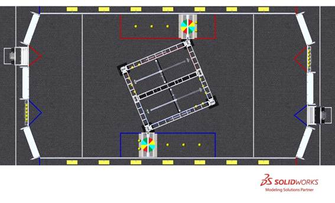
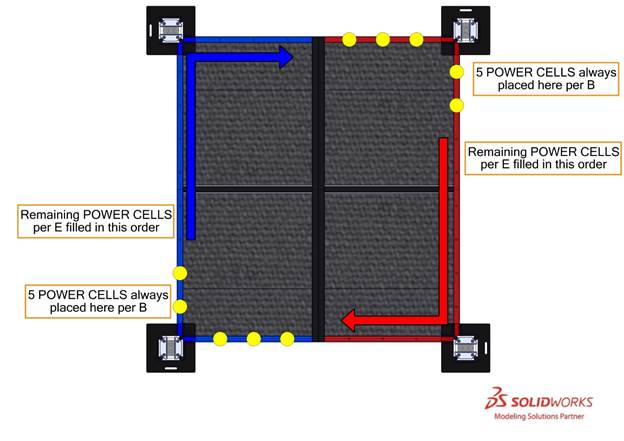

4 MATCH Play
############

During INFINITE RECHARGE\ :sup:`SM`\, two (2) ALLIANCES (an ALLIANCE is a cooperative of up to four (4) *FIRST* Robotics Competition teams) play MATCHES, set up and executed per the details described below.

4.1 Setup
*********

4.1.1 POWER CELLS
=================

Forty-eight (48) POWER CELLS are staged as follows:

A. five (5) POWER CELLS in each of the two (2) TRENCH RUNS

i. two (2) POWER CELLS are placed on each of the TRENCH baseplates further away from the center of the FIELD.

ii. three (3) POWER CELLS are placed centered in the width of each TRENCH RUN, spaced at 3-ft. (~91 cm) intervals. Small rings are used to keep them in place prior to the start of a match. Rings are ⅛ in. (~3 mm) thick, 1¾ in. (~4 cm) diameter O-rings (McMaster Item#: 9452K63). Rings are secured to the carpet by tape.

B. five (5) POWER CELLS placed on the BOUNDARIES inside each ALLIANCE’S RENDEZVOUS POINT as shown in Figure 4‑2.

C. five (5) POWER CELLS on the racks in each ALLIANCE STATION’S LOADING BAY,

D. each of the three (3) teams may preload up to three (3) POWER CELLS in their ROBOT, such that they are fully and solely supported by that ROBOT, and

E. remaining POWER CELLS (zero (0) to nine (9) per ALLIANCE, depending on decisions made in D) in the holes on the BOUNDARIES in the corresponding ALLIANCE’S RENDEZVOUS POINT as shown in Figure 4‑2.

Figure 4‑1: POWER CELL Setup

Figure 4‑2: POWER CELL setup on BOUNDARIES

4.1.2 ROBOTS
============

Each TEAM stages their ROBOT such that at least part of its BUMPERS are intersecting the infinite vertical volume created by the corresponding ALLIANCE’S INITIATION LINE.

If order placement matters to either or both ALLIANCES, the ALLIANCE must notify the Head REFEREE during setup for that MATCH. Upon notification, the Head REFEREE will require ALLIANCES to alternate placement of all ROBOTS. In a Qualification MATCH, ROBOTS are placed in the following order: Red Station 1 ROBOT, Blue Station 1 ROBOT, Red Station 2 ROBOT, Blue Station 2 ROBOT, Red Station 3 ROBOT, Blue Station 3 ROBOT. In a PLAYOFF MATCH, the same pattern is applied, but instead of Blue ALLIANCE placing last, the higher seeded ALLIANCE (regardless of color) places last.

4.1.3 Humans
============

DRIVERS, COACHES, and HUMAN PLAYERS stage behind the STARTING LINE inside their ALLIANCE STATION. TECHNICIANS stage in the event-designated area near the FIELD.

4.2 Autonomous Period
*********************

The first phase of each MATCH is called Autonomous (AUTO) and consists of the first fifteen (0:15) seconds. During AUTO, ROBOTS operate without any DRIVE TEAM control or input. ROBOTS attempt to score POWER CELLS in POWER PORTS, retrieve additional POWER CELLS from around the FIELD, and exit the infinite vertical volume created by the corresponding ALLIANCE’S INITIATION LINE any time before the end of the phase.

4.3 Teleoperated Period
***********************

The second phase of each MATCH is called the Teleoperated Period (TELEOP) and consists of the remaining two minutes and fifteen seconds (2:15). During this phase, DRIVERS remotely operate ROBOTS to retrieve and score POWER CELLS in goals and manipulate CONTROL PANELS to ACTIVATE different stages of the SHIELD GENERATOR.

The final thirty (0:30) seconds of TELEOP is the ENDGAME, during which ROBOTS attempt to ENERGIZE the SHIELD GENERATOR.

4.4 Scoring
***********

ALLIANCES are rewarded for accomplishing various actions through the course of a MATCH, including ROBOT movement during AUTO, scoring POWER CELLS in POWER PORTS, manipulating CONTROL PANELS, ACTIVATING stages of the SHIELD GENERATOR, ENERGIZING the SHIELD GENERATOR, and winning or tying MATCHES.

Rewards are granted via either MATCH points (which contribute to the ALLIANCE’S MATCH score) or Ranking Points (which increase the measure used to rank teams in the Qualification Tournament). Such actions, their criteria for completion, and their point values are listed in Table 4‑2.

All scores, except ENDGAME bonuses, are assessed and updated throughout the MATCH.

4.4.1 POWER PORT Scoring
========================

ALLIANCES generate energy by scoring POWER CELLS into one of three (3) openings of their POWER PORT. To be considered scored, the POWER CELL must pass through the BOTTOM, OUTER, or INNER PORTS and exit through the respective scoring sensors during the MATCH or within five (5) seconds after the MATCH (regardless of how many POWER CELLS are being processed after the end of the MATCH).

If a POWER CELL becomes jammed in the BOTTOM, INNER, or OUTER PORT, credit for the jammed POWER CELL is granted in the period during which the POWER CELL became stuck.

Lights on the POWER PORT indicate progress towards the CAPACITY of the current Stage of the SHIELD GENERATOR. See `POWER PORT <https://firstfrc.blob.core.windows.net/frc2020/Manual/HTML/2020FRCGameSeasonManual.htm#_POWER_PORT>`_ for more details.

The final assessment of POWER CELLS scored in POWER PORTS is made five (5) seconds after the ARENA timer displays zero (0) following AUTO and TELEOP, respectively.

.. note::
    POWER CELLS
    scored during the five (5) seconds after the ARENA timer displays zero (0)
    following AUTO earn AUTO points and, if STAGE 1 has been ACTIVATED, count
    towards STAGE 2 CAPACITY.

4.4.2 SHIELD GENERATOR Scoring
==============================

The SHIELD GENERATOR stores energy generated by scored POWER CELLS. ALLIANCES work to make the SHIELD GENERATOR OPERATIONAL and ENERGIZED in order to protect *FIRST* City.

The SHIELD GENERATOR has three (3) stages that need to be charged to CAPACITY and ACTIVATED consecutively. CAPACITY is the number of POWER CELLS, defined in Table 4‑1, that must be scored to charge each stage. Each POWER CELL, regardless of the POWER PORT opening in which it scores, counts equally toward CAPACITY.

Table 4‑1: SHIELD GENERATOR ACTIVATION requirements

+-------+----------+------------------------------------------------------------------------------+
| Stage | CAPACITY | ACTIVATED when…                                                              |
+-------+----------+------------------------------------------------------------------------------+
| 1     | 9        | nine (9) POWER CELLS are scored & TELEOP has begun                           |
+-------+----------+------------------------------------------------------------------------------+
| 2     | 20       | twenty (20) POWER CELLS are scored in Stage 2 & ROTATION CONTROL is complete |
+-------+----------+------------------------------------------------------------------------------+
| 3     | 20       | twenty (20) POWER CELLS are scored in Stage 3 & POSITION CONTROL is complete |
+-------+----------+------------------------------------------------------------------------------+

.. note::
    As the season
    progresses, the CAPACITY required for each Stage of the SHIELD GENERATOR may
    increase. While Stage CAPACITY will not change between weeks of Regional or
    District Competition play, the Stage CAPACITY may be changed for District
    Championship and/or  *FIRST*  Championship play. Teams will be notified of
    changes in Stage CAPACITY no later than the scheduled Team Update prior to the
    date of the event.

POWER CELLS scored after a stage is at CAPACITY generate MATCH points but do not contribute to the next stage’s CAPACITY. POWER CELLS scored after Stage 3 is ACTIVATED continue to generate MATCH points.

SHIELD GENERATOR lights indicate ACTIVATED Stages. See `SHIELD GENERATOR Lighting <https://firstfrc.blob.core.windows.net/frc2020/Manual/HTML/2020FRCGameSeasonManual.htm#AllianceStationSection>`_ for more details.

4.4.3 CONTROL PANEL Scoring
===========================

CONTROL PANELS ACTIVATE SHIELD GENERATOR stages two (2) and three (3) as described in `CONTROL PANEL <https://firstfrc.blob.core.windows.net/frc2020/Manual/HTML/2020FRCGameSeasonManual.htm#_CONTROL_PANEL>`_ . CONTROL PANEL requirements (i.e. ROTATION CONTROL AND POSITION CONTROL) are not evaluated until the respective stage is at CAPACITY. A stage may be ACTIVATED once it reaches CAPACITY, and a stage must be ACTIVATED before the next stage can begin charging.

Once all three (3) stages are ACTIVATED, the SHIELD GENERATOR is ENERGIZED (the SHIELD GENERATOR does not need to be OPERATIONAL to be ENERGIZED and vice versa.)

4.4.4 GENERATOR SWITCH Scoring
==============================

ALLIANCES use their GENERATOR SWITCH to earn MATCH Points and make the SHIELD GENERATOR OPERATIONAL.

A ROBOT is considered PARKED if, five (5) seconds after the ARENA timer displays zero (0) following TELEOP, it is fully supported (either directly or transitively) by the SHIELD GENERATOR and not in contact with any carpet outside its ALLIANCE’S RENDEZVOUS POINT, but without having met the criteria for HANGING.

A ROBOT is considered HANGING if, five (5) seconds after the ARENA timer displays zero (0) following TELEOP, it is fully supported (either directly or transitively) by its GENERATOR SWITCH.

A GENERATOR SWITCH is considered LEVEL if, five (5) seconds after the ARENA timer displays zero (0) following TELEOP, both following criteria are met:

The final assessment of a LEVEL GENERATOR SWITCH and HANGING or PARKED ROBOTS is made five (5) seconds after the ARENA timer displays zero (0) following TELEOP, at which point the Audience Display stops updating and the lights on the SHIELD GENERATOR flash three (3) times.

The SHIELD GENERATOR is considered to be OPERATIONAL when the ALLIANCE’S ENDGAME SCORE is ≥ 65 points.

4.4.5 Point Values
==================

Point values for tasks in INFINITE RECHARGE are detailed in Table 4‑2.

Table 4‑2: Point Values

+------------------------------+---------------------------------------------------------------------------------------------------------------------------------------+------+--------+-----------------+
| Award                        | Awarded for…                                                                                                                          | AUTO | TELEOP | Qual.           |
+------------------------------+---------------------------------------------------------------------------------------------------------------------------------------+------+--------+-----------------+
| INITIATION LINE              | exit the infinite vertical volume created by the corresponding ALLIANCE’S INITIATION LINE any time before the end of AUTO (per ROBOT) | 5    | -      | -               |
+------------------------------+---------------------------------------------------------------------------------------------------------------------------------------+------+--------+-----------------+
| POWER CELLS                  | scored in BOTTOM PORT                                                                                                                 | 2    | 1      | -               |
|                              +---------------------------------------------------------------------------------------------------------------------------------------+------+--------+-----------------+
|                              | scored in OUTER PORT                                                                                                                  | 4    | 2      | -               |
|                              +---------------------------------------------------------------------------------------------------------------------------------------+------+--------+-----------------+
|                              | scored in INNER PORT                                                                                                                  | 6    | 3      | -               |
+------------------------------+---------------------------------------------------------------------------------------------------------------------------------------+------+--------+-----------------+
| CONTROL PANEL                | ROTATION CONTROL                                                                                                                      | -    | 10     | -               |
|                              +---------------------------------------------------------------------------------------------------------------------------------------+------+--------+-----------------+
|                              | POSITION CONTROL                                                                                                                      |      | 20     |                 |
+------------------------------+---------------------------------------------------------------------------------------------------------------------------------------+------+--------+-----------------+
| ENDGAME Points               | HANG (per ROBOT)                                                                                                                      | -    | 25     | -               |
|                              +---------------------------------------------------------------------------------------------------------------------------------------+------+--------+-----------------+
|                              | PARK (per ROBOT)                                                                                                                      | -    | 5      | -               |
|                              +---------------------------------------------------------------------------------------------------------------------------------------+------+--------+-----------------+
|                              | LEVEL with 1-3 ROBOTS HANGING (per ALLIANCE)                                                                                          |      | 15     |                 |
+------------------------------+---------------------------------------------------------------------------------------------------------------------------------------+------+--------+-----------------+
| SHIELD GENERATOR OPERATIONAL | earning at least sixty-five (65) ENDGAME points                                                                                       |      |        | 1 Ranking Point |
+------------------------------+---------------------------------------------------------------------------------------------------------------------------------------+------+--------+-----------------+
| SHIELD GENERATOR ENERGIZED   | Stage 3 ACTIVATED                                                                                                                     | -    | -      | 1 Ranking Point |
+------------------------------+---------------------------------------------------------------------------------------------------------------------------------------+------+--------+-----------------+
| Tie                          | Completing a MATCH with the same number of points as your opponent                                                                    | -    | -      | 1 Ranking Point |
+------------------------------+---------------------------------------------------------------------------------------------------------------------------------------+------+--------+-----------------+
| Win                          | Completing a MATCH with more points than your opponent                                                                                | -    | -      | 2 Ranking Point |
+------------------------------+---------------------------------------------------------------------------------------------------------------------------------------+------+--------+-----------------+

An ALLIANCE can earn up to four (4) Ranking Points (RP) per Qualification MATCH, as described in Table 4‑2. There are no RP, or comparable point bonuses, in Playoff MATCHES.

4.5 Rule Violations
*******************

Upon a rule violation, one or more of the penalties listed in Table 4‑3 will be assessed.

Table 4‑3 Rule violations

+--------------+---------------------------------------------------------------------------------------------------------------------------------------------------------------------------------------------------+
| Penalty      | Description                                                                                                                                                                                       |
+--------------+---------------------------------------------------------------------------------------------------------------------------------------------------------------------------------------------------+
| FOUL         | a credit of three (3) points towards the opponent’s MATCH score                                                                                                                                   |
+--------------+---------------------------------------------------------------------------------------------------------------------------------------------------------------------------------------------------+
| TECH FOUL    | a credit of fifteen (15) points toward the opponent’s MATCH score                                                                                                                                 |
+--------------+---------------------------------------------------------------------------------------------------------------------------------------------------------------------------------------------------+
| YELLOW CARD  | a warning issued by the Head REFEREE for egregious ROBOT                                                                                                                                          |
|              |   or team member behavior or rule violations. A subsequent YELLOW CARD within                                                                                                                     |
|              |   the same tournament phase results in a RED CARD.                                                                                                                                                |
+--------------+---------------------------------------------------------------------------------------------------------------------------------------------------------------------------------------------------+
| RED CARD     | a penalty assessed for egregious ROBOT or team member                                                                                                                                             |
|              |   behavior or rule violations which results in a team being DISQUALIFIED for                                                                                                                      |
|              |   the MATCH.                                                                                                                                                                                      |
+--------------+---------------------------------------------------------------------------------------------------------------------------------------------------------------------------------------------------+
| DISABLED     | ROBOT is commanded to deactivate all outputs, rendering                                                                                                                                           |
|              |   the ROBOT inoperable for the remainder of the MATCH.                                                                                                                                            |
+--------------+---------------------------------------------------------------------------------------------------------------------------------------------------------------------------------------------------+
| DISQUALIFIED | the state of a team in which they receive zero (0) MATCH points and zero (0) Ranking Points in a Qualification MATCH or causes their ALLIANCE to receive zero (0) MATCH points in a Playoff MATCH |
+--------------+---------------------------------------------------------------------------------------------------------------------------------------------------------------------------------------------------+

Some rule violations escalate if the REFEREE determines an action was “repeated.” While there’s no official *FIRST* Robotics Competition definition of repeated, it’s meant to apply to rule violations that occur more than once within a MATCH.

The official *FIRST* Robotics Competition definition of momentary is fewer than three (3) seconds. The intent of using this word is to provide a reference for our community. It is not the intent for REFEREES to provide a count for these time periods.

See `YELLOW and RED CARDS <https://firstfrc.blob.core.windows.net/frc2020/Manual/HTML/2020FRCGameSeasonManual.htm#YellowandRedCardsSection>`_ for additional details.

4.5.1 Violation Details
=======================

There are several styles of violation wording used in this manual. Below are some example violations and a clarification of the way the violation would be assessed. The examples shown do not represent all possible violations, but rather a representative set of combinations.

Table 4‑4: Violation Examples

+------------------------------------------------------------------------------------------------------------+--------------------------------------------------------------------------------------------------------------------------------------------------------------------------------------------------------------------------------------------------------------------------------------------------------------------------------------------------------------------------------------------------------------------------------------------------------------------------------------+
| Example Violation                                                                                          | Expanded Interpretation                                                                                                                                                                                                                                                                                                                                                                                                                                                              |
+------------------------------------------------------------------------------------------------------------+--------------------------------------------------------------------------------------------------------------------------------------------------------------------------------------------------------------------------------------------------------------------------------------------------------------------------------------------------------------------------------------------------------------------------------------------------------------------------------------+
| FOUL                                                                                                       | Upon violation, a FOUL is assessed against the violating ALLIANCE                                                                                                                                                                                                                                                                                                                                                                                                                    |
+------------------------------------------------------------------------------------------------------------+--------------------------------------------------------------------------------------------------------------------------------------------------------------------------------------------------------------------------------------------------------------------------------------------------------------------------------------------------------------------------------------------------------------------------------------------------------------------------------------+
| TECH FOUL and YELLOW CARD                                                                                  | Upon violation, a TECH FOUL is assessed against the violating ALLIANCE. After the MATCH, the Head REFEREE presents the violating team with a YELLOW CARD.                                                                                                                                                                                                                                                                                                                            |
+------------------------------------------------------------------------------------------------------------+--------------------------------------------------------------------------------------------------------------------------------------------------------------------------------------------------------------------------------------------------------------------------------------------------------------------------------------------------------------------------------------------------------------------------------------------------------------------------------------+
| FOUL, if contact with an opponent TECH FOUL                                                                | Upon violation, a FOUL is assessed against the violating ALLIANCE. If the secondary condition is additionally met at any point while still in violation of the rule, in this case contact is made with an opponent ROBOT, a TECH FOUL is additionally assessed against the violating ALLIANCE.                                                                                                                                                                                       |
+------------------------------------------------------------------------------------------------------------+--------------------------------------------------------------------------------------------------------------------------------------------------------------------------------------------------------------------------------------------------------------------------------------------------------------------------------------------------------------------------------------------------------------------------------------------------------------------------------------+
| FOUL per additional POWER CELL. If egregious, YELLOW CARD                                                  | Upon violation, a number of FOULS are assessed against the violating ALLIANCE equal to the number of additional POWER CELLS beyond the permitted quantity. Additionally, if the REFEREES determine that the action was egregious, the Head REFEREE presents the violating team with a YELLOW CARD after the MATCH.                                                                                                                                                                   |
+------------------------------------------------------------------------------------------------------------+--------------------------------------------------------------------------------------------------------------------------------------------------------------------------------------------------------------------------------------------------------------------------------------------------------------------------------------------------------------------------------------------------------------------------------------------------------------------------------------+
| TECH FOUL, plus an additional TECH FOUL for every five (5) seconds in which the situation is not corrected | Upon violation, a TECH FOUL is assessed against the violating ALLIANCE and the REFEREE begins to count. Their count continues until the criteria to discontinue the count are met, and for each five (5) seconds within that time, an additional TECH FOUL is assessed against the violating ALLIANCE. A ROBOT in violation of this type of rule for fifteen (15) seconds would receive a total of four (4) TECH FOULS (assuming no other rules were simultaneously being violated). |
+------------------------------------------------------------------------------------------------------------+--------------------------------------------------------------------------------------------------------------------------------------------------------------------------------------------------------------------------------------------------------------------------------------------------------------------------------------------------------------------------------------------------------------------------------------------------------------------------------------+
| RED CARD for the ALLIANCE                                                                                  | After the MATCH, the Head REFEREE presents the violating ALLIANCE with a RED CARD in the following fashion:                                                                                                                                                                                                                                                                                                                                                                          |
|                                                                                                            |                                                                                                                                                                                                                                                                                                                                                                                                                                                                                      |
|                                                                                                            | a)                                                                                                                                                                                                                                                                                                                                                                                                                                                                                   |
|                                                                                                            |   In a PLAYOFF MATCH, a single RED CARD is assessed to the ALLIANCE.                                                                                                                                                                                                                                                                                                                                                                                                                 |
|                                                                                                            | b)                                                                                                                                                                                                                                                                                                                                                                                                                                                                                   |
|                                                                                                            |   In all other scenarios, each team on the ALLIANCE is issued a RED CARD.                                                                                                                                                                                                                                                                                                                                                                                                            |
+------------------------------------------------------------------------------------------------------------+--------------------------------------------------------------------------------------------------------------------------------------------------------------------------------------------------------------------------------------------------------------------------------------------------------------------------------------------------------------------------------------------------------------------------------------------------------------------------------------+

4.6 DRIVE TEAM
**************

A DRIVE TEAM is a set of up to five (5) people from the same *FIRST* Robotics Competition team responsible for team performance for a specific MATCH. There are four (4) specific roles on a DRIVE TEAM which ALLIANCES can use to assist ROBOTS with INFINITE RECHARGE.

.. note::
    The intent of the
    definition of DRIVE TEAM and DRIVE TEAM related rules is that, barring
    extenuating circumstances, the DRIVE TEAM consists of people who arrived at the
    event affiliated with that team and are responsible for their team’s and
    ROBOT’S performance at the event (this means a person may be affiliated with
    more than one (1) team). The intent is not to allow teams to “adopt” members of
    other teams for strategic advantage for the loaning team, borrowing team,
    and/or their ALLIANCE (e.g. an ALLIANCE CAPTAIN believes one of their DRIVERS
    has more experience than a DRIVER on their 1st pick, and the teams agree the
    1st pick team will “adopt” that DRIVER and make them a member of their DRIVE
    TEAM for Playoffs).

    The definition
    isn’t stricter for two (2) main reasons. First, to avoid additional
    bureaucratic burden on teams and event volunteers (e.g. requiring that teams
    submit official rosters that Queuing must check before allowing a DRIVE TEAM
    into the ARENA). Second, to provide space for exceptional circumstances that
    give teams the opportunity to display Gracious Professionalism (e.g. a bus is
    delayed, a COACH has no DRIVERS, and their pit neighbors agree to help by
    loaning student DRIVERS as temporary members of the team until their bus
    arrives).

Table 4‑5 DRIVE TEAM roles

+--------------+-------------------------------------------------------------------------+------------+---------------------------------------------------------+
| Role         | Description                                                             | Max./      | Criteria                                                |
|              |                                                                         |            |                                                         |
|              |                                                                         | DRIVE TEAM |                                                         |
+--------------+-------------------------------------------------------------------------+------------+---------------------------------------------------------+
| COACH        | a guide or advisor                                                      | 1          | Pre-college student or adult mentor                     |
|              |                                                                         |            |                                                         |
|              |                                                                         |            | Must wear “COACH” button                                |
+--------------+-------------------------------------------------------------------------+------------+---------------------------------------------------------+
| DRIVER       | an operator and controller of the ROBOT                                 | 3          | Pre-college student                                     |
+--------------+-------------------------------------------------------------------------+            |                                                         |
| HUMAN PLAYER | a POWER CELL                                                            |            | Must wear one (1) of the three (3) “DRIVE TEAM” buttons |
|              |   manager                                                               |            |                                                         |
+--------------+-------------------------------------------------------------------------+------------+---------------------------------------------------------+
| TECHNICIAN   | a resource for ROBOT troubleshooting, setup, and removal from the FIELD | 1          | Pre-college student                                     |
|              |                                                                         |            |                                                         |
|              |                                                                         |            | Must wear “TECHNICIAN” button                           |
+--------------+-------------------------------------------------------------------------+------------+---------------------------------------------------------+

.. note::
    The TECHNICIAN
    provides teams with a technical resource for pre-MATCH setup, ROBOT
    connectivity, OPERATOR CONSOLE troubleshooting, and post-MATCH removal of the ROBOT.
    Some pre-MATCH responsibilities for the TECHNICIAN may include, but are not
    limited to:

    ·        
    location of the ROBOT radio, its power
    connection, and understanding of its indicator lights

    ·        
    location of the roboRIO and
    understanding of its indicator lights

    ·        
    username and password for the OPERATOR
    CONSOLE

    ·        
    restarting the Driver Station and
    Dashboard software on the OPERATOR CONSOLE

    ·        
    changing the bandwidth utilization
    (e.g. camera resolution, frame rate, etc.)

    ·        
    changing a battery

    ·        
    charging pneumatics

    While the TECHNICIAN
    may be the primary technical member of the DRIVE TEAM, all members of the DRIVE
    TEAM are encouraged to have knowledge of the basic functionality of the ROBOT,
    such as the location and operation of the main circuit breaker, connecting and
    resetting joysticks or gamepads from the OPERATOR CONSOLE, and removing the ROBOT
    from the FIELD.

4.7 Other Logistics
*******************

POWER CELLS that leave the FIELD are placed back into the FIELD approximately at the point of exit by FIELD STAFF (REFEREES, FTAS, or other staff working around the FIELD) at the earliest safe opportunity.

.. note::
    Note that ROBOTS
    may not deliberately cause POWER CELLS to leave
    the FIELD (see G7).

An ARENA FAULT is not called for MATCHES that accidentally begin with an incorrect number of, incorrectly positioned, or damaged POWER CELLS. Damaged POWER CELLS are not replaced until the next ARENA reset period. DRIVE TEAMS should alert the FIELD STAFF to any missing or damaged POWER CELLS prior to the start of the MATCH.

Once the MATCH is over and the Head REFEREE determines that the FIELD is safe for FIELD STAFF and DRIVE TEAMS, they or their designee change the LED lights to green and DRIVE TEAMS may retrieve their ROBOT.

In addition to the two minutes and thirty seconds (2:30) of game play, each MATCH also has pre- and post-MATCH time for setup and reset of the ARENA. During ARENA reset, the ARENA is cleared of ROBOTS and OPERATOR CONSOLES from the MATCH that just ended. The ROBOTS and OPERATOR CONSOLES for the subsequent MATCH are loaded into the ARENA by DRIVE TEAMS at this time. FIELD STAFF also use this time to reset ARENA elements and POWER CELLS.

.. image:: ../game_manual/html_files/image006.png

