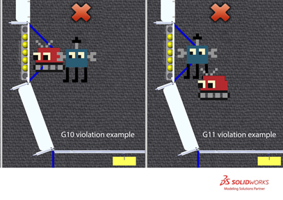

7 Game Rules: ROBOTS
####################

7.1 Before/After the MATCH
**************************

**G1.** Know your ROBOT setup. When placed on the FIELD for a MATCH, each ROBOT must be:

**A.** in compliance with all ROBOT rules, i.e. has passed Inspection (for exceptions regarding Practice MATCHES, see `Inspection & Eligibility Rules <https://firstfrc.blob.core.windows.net/frc2020/Manual/HTML/2020FRCGameSeasonManual.htm#_Toc524785446>`_ ),

**B.** the only team-provided item left on the FIELD by the DRIVE TEAM,

**C.** confined to its STARTING CONFIGURATION,

**D.** positioned such that its BUMPERS are intersecting the infinite vertical volume created by the corresponding ALLIANCE’S INITIATION LINE, and

**E.** fully and solely supporting not more than three (3) POWER CELLS (as described in `Setup <https://firstfrc.blob.core.windows.net/frc2020/Manual/HTML/2020FRCGameSeasonManual.htm#SetupSection>`_ .)

Violation: If fix is a quick remedy, the MATCH won’t start until all requirements are met. If it is not a quick remedy the offending ROBOT will be DISABLED and, at the discretion of the Head REFEREE, must be re-inspected.

.. note::
    Teams are
    encouraged to position ROBOTS such that it is clear to REFEREES that G1-D is not violated.

    If a ROBOT is
    BYPASSED prior to the start of the MATCH, the DRIVE TEAM may not remove the
    ROBOT from the FIELD without permission from the Head REFEREE or the  *FIRST* 
    Technical Advisor (FTA).

**G2.** Teams may not enable their ROBOTS on the FIELD. Teams may not tether to the ROBOT while on the FIELD except in special circumstances (e.g. during TIMEOUTS, after Opening Ceremonies, before an immediate MATCH replay, etc.) and with the express permission from the FTA or a REFEREE.

Violation: YELLOW CARD.

.. note::
    FMS will not enable ROBOTS after the conclusion of the MATCH.

    Tethering includes any wired or wireless connection used to
    electrically energize and/or control elements on the ROBOT. The safety of teams
    and volunteers in close proximity to ROBOTS and ARENA elements on the FIELD is
    of the utmost importance, therefore ROBOTS or ROBOT COMPONENTS may not be enabled
    in any way on the FIELD once the MATCH has concluded.

    ROBOTS need to be safely transported off the FIELD and back
    to the pits after the MATCH, and there may be bystanders, doorways or height
    restrictions along the route.

7.2 During the MATCH
********************

7.2.1 During AUTO Only
======================

**G3.** During AUTO, no defense. During AUTO, a ROBOT’s BUMPERS may not break the plane of their ALLIANCE’s SECTOR (see Figure 3‑3.)

Violation: FOUL. If contact with an opponent ROBOT, either directly or transitively through another ROBOT or POWER CELL, TECH FOUL per instance.

**G4.** During AUTO, behind the lines. During AUTO, DRIVE TEAM members in ALLIANCE STATIONS may not contact anything in front of the STARTING LINES, unless for personal or equipment safety.

Violation: FOUL per item contacted.

.. note::
    Pointing, gesturing, or otherwise extending across the
    STARTING LINE such that contact is not made with carpet or other ARENA elements
    is not a violation of this rule.

    One example of an exception for equipment safety is if an
    OPERATOR CONSOLE starts to slide from, or has already fallen off of, the PLAYER
    STATION shelf. In that circumstance, DRIVE TEAM members may step forward to
    catch or pick it up off the ground and return it to the shelf.

**G5.** During AUTO, let the ROBOT do its thing. During AUTO, DRIVE TEAMS may not directly or indirectly interact with ROBOTS or OPERATOR CONSOLES unless for personal safety, OPERATOR CONSOLE safety, or pressing an E-Stop.

Violation: FOUL and YELLOW CARD

7.2.2 POWER CELL Interaction
============================

**G6.** No more than five (5) POWER CELLS at a time. ROBOTS may not have greater-than-momentary CONTROL of more than five (5) POWER CELLS at a time, either directly or transitively through other objects.

A ROBOT is in CONTROL of a POWER CELL if:

A. the POWER CELL is fully supported by the ROBOT,

B. the POWER CELL travels across the FIELD such that when the ROBOT changes direction, the POWER CELL travels with the ROBOT, or

C. the ROBOT is holding a POWER CELL against a FIELD element in attempt to guard or shield it.

Violation: FOUL per additional POWER CELL. If egregious, YELLOW CARD.

.. note::
    Egregious examples include, but are not
    limited to:

    a.     CONTROLLING ten
    (10) POWER CELLS

    b.     Repeatedly moving
    more than five (5) POWER CELLS across one half of the FIELD to the other.

**G7.** Keep POWER CELLS in bounds. ROBOTS may not intentionally eject POWER CELLS from the FIELD other than through the POWER PORT.

Violation: FOUL per POWER CELL.

**G8.** POWER CELLS: use as directed. ROBOTS may not deliberately use POWER CELLS in an attempt to ease or amplify the challenge associated with FIELD elements.

Violation: TECH FOUL per POWER CELL.

.. note::
    Examples include, but are not limited to:

    a.    
    shooting POWER
    CELLS at HANGING ROBOTS

    b.    
    pushing/placing
    POWER CELLS into the opponent’s TRENCH to make it harder to pass through it

    c.     placing/shooting POWER CELLS onto
    the opponent’s CONTROL PANEL

7.2.3 Zone Specific Restrictions
================================

**G9.** No full court shots **.** A ROBOT whose BUMPERS are fully contained by their SECTOR may not cause POWER CELLS to travel into or through their opponent’s SECTOR.

Violation: TECH FOUL per POWER CELL.

.. note::
    .. image:: ../game_manual/html_files/image046.png

    Figure 7‑1 POWER CELL movement limitations

    REFEREES are not
    expected to track the movement of POWER CELLS throughout the MATCH. Teams are
    encouraged to launch POWER CELLS such that it is clear to REFEREES that G9 is not violated.

    For the purposes
    of G9,
    “travel” means “to move through the air, bounce across the floor, or roll.” A
    POWER CELL is no longer “travelling” once it stops, contacts an opponent ROBOT,
    or is CONTROLLED by a ROBOT on their ALLIANCE. The cause (i.e. responsibility
    for) a POWER CELL “travelling” may transfer from ROBOT to ROBOT as assessed by
    the REFEREE.

**G10.** Right of Way. A ROBOT whose BUMPERS are intersecting the opponent’s TARGET ZONE, TRENCH RUN, or LOADING ZONE may not contact opponent ROBOTS, regardless of who initiates contact.

Violation: TECH FOUL per instance.

.. note::
    The initiator of
    the contact is not a factor when determining violations of this rule.

    Teams should take
    note that they are putting themselves at great risk for TECH FOULS if they
    choose to enter their opponent’s TARGET ZONE, TRENCH RUN or LOADING ZONE.

**G11.** Give Opponents some space. An opponent ROBOT may not contact a ROBOT whose BUMPERS are intersecting its TARGET ZONE or LOADING ZONE, regardless of who initiates contact. ROBOTS in violation of G10 are exempt from this rule.

Violation: TECH FOUL per instance.

.. note::
    The initiator of
    the contact is not a factor when determining violations of this rule.

    Teams should take
    note that they are putting themselves at great risk for TECH FOULS if they
    choose to approach an opponent ROBOT intersecting its TARGET ZONE or LOADING
    ZONE.

Figure 7‑2 G10 and G11 examples

**G12.** Leave the opponent’s CONTROL PANEL alone. A ROBOT may not contact the opponent’s CONTROL PANEL, either directly, or transitively through a POWER CELL, if

**A.** the opponent ROBOT is contacting that CONTROL PANEL, and

**B.** the opponent’s POWER PORT has reached CAPACITY

Violation: In Qualifications MATCHES, opponents are awarded one (1) SHIELD GENERATOR ENERGIZED Ranking Point if not completed at the conclusion of the MATCH. In Playoff MATCHES, TECH FOUL.

**G13.** Don’t climb on each other unless at the RENDEZVOUS POINT. A ROBOT may not be fully supported by a partner ROBOT unless the partner ROBOT’S BUMPERS are intersecting its RENDEZVOUS POINT.

Violation: TECH FOUL per instance.

**G14.** During the ENDGAME, don’t touch ROBOTS in their RENDEZVOUS POINT. During the ENDGAME, a ROBOT may not contact, either directly or transitively through a POWER CELL, an opponent ROBOT whose BUMPERS are completely contained in its RENDEZVOUS POINT and not in contact with its GENERATOR SWITCH.

Violation: TECH FOUL

.. note::
    The initiator of
    the contact is not a factor when determining violations of this rule.

    Teams are encouraged to consider
    rule C8 when developing their
    strategies, such as attempting to draw violations of this rule.

**G15.** During the ENDGAME, don’t mess with HANGING opponents. During the ENDGAME, a ROBOT may not contact, either directly or transitively through a POWER CELL, an opponent’s ROBOT that is contacting its GENERATOR SWITCH and not in their opponent’s RENDEZVOUS POINT.

Violation: The contacted opponent ROBOT, and any partners its supporting, will be considered HANGING, and the opponent’s GENERATOR SWITCH will be considered LEVEL.

.. note::
    The initiator of
    the contact is not a factor when determining violations of this rule.

    Teams are
    encouraged to consider rule C8 when developing their
    strategies, such as attempting to draw violations of this rule.

    For example,
    during the ENDGAME, a Blue ALLIANCE ROBOT is in violation of G15 if it is contacting a
    Red ALLIANCE ROBOT that is both fully contained within the Red ALLIANCE’S
    RENDEZVOUS POINT and HANGING from the Red ALLIANCE GENERATOR SWITCH.

**G15-A.** **During the ENDGAME, don’t mess with the opponent’s GENERATOR SWITCH.** During the ENDGAME, a ROBOT may not contact, either directly or transitively through a POWER CELL, the opponent’s GENERATOR SWITCH.

Violation: Any opponent ROBOTS contacting their GENERATOR SWITCH when the violation occurred, and any partners its supporting, will be considered HANGING, and the opponent’s GENERATOR SWITCH will be considered LEVEL.

7.2.4 ROBOT Restrictions
========================

**G16.** Keep your BUMPERS low. BUMPERS must be in the BUMPER ZONE (see R18) during the MATCH, unless during the ENDGAME and

**A.** a ROBOT’s BUMPERS are intersecting its RENDEZVOUS POINT or

**B.** a ROBOT is supported by a partner ROBOT whose BUMPERS are intersecting its RENDEZVOUS POINT.

Violation: FOUL. If strategic, RED CARD.

.. note::
    An example of a strategic
    violation of G16 includes, but is not limited to, hitting other ROBOTS with the ROBOT
    frame.

**G17.** Tall ROBOTS not allowed. ROBOT height, as measured when it’s resting normally on a flat floor, may not exceed 45 in. (~114 cm) above the carpet during the MATCH, with the exception of ROBOTS intersecting their ALLIANCE’S RENDEZVOUS POINT during the ENDGAME.

Violation: TECH FOUL. If the extension blocks a goal, blocks an opponent’s shot, or scores a goal, additional TECH FOUL per instance.

.. note::
    This measurement
    is intended to be made as if the ROBOT is resting on a flat floor, not relative
    to the height of the ROBOT from the FIELD carpet.

    For example, a
    ROBOT that is at an angle while traversing a BOUNDARY may actually exceed the
    height limit when compared to the carpet of the FIELD.

    .. image:: ../game_manual/html_files/image048.png

    Figure 7‑3 G17 Example

**G18.** Don’t overextend yourself. ROBOTS may not extend more than 12 inches (~30 cm) beyond their FRAME PERIMETER.

Violation: FOUL. If egregious, RED CARD.

.. note::
    Examples of
    compliance and non-compliance of G18 are shown in Figure 7‑3.

    Yellow bars
    represent the limits of the FRAME PERIMETER and are drawn in the same
    orientation of the ROBOT’S FRAME PERIMETER. Green bars represent a measured
    extension from the FRAME PERIMETER that does not violate G18. Red bars represent a measured extension from the FRAME
    PERIMETER that exceeds the limit in G18). ROBOTS A and C violate G18, whereas ROBOT B does not.

    .. image:: ../game_manual/html_files/image049.png

    Figure 7‑4
    Examples of G18 compliance and non-compliance

    Egregious
    examples of G18 violations include:

    a.     extending more than 12 inches (~30 cm) beyond the FRAME
    PERIMETER to score a POWER CELL

    b.     extending more than 12 inches (~30 cm) beyond the FRAME
    PERIMETER to score a HANG

    c.     expanding to block opponent access to a FIELD element, e.g.
    GENERATOR SWITCH or POWER PORT.

    d.     expanding into the BOTTOM PORT to disrupt the scoring
    mechanism

**G19.** Keep it together. ROBOTS may not intentionally detach or leave parts on the FIELD.

Violation: RED CARD.

**G20.** Keep your BUMPERS together. BUMPERS may not fail such that a segment completely detaches, any side of a ROBOT’s FRAME PERIMETER is exposed, or the team number or ALLIANCE color are indeterminate.

Violation: DISABLED.

7.2.5 ROBOT to ROBOT Interaction
================================

**G21.** There’s a 5-count on pins. ROBOTS may not PIN an opponent’s ROBOT for more than five (5) seconds. A ROBOT is PINNING if it is preventing the movement of an opponent ROBOT by contact, either direct or transitive (such as against a FIELD element). A ROBOT is considered PINNED until the ROBOTS have separated by at least six feet from each other or either ROBOT has moved six feet from where the PIN initiated, whichever comes first. The PINNING ROBOT(S) must then wait for at least three (3) seconds before attempting to PIN the same ROBOT again.

Violation: FOUL, plus an additional TECH FOUL for every five (5) seconds in which the situation is not corrected.

.. note::
    A Team’s desired
    direction of travel is not a consideration when determining if a ROBOT is
    PINNED.

**G22.** Don’t collude with your partners to shut down major parts of game play. Two or more ROBOTS that appear to a REFEREE to be working together may not isolate or close off any major component of MATCH play.

Violation: TECH FOUL, plus an additional TECH FOUL for every five (5) seconds in which the situation is not corrected.

.. note::
    Examples of
    violations of this rule include but are not limited to:

    a.     blocking an opponent’s TRENCH

    b.     blocking all the opponent LOADING BAY Chutes

    c.     blocking the opponent BOTTOM PORT

    d.     shutting down access to all POWER CELLS

    e.     quarantining all opponents to a small area of the FIELD

    A single ROBOT
    blocking access to a particular area of the FIELD is not a violation of this
    rule.

    Two ROBOTS
    independently playing defense on two opponent ROBOTS is not a violation of this
    rule.

**G23.** Don’t tear others down to lift yourself up. ROBOT actions that appear to be deliberate to a REFEREE and that cause damage or inhibition via attaching, tipping, or entangling to an opponent ROBOT are not allowed.

Violation: TECH FOUL and YELLOW CARD. If harm or incapacitation occurs as a result of the strategy, RED CARD.

.. note::
    MECHANISMS
    outside the FRAME PERIMETER are particularly susceptible to causing damage,
    drawing this penalty and/or drawing penalties associated with violations of G24 and G25. Teams are encouraged
    to be cautious of their use of such MECHANISMS when engaging in ROBOT to ROBOT
    MATCH play.

    Examples of
    violations of this rule include, but are not limited to:

    a.     using a wedge-like mechanism to tip opponent ROBOTS

    b.     making BUMPER-to-BUMPER contact with an opponent ROBOT that
    is attempting to right itself after previously falling over and causing them to
    fall over again

**G24.** Stay out of other ROBOTS. A ROBOT with a COMPONENT(S) outside its FRAME PERIMETER, other than BUMPERS, may not initiate direct contact with an opponent ROBOT inside the vertical projection of its FRAME PERIMETER using that COMPONENT.

Violation: FOUL per contact.

.. note::
    For the purposes
    of G24 “initiate
    direct contact” requires movement towards an opponent ROBOT.

    In a collision,
    it’s possible for both ROBOTS to initiate direct contact.

G25. Damaging other ROBOTS, not allowed. Regardless of intent, a ROBOT may not initiate direct contact inside the vertical projection of an opponent ROBOT’S FRAME PERIMETER that damages or functionally impairs the opponent ROBOT.

ROBOTS with BUMPER gaps are at their own risk regarding damaging contact in these areas by ROBOTS that remain completely inside their own FRAME PERIMETER, as they are not in violation of this rule.

Violation: TECH FOUL and YELLOW CARD

.. note::
    Some examples of
    violations of this rule include, but are not limited to:

    a.     an extension damages a COMPONENT inside an opponent ROBOT’s
    FRAME PERIMETER

    b.     an extension powers off an opponent’s ROBOT

    c.     an extension relieves an opponent’s ROBOT’s air pressure.

    d.     a ROBOT that unintentionally extends outside its FRAME
    PERIMETER while tipping and damages a COMPONENT inside an opponent ROBOT’s
    FRAME PERIMETER

    At the conclusion
    of the MATCH, the HEAD REFEREE may elect to visually inspect a ROBOT to confirm
    violations of G25 made during a MATCH and remove the violation if the damage
    cannot be verified.

    For the purposes
    of G25,
    “initiate direct contact” requires movement towards an opponent ROBOT.

    In a collision,
    it’s possible for both ROBOTS to initiate direct contact.

7.2.6 FIELD Interaction
=======================

**G26.** Be careful what you interact with. ROBOTS and OPERATOR CONSOLES are prohibited from the following actions with regards to interaction with ARENA elements. Items A – C exclude POWER CELLS, HANDLE, and the ALLIANCE’S CONTROL PANEL. Item G excludes the HANDLE.

**A.** Grabbing

**B.** Grasping

**C.** Attaching (including the use of a vacuum or hook tape to anchor to the FIELD carpet and excluding use of the PLAYER STATION hook-and-loop tape, plugging in to the provided power outlet, and plugging the provided Ethernet cable into the OPERATOR CONSOLE)

**D.** Deforming

**E.** Becoming Entangled

**F.** Damaging

**G.** Suspending from

Violation: MATCH will not start until the situation is corrected. If during a MATCH, TECH FOUL. If during a MATCH and longer than momentary or repeated, YELLOW CARD. If offense is via a ROBOT and the Head REFEREE determines that further damage is likely to occur, offending ROBOT will be DISABLED. Corrective action (such as eliminating sharp edges, removing the damaging MECHANISM, and/or re-Inspection) may be required before the ROBOT will be allowed to compete in subsequent MATCHES.

.. note::
    POWER CELLS are
    expected to undergo a reasonable amount of wear and tear as they are handled by
    ROBOTS, such as scratching or marking. Gouging, tearing off pieces, or
    routinely marking POWER CELLS are violations of this rule.

