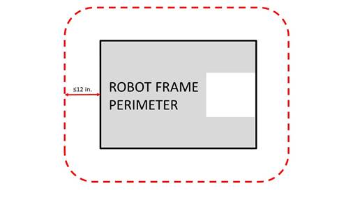
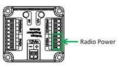

9 ROBOT Construction Rules
##########################

This section of the 2020 *FIRST* \ :sup:`®`\ Robotics Competition Game Manual presents rules relevant to the construction of a 2020 *FIRST* Robotics Competition ROBOT. ROBOTS must pass Inspection at each *FIRST* Robotics Competition event to confirm compliance before being allowed to compete in a Qualification or Playoff MATCH, per `Inspection & Eligibility Rules <https://firstfrc.blob.core.windows.net/frc2020/Manual/HTML/2020FRCGameSeasonManual.htm#_Toc524785446>`_ .

9.1 Overview
************

The rules listed below explicitly address legal parts and materials and how those parts and materials may be used on a 2020 ROBOT. A ROBOT is an electromechanical assembly built by the *FIRST* Robotics Competition team to play the current season’s game and includes all the basic systems required to be an active participant in the game –power, communications, control, BUMPERS, and movement about the field.

There are many reasons for the structure of the rules, including safety, reliability, parity, creation of a reasonable design challenge, adherence to professional standards, impact on the competition, and compatibility with the Kit of Parts (KOP). The KOP is the collection of items listed on the current season’s Kickoff Kit Checklists, distributed to the team via *FIRST* Choice in the current season, or paid for completely (except shipping) with a Product Donation Voucher (PDV) from the current season.

Another intent of these rules is to have all energy sources and active actuation systems on the ROBOT (e.g. batteries, compressors, motors, servos, cylinders, and their controllers) drawn from a well-defined set of options. This is to ensure that all teams have access to the same actuation resources and that the Inspectors are able to accurately and efficiently assess the legality of a given part.

ROBOTS are made up of COMPONENTS and MECHANISMS. A COMPONENT is any part in its most basic configuration, which cannot be disassembled without damaging or destroying the part or altering its fundamental function. A MECHANISM is a COTS or custom assembly of COMPONENTS that provide specific functionality on the ROBOT. A MECHANISM can be disassembled (and then reassembled) into individual COMPONENTS without damage to the parts.

Many rules in this section reference Commercial-Off-The-Shelf (COTS) items. A COTS item must be a standard (i.e. not custom order) part commonly available from a VENDOR for all teams for purchase. To be a COTS item, the COMPONENT or MECHANISM must be in an unaltered, unmodified state (with the exception of installation or modification of any software). Items that are no longer commercially available but are functionally equivalent to the original condition as delivered from the VENDOR are considered COTS and may be used.

.. note::
    Example 1: A team
    orders two (2) ROBOT grippers from RoboHands Corp. and receives both items.
    They put one in their storeroom and plan to use it later. Into the other, they
    drill “lightening holes” to reduce weight. The first gripper is still
    classified as a COTS item, but the second gripper is now a FABRICATED ITEM, as
    it has been modified.

    Example 2: A team
    obtains openly available blueprints of a drive module commonly available from
    Wheels-R-Us Inc. and has local machine shop “We-Make-It, Inc.” manufacture a
    copy of the part for them. The produced part is NOT a COTS item, because it is
    not commonly carried as part of the standard stock of We-Make-It, Inc.

    Example 3: A team
    obtains openly available design drawings from a professional publication during
    the pre-season, and uses them to fabricate a gearbox for their ROBOT during the
    build period following Kickoff. The design drawings are considered a COTS item,
    and may be used as “raw material” to fabricate the gearbox. The finished
    gearbox itself would be a FABRICATED ITEM, and not a COTS item.

    Example 4: A COTS
    part that has non-functional label markings added would still be considered a
    COTS part, but a COTS part that has device-specific mounting holes added is a
    FABRICATED ITEM.

    Example 5: A team
    has a COTS single-board processor version 1.0, which can no longer be
    purchased. Only the COTS single-board processor version 2.0 may be purchased.
    If the COTS single-board processor version 1.0 is functionally equivalent to
    its original condition, it may be used.

    Example 6: A team
    has a COTS gearbox which has been discontinued. If the COTS gearbox is
    functionally equivalent to its original condition, it may be used.

A VENDOR is a legitimate business source for COTS items that satisfies all the following criteria:

**A.** has a Federal Tax Identification number. In cases where the VENDOR is outside of the United States, they must possess an equivalent form of registration or license with the government of their home nation that establishes and validates their status as a legitimate business licensed to operate within that country.

**B.** is not a “wholly owned subsidiary” of a *FIRST* Robotics Competition team or collection of teams. While there may be some individuals affiliated with both a team and the VENDOR, the business and activities of the team and VENDOR must be completely separable.

**C.** must be able to ship any general (i.e., non- *FIRST* unique) product within five business days of receiving a valid purchase request. It is recognized that certain unusual circumstances (such as 1,000 *FIRST* teams all ordering the same part at once from the same VENDOR) may cause atypical delays in shipping due to backorders for even the largest VENDORS. Such delays due to higher-than-normal order rates are excused.

**D.** should maintain sufficient stock or production capability to fill teams’ orders within a reasonable period during the season (less than 1 week). (Note that this criterion may not apply to custom-built items from a source that is both a VENDOR and a fabricator. For example, a VENDOR may sell flexible belting that the team wishes to procure to use as treads on their drive system. The VENDOR cuts the belting to a custom length from standard shelf stock that is typically available, welds it into a loop to make a tread, and ships it to a team. The fabrication of the tread takes the VENDOR two weeks. This would be considered a FABRICATED ITEM, and the two-week ship time is acceptable.) Alternately, the team may decide to fabricate the treads themselves. To satisfy this criterion, the VENDOR would just have to ship a length of belting from shelf stock (i.e. a COTS item) to the team within five business days and leave the welding of the cuts to the team.

**E.** makes their products available to all *FIRST* Robotics Competition teams. A VENDOR must not limit supply or make a product available to just a limited number of *FIRST* Robotics Competition teams.

.. note::
    The intent of
    this definition it to be as inclusive as possible to permit access to all
    legitimate sources, while preventing ad hoc organizations from providing
    special-purpose products to a limited subset of teams in an attempt to
    circumvent the cost accounting rules.

    *FIRST*  desires to permit teams to have the broadest choice of
    legitimate sources possible, and to obtain COTS items from the sources that
    provide them with the best prices and level of service available. Teams also
    need to protect against long delays in availability of parts that will impact
    their ability to complete their ROBOT. The build season is brief, so the VENDOR
    must be able to get their product, particularly  *FIRST*  unique items, to a
    team in a timely manner.

    Ideally, chosen
    VENDORS should have national distributors (e.g. Home Depot, Lowes, MSC,
    McMaster-Carr, etc.). Remember,  *FIRST*  Robotics Competition events are
    not always near home – when parts fail, local access to replacement materials
    is often critical.

A FABRICATED ITEM is any COMPONENT or MECHANISM that has been altered, built, cast, constructed, concocted, created, cut, heat treated, machined, manufactured, modified, painted, produced, surface coated, or conjured partially or completely into the final form in which it will be used on the ROBOT.

.. note::
    Note that it is
    possible for an item (typically raw materials) to be neither COTS nor a
    FABRICATED ITEM. For example, a 20 ft. (~610 cm) length of aluminum which has
    been cut into 5 ft. (~152 cm) pieces by the team for storage or transport is
    neither COTS (it’s not in the state received from the VENDOR), nor a FABRICATED
    ITEM (the cuts were not made to advance the part towards its final form on the
    ROBOT).

Teams may be asked to provide documentation proving legality of non-2020 KOP items during Inspection where a Rule specifies limits for a legal part (e.g. pneumatic items, current limits, COTS electronics, etc.).

Some of these rules make use of English unit requirements for parts. If your team has a question about a metric-equivalent part’s legality, please e-mail your question to `frcparts@firstinspires.org <mailto:frcparts@firstinspires.org?subject=Metric%20equivalent%20question>`_ for an official ruling. To seek approval for alternate devices for inclusion in future *FIRST* Robotic Competition seasons, please contact `frcparts@firstinspires.org <mailto:frcparts@firstinspires.org?subject=Alternate%20device%20approval>`_ with item specifications.

Teams should acknowledge the support provided by the corporate Sponsors and Mentors with an appropriate display of their school and Sponsors names and/or logos (or the name of the supporting youth organization, if appropriate).

*FIRST* Robotics Competition can be a full-contact competition and may include rigorous game play. While the rules aim to limit severe damage to ROBOTS, teams should design their ROBOTS to be robust.

9.2 General ROBOT Design
************************

**R1.** The ROBOT (excluding BUMPERS) must have a FRAME PERIMETER, contained within the BUMPER ZONE and established while in the ROBOT’S STARTING CONFIGURATION, that is comprised of fixed, non-articulated structural elements of the ROBOT. Minor protrusions no greater than ¼ in. (~6 mm) such as bolt heads, fastener ends, weld beads, and rivets are not considered part of the FRAME PERIMETER.

.. note::
    To determine the
    FRAME PERIMETER, wrap a piece of string around the ROBOT (excluding BUMPERS) at
    the BUMPER ZONE described in R18 and pull it taut. The
    string outlines the FRAME PERIMETER.

    Example: A
    ROBOT’S chassis is shaped like the letter ‘V’, with a large gap between chassis
    elements on the front of the ROBOT. When wrapping a taut string around this
    chassis, the string extends across the gap and the resulting FRAME PERIMETER is
    a triangle with three sides.

**R2.** In the STARTING CONFIGURATION (the physical configuration in which a ROBOT starts a MATCH), no part of the ROBOT shall extend outside the vertical projection of the FRAME PERIMETER, with the exception of its BUMPERS and minor protrusions such as bolt heads, fastener ends, rivets, cable ties, etc.

.. note::
    If a ROBOT is
    designed as intended and each side is pushed up against a vertical wall (in
    STARTING CONFIGURATION and with BUMPERS removed), only the FRAME PERIMETER (or
    minor protrusions) will be in contact with the wall.

    The allowance for
    minor protrusions in R2 is intended to allow protrusions that are both minor in
    extension from the FRAME PERIMETER and cross sectional area.

    If a ROBOT uses
    interchangeable MECHANISMS per I3, Teams should be
    prepared to show compliance with R2 and R4 in all configurations.

**R3.** A ROBOT’S STARTING CONFIGURATION may not have a FRAME PERIMETER greater than 120 in. (~304 cm) and may not be more than 45 in. (~114 cm) tall.

.. note::
    Be sure to
    consider the size of the ROBOT on its cart to make sure it will fit through
    doors. Also consider the size of the ROBOT to ensure that it will fit into a
    shipping crate, vehicle, etc.

    Note that the
    BUMPER Rules contained in  `BUMPER Rules <https://firstfrc.blob.core.windows.net/frc2020/Manual/HTML/2020FRCGameSeasonManual.htm#_BUMPER_Rules>`_   may impose additional restrictions on ROBOT design

**R4.** ROBOTS may not extend more than 12 in. (~30 cm) beyond their FRAME PERIMETER (see Figure 9‑1)

Figure 9‑1 FRAME PERIMETER extension

.. note::
    Expect to have to
    demonstrate a ROBOT’S ability to constrain itself per above during Inspection.
    Constraints may be implemented with either hardware or software.

    See  `Game Rules: ROBOTS <https://firstfrc.blob.core.windows.net/frc2020/Manual/HTML/2020FRCGameSeasonManual.htm#_Game_Rules:_ROBOTS>`_   for
    height and extension restrictions for various areas of the FIELD.

**R5.** The ROBOT weight must not exceed 125 lbs. (~56 kg). When determining weight, the basic ROBOT structure and all elements of all additional MECHANISMS that might be used in a single configuration of the ROBOT shall be weighed together (see I3).

For the purposes of determining compliance with the weight limitations, the following items are excluded:

**A.** ROBOT BUMPERS

**B.** ROBOT battery and its associated half of the Anderson cable quick connect/disconnect pair (including no more than 12 in. (~30 cm) of cable per leg, the associated cable lugs, connecting bolts, and insulation)

**C.** tags used for location detection systems if provided by the event

9.3 ROBOT Safety & Damage Prevention
************************************

**R6.** Traction devices must not have surface features that could damage the ARENA (e.g. metal, sandpaper, hard plastic studs, cleats, hook-loop fasteners or similar attachments). Traction devices include all parts of the ROBOT that are designed to transmit any propulsive and/or braking forces between the ROBOT and FIELD carpet.

**R7.** Protrusions from the ROBOT and exposed surfaces on the ROBOT shall not pose hazards to the ARENA elements (including the POWER CELLS) or people.

**R8.** ROBOT parts shall not be made from hazardous materials, be unsafe, cause an unsafe condition, or interfere with the operation of other ROBOTS.

.. note::
    Examples of items
    that will violate R8 include (but are not limited to):

    a.     Shields, curtains, or any other devices or materials
    designed or used to obstruct or limit the vision of any DRIVERS and/or COACHES
    and/or interfere with their ability to safely control their ROBOT

    b.     Speakers, sirens, air horns, or other audio devices that
    generate sound at a level sufficient to be a distraction

    c.     Any devices or decorations specifically intended to jam or
    interfere with the remote sensing capabilities of another ROBOT, including
    vision systems, acoustic range finders, sonars, infrared proximity detectors,
    etc. (e.g. including imagery on your ROBOT that, to a reasonably astute
    observer, mimics the retro-reflective features of vision targets described in  `Vision Targets <https://firstfrc.blob.core.windows.net/frc2020/Manual/HTML/2020FRCGameSeasonManual.htm#_Vision_Targets>`_  )

    d.     Exposed lasers other than Class I.

    e.     Flammable gasses

    f.      Any device intended to produce flames or pyrotechnics

    g.     Hydraulic fluids or hydraulic items

    h.     Switches or contacts containing liquid mercury

    i.      Circuitry used to create voltages in excess of 24 Volts

    j.      Any ballast not secured sufficiently, including loose
    ballast e.g. sand, ball bearings, etc., such that it may become loose during a
    MATCH.

    k.     Exposed, untreated hazardous materials (e.g. lead weights)
    used on the ROBOT. These materials may be permitted if painted, encapsulated or
    otherwise sealed to prevent contact. These materials may not be machined in any
    way at an event.

    l.      Tire sealant

    m.   High intensity light sources used on the ROBOT (e.g. super
    bright LED sources marketed as ‘military grade’ or ‘self-defense’) may only be
    illuminated for a brief time while targeting and may need to be shrouded to
    prevent any exposure to participants. Complaints about the use of such light
    sources will be followed by re-inspection and possible disablement of the
    device.

    Teams should
    provide MSD Sheets for any materials they use that might be considered
    questionable during ROBOT Inspection.

**R9.** ROBOTS must allow removal of game pieces from the ROBOT and the ROBOT from FIELD elements while DISABLED and powered off.

.. note::
    ROBOTS will not
    be re-enabled after the MATCH, so teams must be sure that game pieces and
    ROBOTS can be quickly, simply, and safely removed.

**R10.** Lubricants may be used only to reduce friction within the ROBOT. Lubricants must not contaminate the FIELD or other ROBOTS.

9.4 Budget Constraints & Fabrication Schedule
*********************************************

**R11.** The total cost of all items on the ROBOT (i.e. all items presented at Inspection per I3: MECHANISMS, configurations, and decorations that will be used on the ROBOT in MATCHES without re-inspection), including software, shall not exceed $5000 USD. All costs are to be determined as explained in `Budget Constraints & Fabrication Schedule <https://firstfrc.blob.core.windows.net/frc2020/Manual/HTML/2020FRCGameSeasonManual.htm#_Budget_Constraints_&>`_ . Exceptions are as follows:

**A.** individual items that are less than $5 USD each, as purchasable from a VENDOR,

**B.** items from the team’s current year’s KOP (identical functional replacements may be used to meet this criteria), up to the KOP quantity (including the rookie KOP items), and

**C.** Specific exempt items:

i. One (1) Inertial Measurement Unit (Note that R12 still applies)

ii. Rockwell Automation sensors available through *FIRST* Choice in any season

iii. tags used for location detection systems if provided by the event

.. note::
    An item is
    considered an IMU if it includes “IMU” or “Inertial Measurement Unit” in the
    VENDOR’S product description.

    Teams should be
    prepared to disclose to Inspectors the cost of any non-KOP item and the total
    cost of the ROBOT. Teams should also be prepared to show that a particular item
    was received from  *FIRST*  Choice or a voucher in the current season if
    necessary.

    Per I6, teams must be prepared
    to display a Bill of Material (BOM) to Inspectors during Inspection. The BOM
    may be displayed in either printed or electronic form.

    Individual
    COMPONENTS or MECHANISMS, not excluded in R11, that are retrieved
    from previous ROBOTS and used on 2020 ROBOTS must have their un-depreciated
    cost included in the 2020 BOM and applied to the overall cost assessment.

    Example 1: The
    Kickoff KOP checklist lists two (2) of motor controller XYZ in the Gray Tote
    distributed to rookie teams. Any team, including a veteran team that did not
    receive these items, can account for up to two (2) of them on the KOP checklist
    at a $0 cost. Additional quantity of the same item would have to be accounted
    at the Fair Market Value.

    Example 2: A team
    uses  *FIRST*  Choice credits, or a voucher, to acquire part ABC. This part,
    in the quantity obtained by the team via the KOP may be accounted at $0.
    Additional quantity of the same item would have to be accounted at the Fair
    Market Value.

    Example 3: Part
    ABC is available in  *FIRST*  Choice, but a team decides they have enough
    already on hand and does not acquire any through  *FIRST*  Choice. All of
    these items used on the ROBOT need to be accounted for at Fair Market Value as
    they did not come from the current year’s KOP.

    An “identical
    functional replacement” is an item which, to any reasonably astute observer,
    has the same form, fit, feature set, and function as the original component.

    For example, any
    CIM motor can replace a CIM motor or a sheet of polycarbonate paid for
    completely by a voucher can be replaced with a sheet of polycarbonate of the
    same parameters (thickness, color, size, etc.). As another example, a motor
    controller that has the same form, fit, and function (i.e. controlling motors)
    as the original motor controller, but a different feature set (i.e. can
    communicate over CAN vs. the original controller which was PWM only) is not an
    identical functional replacement because the controllers’ feature sets differ.

**R12.** No individual, non-KOP item or software shall have a Fair Market Value that exceeds $500 USD. The total cost of COMPONENTS purchased in bulk may exceed $500 USD as long as the cost of an individual COMPONENT does not exceed $500 USD.

.. note::
    The Analog
    Devices ADIS16448 IMU MXP Breakout Board does not have a published Fair Market
    Value (FMV). This device is considered to comply with R12 regardless of its
    true FMV.

    If a COTS item is
    part of a modular system that can be assembled in several possible
    configurations, then each individual module must fit within the price
    constraints defined in R12.

    If the modules
    are designed to assemble into a single configuration, and the assembly is
    functional in only that configuration, then the total cost of the complete
    assembly including all modules must fit within the price constraints defined in
    R12.

    In summary, if a
    VENDOR sells a system or a kit, a team must use the entire system/kit Fair
    Market Value and not the value of its COMPONENT pieces.

    Example 1: VENDOR
    A sells a gearbox that can be used with a number of different gear sets, and
    can mate with two different motors they sell. A team purchases the gearbox, a
    gear set, and a motor (which are not offered together as an assembly or kit),
    then assembles them together. Each part is treated separately for the purpose
    of BOM costing, since the purchased pieces can each be used in various
    configurations.

    Example 2: VENDOR
    B sells a robotic arm assembly that the team wants to use. However, it costs
    $700 USD, so they cannot use it. The VENDOR sells the “hand”, “wrist”, and
    “arm” as separate assemblies, for $200 USD each. A team wishes to purchase the
    three items separately, then reassemble them. This would not be legal, as they
    are really buying and using the entire assembly, which has a Fair Market Value
    of $700 USD.

    Example 3: VENDOR
    C sells a set of wheels or wheel modules that are often used in groups of four.
    The wheels or modules can be used in other quantities or configurations. A team
    purchases four and uses them in the most common configuration. Each part is
    treated separately for the purpose of BOM costing, since the purchased pieces
    can be used in various configurations.

**R13.** The BOM cost of each non-KOP item must be calculated based on the unit Fair Market Value for the material and/or labor, except for labor provided by team members (including sponsor employees who are members of the team), members of other teams, event provided Machine Shops and shipping.

.. note::
    The Fair Market
    Value of a COTS item is its price defined by a VENDOR for
    the part or an identical functional replacement. This price must be generally
    available to all FIRST Robotics Competition teams throughout the build and
    competition season (i.e. short-term sale prices or coupons do not reflect Fair
    Market Value), however teams are only expected to make a good faith effort at
    determining the item price and are not expected to monitor prices of ROBOT
    items throughout the season in response to price fluctuations. The Fair Market
    Value is the cost of the item itself and does not include any duties, taxes,
    tariffs, shipping, or other costs that may vary by locality. If COTS parts were
    sourced in bulk, the cost may be scaled proportionally to assess the Fair
    Market Value of one unit.

    The Fair Market Value of COTS software is the price, set by
    the VENDOR, to license the software (or component of the software) that runs on
    the ROBOT for the period from Kickoff to the end of the  *FIRST* 
    Championship. The Fair Market Value of software licensed free-of-cost,
    including through the Virtual KOP, for use on the ROBOT is $0.

    The Fair Market Value of raw material used to construct
    FABRICATED parts may be accounted for in one of two ways:

    ·        
    The cost
    of any purchasable quantity that can be used to make the individual part (i.e.
    the purchasable raw material is larger than the FABRICATED part).

    ·        
    Grouping parts
    made from the same raw material and accounting for the cost of a single
    quantity that can produce all of those parts.

    Example 1: A team
    orders a custom bracket made by a company to the team's specification. The
    company’s material cost and normally charged labor rate apply.

    Example 2: A team
    receives a donated sensor. The company would normally sell this item for $52
    USD, which is therefore its Fair Market Value.

    Example 3:
    Special price discounts from National Instruments and other  *FIRST* 
    Suppliers are being offered to all teams for the whole season. The discounted
    purchase price of items from these sources may be used in the additional parts
    accounting calculations.

    Example 4: A team
    purchases steel bar stock for $10 USD and has it machined by a local machine
    shop. The machine shop is not considered a team Sponsor but donates two (2)
    hours of expended labor anyway. The team must include the estimated normal cost
    of the labor as if it were paid to the machine shop and add it to the $10 USD.

    Example 5: A team
    purchases steel bar stock for $10 USD and has it machined by a local machine
    shop that is a recognized Sponsor of the team. If the machinists are considered
    members of the team, their labor costs do not apply. The total applicable cost
    for the part would be $10 USD.

    It is in the best
    interests of the teams and  *FIRST*  to form relationships with as many
    organizations as possible. Teams are encouraged to be expansive in recruiting
    and including organizations in their team, as that exposes more people and
    organizations to  *FIRST* . Recognizing supporting companies as Sponsors of,
    and members in, the team is encouraged, even if the involvement of the Sponsor
    is solely through the donation of fabrication labor.

    Example 6: A team
    purchases steel bar stock for $10 USD and has it machined by another team. The
    total applicable cost for the part would be $10 USD.

    Example 7: A team
    purchases a 4 ft. by 4 ft. (~122 cm by 122 cm) sheet of aluminum, but only uses
    a piece 10 in. by 10 in. (~25 cm by 25 cm) on their ROBOT. The team identifies
    a source that sells aluminum sheet in 1 by 1 ft. (~30 cm by 30 cm) pieces. The
    team may cost their part based on a 1 by 1 ft. (~30 cm by 30 cm) piece, even
    though they cut the piece from a larger bulk purchase. They do not have to
    account for the entire 4 by 4 ft. (~122 cm by 122 cm) bulk purchase item.

    Example 8: A team
    purchases a widget at a garage sale or online auction for $3, but it’s
    available for sale from a VENDOR for $13. The Fair Market Value that gets
    reported on the BOM is $13.

    Example 9: A team
    3D prints multiple parts for their ROBOT from a single spool of material. The
    cost of the spool (in the smallest available size able to produce the parts)
    may be included just once on the BOM to account for all parts.

**R14.** FABRICATED ITEMS created before Kickoff are not permitted. Exceptions are:

**A.** OPERATOR CONSOLE,

**B.** BUMPERS (a protective assembly designed to attach to the exterior of the ROBOT and constructed as specified in `BUMPER Rules <https://firstfrc.blob.core.windows.net/frc2020/Manual/HTML/2020FRCGameSeasonManual.htm#BumperRulesSection>`_ ),

**C.** battery assemblies as described in R5-B,

**D.** FABRICATED ITEMS consisting of one COTS electrical device (e.g. a motor or motor controller) and attached COMPONENTS associated with any of the following modifications:

i. wires modified to facilitate connection to a ROBOT (including removal of existing connectors)

ii. connectors and any materials to secure and insulate those connectors added (Note: passive PCBs such as those used to adapt motor terminals to connectors are considered connectors)

iii. motor shafts modified and/or gears, pulleys, or sprockets added

iv. motors modified with a filtering capacitor as described in the Blue Box below R56

**E.** COTS items with any of the following modifications:

i. Non-functional decoration or labeling

ii. Assembly of COTS items per manufacturer specs, unless the result constitutes a MAJOR MECHANISM as defined in I1

iii. Work that could be reasonably accomplished in fewer than 30 minutes with the use of handheld tools (e.g. drilling a small number of holes in a COTS part)

.. note::
    Please note that
    this means FABRICATED ITEMS from ROBOTS entered in previous  *FIRST* 
    competitions may not be used on ROBOTS in the 2020  *FIRST*  Robotics
    Competition (other than those allowed per R14-B through -E). Before the
    formal start of the Build Season, teams are encouraged to think as much as they
    please about their ROBOTS. They may develop prototypes, create proof-of-concept
    models, and conduct design exercises. Teams may gather all the raw stock
    materials and COTS COMPONENTS they want.

    Parts with precision
    machined (mill, CNC, etc.) features may still meet R14-E part iii if
    functionally equivalent features could reasonably be made within the
    restrictions specified.

    Example 1: A team
    designs and builds a two-speed shifting transmission during the fall as a
    training exercise. After Kickoff, they utilize all the design principles they
    learned in the fall to design their ROBOT. To optimize the transmission design
    for their ROBOT, they change the transmission gear ratios and reduce the size,
    and build two new transmissions, and place them on the ROBOT. All parts of this
    process are permitted activities.

    Example 2: A team
    re-uses a 2020-legal motor from a previous ROBOT which has had connectors added
    to the wires. This is permitted, per exception D, because the motor is a COTS
    electrical COMPONENT.

    Example 3: A team
    re-uses a piece of aluminum tubing from a previous ROBOT which has a precision
    machined bearing hole in it. On the current ROBOT, the bearing hole is not
    used. As the only function of the hole on the current ROBOT is material
    removal, which does not require precise tolerancing, a functionally equivalent
    hole could be made with a hand drill in under 30 minutes and the part is
    permitted per R14-E iii.

**R15.** Software and mechanical/electrical designs created before Kickoff are only permitted if the source files (complete information sufficient to produce the design) are available publicly prior to Kickoff.

.. note::
    Example 1: A team
    realizes that the transmission designed and built in the fall perfectly fits
    their need for a transmission to drive the ROBOT arm. They build an exact copy
    of the transmission from the original design plans, and bolt it to the ROBOT.
    This would be prohibited, as the transmission – although made during the
    competition season – was built from detailed designs developed prior to
    Kickoff.

    Example 2: A team
    developed an omni-directional drive system for the 2019 competition. In July 2019
    they refined and improved the control software (written in C++) to add more
    precision and capabilities. They decided to use a similar system for the 2020 competition.
    They copied large sections of unmodified code over into the control software of
    the new ROBOT (also written in C++). This would be a violation of the schedule
    constraint and is not allowed.

    Example 3: The
    same team decides to use LabVIEW as their software environment for 2020.
    Following Kickoff, they use the previously-developed C++ code as a reference
    for the algorithms and calculations required to implement their
    omni-directional control solution. Because they developed new LabVIEW code as
    they ported over their algorithms, this is permitted.

    Example 4: A
    different team develops a similar solution during the fall and plans to use the
    developed software on their competition ROBOT. After completing the software,
    they post it in a generally accessible public forum and make the code available
    to all teams. Because they have made their software publicly available before
    Kickoff, they can use it on their ROBOT.

    Example 5: A team
    develops a transmission prior to Kickoff. After completing the project, they
    publish the CAD files on a generally accessible public forum and make them
    available to all teams. Because they have made the design publicly available
    before Kickoff, they can use the design to create an identical transmission,
    fabricated after Kickoff, for use on their 2020 ROBOT.

**R16.** During an event a team is attending (regardless of whether the team is physically at the event location), the team may neither work on nor practice with their ROBOT or ROBOT elements outside of the hours that pits are open, with the following exceptions:

**A.** Exceptions listed in R14, other than R14-E iii

**B.** Software development

**C.** Batteries may be charged during the designated Load-in time

.. note::
    For the purposes
    of this rule, official events begin as follows:

    ·        
    Regionals, District Championships, and  *FIRST* 
    Championship: at the start of the first designated Load-in period, according to
    the Public Schedule. If the Public Schedule is not available or there is no
    designated Load-in period, the events begin at 4pm on the day prior to pits
    opening.

    ·        
    District Events: when pits open

    Examples of
    activity prohibited by R16 include:

    a.     Working on the ROBOT at the team’s shop after Load-in for
    the event has begun

    b.     Working on ROBOT parts at night at the team’s hotel.

    Note that E8 and E20
    impose additional restrictions on work done on the ROBOT or ROBOT materials
    while attending an event.

    One purpose of R16 is to increase equity
    between teams with significant travel to an event and those nearby (close teams
    would otherwise have an advantage by being able to work on their ROBOT, in
    their shop, until it’s time to go to the event).

9.5 BUMPER Rules
****************

A BUMPER is a required assembly which attaches to the ROBOT frame. BUMPERS protect ROBOTS from damaging/being damaged by other ROBOTS and FIELD elements. Criteria used in writing these rules includes the following:

• Minimize variety of BUMPERS so teams can expect consistency

• Minimize the amount of design challenge in creating BUMPERS

• Minimize cost of BUMPER materials

• Maximize use of relatively ubiquitous materials

**R17.** ROBOTS are required to use BUMPERS to protect all outside corners of the FRAME PERIMETER. For adequate protection, at least 6 in. (~16 cm) of BUMPER must be placed on each side of each outside corner (see Figure 9‑2 BUMPER corner examples) and must extend to within ¼ in. (~6 mm) of the FRAME PERIMETER corner. If a FRAME PERIMETER side is shorter than 12 in. (~31 cm), that entire side must be protected by BUMPER (see Figure 9‑3). A round or circular FRAME PERIMETER, or segment of the FRAME PERIMETER, is considered to have an infinite number of corners, therefore the entire frame or frame segment must be completely protected by BUMPER(S).

.. note::
    The dimension
    defined in R17
    is measured along the FRAME PERIMETER. The portion of the BUMPER that extends
    beyond the corner of the FRAME PERIMETER is not included in the 6 in. (~16 cm)
    requirement. See Figure 9‑2.

Figure 9‑2 BUMPER corner examples

Figure 9‑3 BUMPER around full side/corner.

**R18.** Except as allowed per G16, BUMPERS must be located entirely within the BUMPER ZONE, which is the volume contained between the floor and a virtual horizontal plane 7½ in. (~19 cm) above the floor in reference to the ROBOT standing normally on a flat floor. BUMPERS do not have to be parallel to the floor.

.. note::
    This measurement
    is intended to be made as if the ROBOT is resting on a flat floor (without
    changing the ROBOT configuration), not relative to the height of the ROBOT from
    the FIELD carpet. Examples include:

    Example 1: A
    ROBOT that is at an angle while navigating the FIELD has its BUMPERS outside
    the BUMPER ZONE. If this ROBOT were virtually transposed onto a flat floor, and
    its BUMPERS are in the BUMPER ZONE, it meets the requirements of R18.

    Example 2: A
    ROBOT deploys a MECHANISM which lifts the BUMPERS outside the BUMPER ZONE (when
    virtually transposed onto a flat floor). This violates R18.

**R19.** BUMPERS must not be articulated (relative to the FRAME PERIMETER).

**R20.** BUMPERS (the entire BUMPER, not just the cover) must be designed for quick and easy installation and removal to facilitate inspection and weighing.

.. note::
    As a guideline,
    BUMPERS should be able to be installed or removed by two (2) people in fewer
    than five (5) minutes.

**R21.** Each ROBOT must be able to display Red or Blue BUMPERS to MATCH their ALLIANCE color, as assigned in the MATCH schedule distributed at the event (as described in `MATCH Schedules <https://firstfrc.blob.core.windows.net/frc2020/Manual/HTML/2020FRCGameSeasonManual.htm#MatchSchedulesSection>`_ ). BUMPER Markings visible when installed on the ROBOT, other than the following, are prohibited:

**A.** those required per R22,

**B.** hook-and-loop fastener or snap fasteners backed by the hard parts of the BUMPER, and

**C.** solid white *FIRST* logos between 4¾ in. (~12 cm) and 5¼ in. wide (~13 cm) (i.e. comparable to those available in the `2020 Virtual Kit <https://www.firstinspires.org/robotics/frc/kit-of-parts#VirtualKit>`_ .

.. note::
    The FRAME PERIMETER
    facing surfaces of BUMPERS are not “displayed” and thus R21 does not apply.

**R22.** Team numbers must be displayed and positioned on the BUMPERS such that an observer walking around the perimeter of the ROBOT can unambiguously tell the team’s number from any point of view and meet the following additional criteria:

**A.** consist of only Arabic numerals at least 4 in. (~11 cm) high, at least ½ in. (~13 mm) in stroke width, and be either white in color or outlined in white with a minimum 1/16 in. (~2 mm) outline

.. note::
    The ½ in. (~13
    mm) stroke width requirement applies to the majority of the stroke. Font
    elements less than ½ in. (~13 mm) such as serifs, rounded edges, small
    hairlines or gaps, etc. are permitted as long as the majority of the stroke
    meets the sizing requirement and the numbers are unambiguous.

**B.** must not wrap around sharp corners (less than 160 degrees) of the FRAME PERIMETER

**C.** may not substitute logos or icons for numerals

.. note::
    There is no
    prohibition against splitting team numbers onto different sections of BUMPER.
    The intent is that the team’s number is clearly visible and unambiguous so that
    Judges, REFEREES, Announcers, and other teams can easily identify competing
    ROBOTS.

    This marking is
    intended to display the team number only, not to intentionally change the
    surface characteristics of the BUMPER. Excessive material usage as part of any
    team number marking will invite close scrutiny.

**R23.** Each set of BUMPERS (including any fasteners and/or structures that attach them to the ROBOT) must weigh no more than 15 lbs. (~6 kg).

.. note::
    If a multi-part
    attachment system is utilized (e.g. interlocking brackets on the ROBOT and the
    BUMPER), then the elements permanently attached to the ROBOT will be considered
    part of the ROBOT, and the elements attached to the BUMPERS will be considered
    part of the BUMPER. Each element must satisfy all applicable rules for the
    relevant system.

**R24.** BUMPERS must be constructed as follows (see Figure 9‑6):

**A.** be backed by ¾ in. (nominal) thick (~19mm) by 5 in. ± ½ in. (~127 mm ± 12.7 mm) tall plywood, Oriented Strand Board (OSB) or solid wood (with the exception of balsa). Small clearance pockets and/or access holes in the wood backing are permitted, as long as they do not significantly affect the structural integrity of the BUMPER.

.. note::
    ¾” Plywood and
    OSB refer to items sold by VENDORS as that material and thickness, teams may
    not fabricate their own plywood or OSB. Other engineered woods such as
    Fiberboard or Particle Board are not likely to survive the rigors of  *FIRST* 
    Robotics Competition gameplay and thus not permitted in R24-A.

    Note: ¾” plywood
    is now often marked according to the actual dimension (²³⁄₃₂”) not the nominal size. Plywood sold as ²³⁄₃₂” meets the requirements of R24-A.

**B.** hard BUMPER parts allowed per R24-A, -E, -F, and -G must not extend more than 1 in. (~25 mm) beyond the FRAME PERIMETER (measured as shown in Figure 9‑4).

Figure 9‑4 Hard Parts of BUMPER Corners

**C.** use a stacked pair of approximately 2½ in. (nominal, ~63mm) round, petal, or hex “pool noodles” (solid or hollow) as the BUMPER cushion material (see Figure 9‑6). All pool noodles used in a BUMPER set (e.g. Red set of BUMPERS) may not be modified (with the exception of cutting to length or cutting to facilitate mating pool noodles at the corners as required by R25) or deformed and must be the same diameter, cross-section, and density (e.g. all round hollow or all hex solid). Cushion material may extend up to 2½ in. (~63 mm) beyond the end of the plywood (see Figure 9‑7). To assist in applying the fabric covering, soft fasteners may be used to attach the pool noodles to the wood backing, so long as the cross section in Figure 9‑6 is not significantly altered (e.g. tape compressing the pool noodles).

.. note::
    All pool noodles used on a ROBOT must be the same in order
    to maintain the desired interaction between ROBOTS in the cases of
    BUMPER-to-BUMPER contact. BUMPERS containing pool noodles of vastly different
    construction may cause a “ramp” effect when interacting with other BUMPERS.

    Minor noodle compression as a result of smoothing BUMPER fabric or rounding a FRAME PERIMETER corner
    is not considered deformed. Any compression beyond that, e.g. for the
    purposes of flattening the noodle, is deformation and a violation of R24-C.

**D.** be covered with a rugged, smooth cloth. (multiple layers of cloth and seams are permitted if needed to accommodate R21 and/or R22, provided the cross section in Figure 9‑6 is not significantly altered).

.. note::
    Silk and bedding
    are not considered rugged cloths, however 1000D Cordura is. Tape (e.g. gaffer’s
    tape) matching the BUMPER color is allowed to patch small holes on a temporary
    basis.

    It is expected
    that there may be multiple layers of cloth as fabric is folded to accommodate
    the corners and seams of BUMPERS.

The cloth must completely enclose all exterior surfaces of the wood and pool noodle material when the BUMPER is installed on the ROBOT. The fabric covering the BUMPERS must be solid in color.

**E.** optionally use metal angle, as shown in Figure 9‑6 or other fasteners (e.g. staples, screws, adhesives, etc.) to clamp cloth.

**F.** optionally use metal brackets (i.e. angle or sheet metal) or other fasteners (e.g. staples, screws, adhesives, etc.) to attach BUMPER segments to each other (see Figure 9‑5).

Figure 9‑5 Hard Parts of BUMPER Corners

**G.** must attach to the FRAME PERIMETER of the ROBOT with a rigid fastening system to form a tight, robust connection to the main structure/frame (e.g. not attached with hook-and-loop, tape, or tie-wraps). The attachment system must be designed to withstand vigorous game play. All removable fasteners (e.g. bolts, locking pins, pip-pins, etc.) will be considered part of the BUMPERS.

Figure 9‑6 BUMPER Vertical Cross Section

**R25.** Corner joints between BUMPERS must be filled with pool noodle material. Examples of implementation are shown in Figure 9‑7.

Figure 9‑7 Soft Parts of BUMPER Corners

**R26.** BUMPERS must be supported by the structure/frame of the ROBOT (see Figure 9‑8). To be considered supported, a minimum of ½ in. (~13 mm) at each end of each BUMPER wood segment must be backed by the FRAME PERIMETER (≤¼ in. gap, ~6mm). “Ends” exclude hard BUMPER parts which extend past the FRAME PERIMETER permitted by R24-B. Additionally, any gap between the backing material and the frame:

**A.** must not be greater than ¼ in. (~6 mm) deep, or

**B.** not more than 8 in. (~20 cm) wide

Figure 9‑8 BUMPER support examples

.. note::
    The intent of
    this rule is to make sure the BUMPER wood is properly supported to minimize the
    likelihood of breakage on impact. Flexible ROBOT elements, such as thin
    plastic, do not accomplish this intent and are not considered “structure/frame”
    of the ROBOT.

9.6 Motors & Actuators
**********************

**R27.** The only motors and actuators permitted on 2020 ROBOTS include the following (in any quantity):

Table 9‑1 Motor allowances

+----------------------------------------------------------------+------------------------------------------------------------------------------------------------------+
| Motor Name                                                     | Part Numbers Available                                                                               |
+----------------------------------------------------------------+--------------------------------------------------+---------------------------------------------------+
| AndyMark 9015                                                  | am-0912                                          | AndyMark 9015                                     |
+----------------------------------------------------------------+--------------------------------------------------+---------------------------------------------------+
| AndyMark NeveRest                                              | am-3104                                          |                                                   |
+----------------------------------------------------------------+--------------------------------------------------+---------------------------------------------------+
| AndyMark PG                                                    | am-2161 (alt. PN am-2765)                        | am-2194 (alt. PN am-2766)                         |
+----------------------------------------------------------------+--------------------------------------------------+---------------------------------------------------+
| AndyMark RedLine Motor                                         | am-3775                                          | am-3775a                                          |
+----------------------------------------------------------------+--------------------------------------------------+---------------------------------------------------+
| AndyMark Snow Blower Motor                                     | am-2235                                          | am-2235a                                          |
+----------------------------------------------------------------+--------------------------------------------------+---------------------------------------------------+
| Banebots                                                       | am-3830                                          | M5 – RS550-12                                     |
|                                                                |                                                  |                                                   |
|                                                                | M7-RS775-18                                      | RS550VC-7527                                      |
|                                                                |                                                  |                                                   |
|                                                                | RS775WC-8514                                     | RS550                                             |
+----------------------------------------------------------------+--------------------------------------------------+---------------------------------------------------+
| CIM                                                            | FR801-001                                        | PM25R-45F-1004                                    |
|                                                                |                                                  |                                                   |
|                                                                | M4-R0062-12                                      | PM25R-45F-1003                                    |
|                                                                |                                                  |                                                   |
|                                                                | AM802-001A                                       | PMR25R-45F-1003                                   |
|                                                                |                                                  |                                                   |
|                                                                | 217-2000                                         | PMR25R-44F-1005                                   |
|                                                                |                                                  |                                                   |
|                                                                | PM25R-44F-1005                                   | am-0255                                           |
+----------------------------------------------------------------+--------------------------------------------------+---------------------------------------------------+
| CTR Electronics/VEX Robotics Falcon 500                        | 217-6515                                         | 19-708850                                         |
|                                                                |                                                  |                                                   |
|                                                                | am-6515                                          | am-6515_Short                                     |
+----------------------------------------------------------------+--------------------------------------------------+---------------------------------------------------+
| Current/former KOP Automotive motors                           | Denso AE235100-0160                              | Denso 262100-3040                                 |
|                                                                |                                                  |                                                   |
|                                                                | Denso 5-163800-RC1                               | Bosch 6 004 RA3 194-06                            |
|                                                                |                                                  |                                                   |
|                                                                | Denso 262100-3030                                | Johnson Electric JE-PLG-149                       |
+----------------------------------------------------------------+--------------------------------------------------+---------------------------------------------------+
| Nidec Dynamo BLDC Motor                                        | am-3740                                          | DM3012-1063                                       |
+----------------------------------------------------------------+--------------------------------------------------+---------------------------------------------------+
| Playing with Fusion Venom                                      | BDC-10001                                        |                                                   |
+----------------------------------------------------------------+--------------------------------------------------+---------------------------------------------------+
| REV Robotics NEO Brushless                                     | REV-21-1650                                      |                                                   |
+----------------------------------------------------------------+--------------------------------------------------+---------------------------------------------------+
| REV Robotics NEO 550                                           | REV-21-1651                                      |                                                   |
+----------------------------------------------------------------+--------------------------------------------------+---------------------------------------------------+
| VEX BAG                                                        | 217-3351                                         |                                                   |
+----------------------------------------------------------------+--------------------------------------------------+---------------------------------------------------+
| VEX Mini-CIM                                                   | 217-3371                                         |                                                   |
+----------------------------------------------------------------+--------------------------------------------------+---------------------------------------------------+
| West Coast Products RS775 Pro                                  | 217-4347                                         |                                                   |
+----------------------------------------------------------------+--------------------------------------------------+---------------------------------------------------+
| Electrical solenoid actuators, no greater than 1 in. (nominal) stroke and rated electrical input power no greater than 10 watts (W) continuous duty at 12 volts (VDC) |
+-----------------------------------------------------------------------------------------------------------------------------------------------------------------------+
| Fans, no greater than 120mm (nominal) size and rated electrical input power no greater than 10 watts (W) continuous duty at 12 volts (VDC)                            |
+-----------------------------------------------------------------------------------------------------------------------------------------------------------------------+
| Hard drive motors part of a legal COTS computing device                                                                                                               |
+-----------------------------------------------------------------------------------------------------------------------------------------------------------------------+
| **Factory installed vibration and****autofocus****motors resident in COTS computing devices (e.g. rumble motor in a smartphone).**                                    |
+-----------------------------------------------------------------------------------------------------------------------------------------------------------------------+
| **PWM COTS****servos with a retail cost < $75.**                                                                                                                      |
+-----------------------------------------------------------------------------------------------------------------------------------------------------------------------+
| **Motors integral to a****COTS****sensor (e.g. LIDAR, scanning sonar, etc.), provided the device is not modified except to facilitate mounting**                      |
+-----------------------------------------------------------------------------------------------------------------------------------------------------------------------+
| **One (1) compressor compliant with****R79****and used to compress air for the ROBOT’S pneumatic system**                                                             |
+-----------------------------------------------------------------------------------------------------------------------------------------------------------------------+

.. note::
    For servos, note
    that the roboRIO is limited to a max current output of 2.2A on the 6V rail
    (12.4W of electrical input power). Teams should make sure that their total
    servo power usage remains below this limit at all times.

    Given the
    extensive amount of motors allowed on the ROBOT, teams are encouraged to
    consider the total power available from the ROBOT battery during the design and
    build of the ROBOT. Drawing large amounts of current from many motors at the
    same time could lead to drops in ROBOT battery voltage that may result in
    tripping the main breaker or trigger the brownout protection of the roboRIO.
    For more information about the roboRIO brownout protection and measuring
    current draw using the PDP, see  `roboRIO Brownout and Understanding Current Draw <https://docs.wpilib.org/en/latest/docs/software/roborio-info/roborio-brownouts.html>`_  .

    AndyMark PG
    Gearmotors are sold with labeling based on the entire assembly. Assemblies
    labeled am-3651 through am-3656 contain legal motors specified in the table
    above. These motors may be used with or without the provided gearbox.

**R28.** The integral mechanical and electrical system of any motor must not be modified. Motors, servos, and electric solenoids used on the ROBOT shall not be modified in any way, except as follows:

**A.** The mounting brackets and/or output shaft/interface may be modified to facilitate the physical connection of the motor to the ROBOT and actuated part.

**B.** The electrical leads may be trimmed to length as necessary and connectors or splices to additional wiring may be added.

**C.** The locking pins on the window motors (P/N: 262100-3030 and 262100-3040) may be removed.

**D.** The connector housings on KOP Automotive motors listed in Table 9‑1 may be modified to facilitate lead connections.

**E.** Servos may be modified as specified by the manufacturer (e.g. re-programming or modification for continuous rotation).

**F.** The wiring harness of the Nidec Dynamo BLDC Motor may be modified as documented by *FIRST* in the `"Nidec Dynamo BLDC Motor with Controller" article <https://wpilib.screenstepslive.com/s/currentCS/m/kop/l/824829-nidec-dynamo-bldc-motor-with-controller>`_ .

**G.** Minimal labeling applied to indicate device purpose, connectivity, functional performance, etc.

**H.** Any number of #10-32 plug screws may be removed from the Falcon 500.

**I.** Insulation may be applied to electrical terminals.

.. note::
    The intent of
    this rule is to allow teams to modify mounting tabs and the like, not to gain a
    weight reduction by potentially compromising the structural integrity of any
    motor.

**R29.** With the exception of servos, fans, or motors integral to sensors of COTS computing devices permitted in R27, each actuator must be controlled by a power regulating device. The only power regulating devices for actuators permitted on the ROBOT include:

**A.** Motor Controllers

i. DMC 60/DMC 60c Motor Controller (P/N: 410-334-1, 410-334-2)

ii. Jaguar Motor Controller (P/N: MDL-BDC, MDL-BDC24, and 217-3367) connected to PWM only

iii. Nidec Dynamo BLDC Motor with Controller to control integral actuator only (P/N 840205-000, am-3740)

iv. SD540 Motor Controller (P/N: SD540x1, SD540x2, SD540x4, SD540Bx1, SD540Bx2, SD540Bx4, SD540C)

v. Spark Motor Controller (P/N: REV-11-1200)

vi. Spark MAX Motor Controller (P/N: REV-11-2158)

vii. Talon FX Motor Controller (P/N: 217-6515, 19-708850, am-6515, am-6515_Short) for controlling integral Falcon 500 only.

viii. Talon Motor Controller (P/N: CTRE_Talon, CTRE_Talon_SR, and am-2195)

ix. Talon SRX Motor Controller (P/N: 217-8080, am-2854, 14-838288)

x. Venom Motor with Controller (P/N: BDC-10001) for controlling integral motor only

xi. Victor 884 Motor Controller (P/N: VICTOR-884-12/12)

xii. Victor 888 Motor Controller (P/N: 217-2769)

xiii. Victor SP Motor Controller (P/N: 217-9090, am-2855, 14-868380)

xiv. Victor SPX Motor Controller (P/N: 217-9191, 17-868388, am-3748)

**B.** Relay Modules

i. Spike H-Bridge Relay (P/N: 217-0220 and SPIKE-RELAY-H)

ii. Automation Direct Relay (P/N: AD-SSR6M12-DC-200D, AD-SSRM6M25-DC-200D, AD-SSR6M45-DC-200D)

**C.** Pneumatics controllers

i. Pneumatics Control Module (P/N: am-2858, 217-4243)

.. note::
    Note: The
    Automation Direct Relays are single directional. Per R30 they may not be wired
    together in an attempt to provide bi-directional control.        

**R30.** Each power regulating device may control electrical loads per Table 9‑2. Unless otherwise noted, each power regulating device shall control one and only one electrical load.

Table 9‑2 Power regulating device allotments

+---------------------------------------+------------------------------+--------------+-----------------------+
| Electrical Load                       | Motor Controller             | Relay Module | Pneumatics Controller |
+---------------------------------------+------------------------------+--------------+-----------------------+
| AndyMark RedLine Motor                | Yes                          | No           | No                    |
|                                       |                              |              |                       |
| Banebots                              |                              |              |                       |
|                                       |                              |              |                       |
| CIM                                   |                              |              |                       |
|                                       |                              |              |                       |
| REV Robotics NEO Brushless            |                              |              |                       |
|                                       |                              |              |                       |
| REV Robotics NEO 550                  |                              |              |                       |
|                                       |                              |              |                       |
| VEX Mini-CIM                          |                              |              |                       |
|                                       |                              |              |                       |
| WCP RS775 Pro                         |                              |              |                       |
+---------------------------------------+------------------------------+--------------+-----------------------+
| AndyMark 9015                         | Yes                          | No           | No                    |
|                                       |                              |              |                       |
| VEXpro BAG                            | (up to 2 per controller)     |              |                       |
+---------------------------------------+------------------------------+--------------+-----------------------+
| AndyMark PG                           | Yes                          | Yes          | No                    |
|                                       |                              |              |                       |
| KOP Automotive Motors                 | (up to 2 per controller)     |              |                       |
|                                       |                              |              |                       |
| NeverRest                             |                              |              |                       |
|                                       |                              |              |                       |
| Snow Blower Motor                     |                              |              |                       |
+---------------------------------------+------------------------------+--------------+-----------------------+
| CTR Electronics/VEX Falcon 500        | Yes                          | No           | No                    |
|                                       |                              |              |                       |
| Nidec Dynamo BLDC Motor w/ Controller | (integrated controller only) |              |                       |
|                                       |                              |              |                       |
| Playing With Fusion Venom             |                              |              |                       |
+---------------------------------------+------------------------------+--------------+-----------------------+
| Compressor                            | No                           | Yes          | Yes                   |
+---------------------------------------+------------------------------+--------------+-----------------------+
| Pneumatic Solenoid Valves             | No                           | Yes1         | Yes                   |
|                                       |                              |              |                       |
|                                       |                              |              | (1 per channel)       |
+---------------------------------------+------------------------------+--------------+-----------------------+
| Electric Solenoids                    | Yes1                         | Yes1         | Yes                   |
|                                       |                              |              |                       |
|                                       |                              |              | (1 per channel        |
+---------------------------------------+------------------------------+--------------+-----------------------+
| CUSTOM CIRCUITS2                      | Yes1                         | Yes1         | Yes                   |
|                                       |                              |              |                       |
|                                       |                              |              | (1 per channel)       |
+---------------------------------------+------------------------------+--------------+-----------------------+

\ :sup:`1`\ Multiple low-load, pneumatic solenoid valves (relay only), electric solenoids or CUSTOM CIRCUITS may be connected to a single relay module or motor controller. This would allow one (1) relay module or motor controller to drive multiple pneumatic actions or multiple CUSTOM CIRCUITS. No other electrical load can be connected to a relay module used in this manner.

\ :sup:`2`\ A CUSTOM CIRCUIT is any electrical COMPONENT of the ROBOT other than motors, pneumatic solenoids, roboRIO, PDP, PCM, VRM, RSL, 120A breaker, motor controllers, relay modules (per R29-B), wireless bridge, electrical solenoid actuators, or batteries.

**R31.** Servos must be connected to, and only to, one of the following:

**A.** PWM PORTS on the roboRIO

**B.** PWM PORTS on a WCP Spartan Sensor Board (P/N: WCP-0045)

**C.** REV Robotics Servo Power Module (P/N: REV-11-1144)

9.7 Power Distribution
**********************

In order to maintain safety, the rules in this section apply at all times while at the event, not just while the ROBOT is on the FIELD for MATCHES.

**R32.** The only legal source of electrical energy for the ROBOT during the competition, the ROBOT battery, must be one and only one non-spillable sealed lead acid (SLA) battery with the following specifications:

**A.** Nominal voltage: 12V

**B.** Nominal capacity at 20-hour discharge rate: minimum 17Ah, maximum 18.2Ah

**C.** Shape: Rectangular

**D.** Nominal Dimensions:7.1 in. x 3 in. x 6.6 in., +/- .1 in. for each dimension (~ 180 mm x 76mm x 168 mm, +/- 2.5 mm for each dimension)

**E.** Nominal weight: 11lbs. to 14.5 lbs. (~5 kg. to 6.5 kg.)

**F.** Terminals: Nut and bolt style

.. note::
    Examples of
    batteries which meet these criteria include:

    a.     Enersys (P/N: NP18-12, NP18-12B, NP18-12BFR)

    b.     MK Battery (P/N: ES17-12)

    c.     Battery Mart (P/N: SLA-12V18)

    d.     Sigma (P/N: SP12-18)

    e.     Universal Battery (P/N: UB12180)

    f.      Power Patrol (P/N: SLA1116)

    g.     Werker Battery (P/N: WKA12-18NB)

    h.     Power Sonic (P/N: PS-12180NB)

    i.     
    Yuasa (P/N: NP18-12B)

    j.      Panasonic (P/N: LC-RD-1217)

    k.     Interstate Batteries (P/N: BSL1116)

    l.      Duracell Ultra Battery (P/N: DURA12-18NB)

    Teams should be
    aware that they may be asked to provide documentation of the specifications of
    any battery not listed above.

    Batteries should
    be charged in accordance with manufacturer’s specification. (Please see the  `FIRST Safety Manual <https://www.firstinspires.org/resource-library/frc/safety-manual>`_   for additional information.)

**R33.** COTS USB battery packs with a capacity of 100Wh or less (20000mAh at 5V) and 2.5 Amp max output per port, or batteries integral to and part of a COTS computing device or self-contained camera (e.g. laptop batteries, GoPro style camera, etc.) may be used to power COTS computing devices and any peripheral COTS input or output devices connected to the COTS computing device provided they are:

**A.** securely fastened to the ROBOT.

**B.** connected only using unmodified COTS cables

**C.** charged according to manufacturer recommendations

**R34.** Any battery charger used to charge a ROBOT battery must have the corresponding Anderson SB connector installed.

**R35.** Any battery charger used to charge a ROBOT battery may not be used such that it exceeds 6-Amp peak charge current.

**R36.** No batteries other than those allowed per R32 and R33 are allowed on the ROBOT, whether or not they are being used to supply power.

.. note::
    For example,
    teams may not use additional batteries as extra weight on their ROBOTS.

**R37.** The ROBOT battery must be secured such that it will not dislodge during vigorous ROBOT interaction including if the ROBOT is turned over or placed in any arbitrary orientation.

**R38.** Each electrical terminal on the ROBOT battery, main breaker, and their connections (lugs, stripped wire ends, etc.) to the wire must be fully insulated at all times.

**R39.** Non-electrical sources of energy used by the ROBOT, (i.e., stored at the start of a MATCH), shall come only from the following sources:

**A.** compressed air stored in the pneumatic system that has been charged in compliance with R79 and R80,

**B.** a change in the altitude of the ROBOT center of gravity,

**C.** storage achieved by deformation of ROBOT parts,

**D.** closed-loop COTS pneumatic (gas) shocks, and

**E.** air-filled (pneumatic) wheels.

**R40.** The one (1) ROBOT battery, a single pair of Anderson Power Products (or APP) 2-pole SB type connectors, the one (1) main 120-amp (120A) surface mount circuit breaker (Cooper Bussman P/N: CB185-120, CB185F-120, CB285-120), and the one (1) CTR Electronics Power Distribution Panel (PDP, P/N: am-2856, 217-4244, 14-806880) shall be connected with 6 AWG (7 SWG or 16 mm2) copper wire or larger, with no additional devices or modifications, as shown in Figure 9‑9.

.. image:: ../game_manual/html_files/image061.png

Figure 9‑9 Electrical connection diagram

.. note::
    “SB type” refers
    to SB type only (e.g. SB-50, SB-120, etc.), not SBS or any other part type
    beginning with SB. All batteries supplied by  *FIRST*  (such as Spare Parts
    and international batteries) will have a Red or Pink SB50 connector installed
    which may not be removed.

    The pink
    connectors included in the 2020 KOP mate with the Red SB50 connector.

**R41.** All circuits, with the exceptions of those listed in R46 and R48, must connect to, and have power sourced solely by, a single protected 12VDC WAGO connector pair (i.e. the Load Terminals, as shown in Figure 9‑9) of the one (1) CTR Electronics Power Distribution Panel, not the M6 cap screws.

**R42.** All wiring and electrical devices, including all Control System COMPONENTS, shall be electrically isolated from the ROBOT frame. The ROBOT frame must not be used to carry electrical current.

.. note::
    R42 is checked by observing
    a >3kΩ resistance between either the (+) or (-) post within the APP
    connector that is attached to the PDP and any point on the ROBOT.

    All legal motor
    controllers with metal cases are electrically isolated. They may be mounted
    directly to ROBOT frame COMPONENTS.

    Note that some
    cameras, decorative lights and sensors (e.g. some encoders, some IR sensors,
    etc.) have grounded enclosures or are manufactured with conductive plastics.
    These devices must be electrically isolated from the ROBOT frame to ensure
    compliance with R42.

**R43.** The 120A circuit breaker must be quickly and safely accessible from the exterior of the ROBOT. This is the only 120A circuit breaker allowed on the ROBOT.

.. note::
    Examples
    considered not “quickly and safely accessible” include breakers covered by an
    access panel or door, or mounted on, underneath or immediately adjacent to
    moving COMPONENTS.

    It is strongly
    recommended that the 120A circuit breaker location be clearly and obviously
    labeled so it can be easily found by FIELD STAFF during a MATCH.

**R44.** The PDP, associated wiring, and all circuit breakers must be visible for Inspection.

**R45.** Any active electrical item that is not an actuator (specified in R27) or core Control System item (specified in R66) is considered a CUSTOM CIRCUIT. CUSTOM CIRCUITS shall not produce voltages exceeding 24V.

**R46.** The roboRIO power input must be connected to the dedicated supply terminals on the PDP shown in Figure 9‑10. No other electrical load shall be connected to these terminals.

Figure 9‑10 roboRIO power source

**R47.** The Wireless Bridge (Radio) power must be supplied directly by the 12V 2A output of a CTR Electronics Voltage Regulator Module (VRM) (P/N: am-2857, 217-4245) and must be the only load connected to those terminals.

Figure 9‑11 Radio power source

.. note::
    Note that this
    wiring is different from the wiring for the radio used in 2015, but is
    identical to the wiring from 2016-2019. When using a 2015 VRM with the OM5P-AN
    or OM5P-AC radio, the radio should be connected as described above, not to the
    terminals labeled “Radio”.

    Note that this
    prohibits using any active POE Injector device to power the radio but does not
    prohibit using any PASSIVE CONDUCTORS to inject the VRM power into an Ethernet
    cable plugged into the radio port labeled “18-24v POE”.

**R48.** The VRM supplying power to the Wireless Bridge per R47 must be connected to the designated supply terminals at the end of the PDP, and not the main WAGO connectors along the sides of the PDP as shown in Figure 9‑12. With the exception of a single CTR Electronics Pneumatics Control Module (PCM, P/N: am-2858), no other electrical load shall be connected to these PDP terminals.

Figure 9‑12 VRM and PCM power source

.. note::
    Please reference  `How to Wire an FRC Robot <https://frc-docs.readthedocs.io/en/latest/docs/getting-started/getting-started-frc-control-system/how-to-wire-a-robot.html>`_   for Wireless Bridge wiring
    information.

**R49.** Only one wire shall be connected to each WAGO connector on the PDP.

.. note::
    If multi-point
    distribution of circuit power is needed (e.g. to provide power to multiple PCMs
    and/or VRMs from one 20A circuit), then all incoming wires may be appropriately
    spliced into the main lead (e.g. using an insulated terminal block, crimped
    splice or soldered wire splice), and the single main lead inserted into the
    WAGO connector to power the circuit.

**R50.** The only circuit breakers permitted for use in the PDP are:

**A.** Snap Action VB3-A Series, terminal style F57

**B.** Snap Action MX5-A or MX5-L Series, 40A rating or lower

**R51.** The fuses in the PDP shall only be replaced with functionally identical fuses (mini automotive blade fuses with values matching those printed on the PDP).

.. note::
    Note that these
    fuses must be pressed very firmly to seat properly. Improper seating can cause
    component reboots during impacts.

**R52.** Each branch circuit must be protected by one and only one circuit breaker on the PDP per Table 9‑3. No other electrical load can be connected to the breaker supplying this circuit.

Table 9‑3 Branch circuit protection requirements

+------------------------------------------------------------------------------------+-----------------------+------------------------------+
| Branch Circuit                                                                     | Circuit Breaker Value | Quantity Allowed Per Breaker |
+------------------------------------------------------------------------------------+-----------------------+------------------------------+
| Motor Controller                                                                   | Up to 40A             | 1                            |
+------------------------------------------------------------------------------------+-----------------------+------------------------------+
| CUSTOM CIRCUIT                                                                     | Up to 40A             | 1                            |
+------------------------------------------------------------------------------------+-----------------------+------------------------------+
| Automation Direct Relay 40A (*6M40*)                                               | Up to 40A             | 1                            |
+------------------------------------------------------------------------------------+-----------------------+------------------------------+
| **Fans permitted per Table 9‑1****and not already part of COTS computing devices** | Up to 20A             | No limit                     |
+------------------------------------------------------------------------------------+-----------------------+------------------------------+
| Spike Relay Module                                                                 | Up to 20A             | 1                            |
+------------------------------------------------------------------------------------+-----------------------+------------------------------+
| Automation Direct Relay 25A (*6M25*)                                               | Up to 20A             | 1                            |
+------------------------------------------------------------------------------------+-----------------------+------------------------------+
| PCM – with compressor                                                              | 20A                   | 1                            |
+------------------------------------------------------------------------------------+-----------------------+------------------------------+
| Additional VRM (non-radio)/Additional PCM (non-compressor)                         | 20A                   | 3 total                      |
+------------------------------------------------------------------------------------+-----------------------+------------------------------+
| Automation Direct Relay 12A (*6M12*)                                               | Up to 10A             | 1                            |
+------------------------------------------------------------------------------------+-----------------------+------------------------------+

.. note::
    R52 does not prohibit the
    use of smaller value breakers in the PDP or any fuses or breakers within CUSTOM
    CIRCUITS for additional protection.

**R53.** All circuits shall be wired with appropriately sized insulated copper wire (SIGNAL LEVEL cables don’t have to be copper):

Table 9‑4 Breaker and Wire Sizing

+-----------------------------------------------------------------------------------------------------------------------------------------------------------------------------------------------------------------------------------------------+----------------------+
| Application                                                                                                                                                                                                                                   | Minimum Wire Size    |
+-----------------------------------------------------------------------------------------------------------------------------------------------------------------------------------------------------------------------------------------------+----------------------+
| 31 – 40A protected circuit                                                                                                                                                                                                                    | 12 AWG               |
|                                                                                                                                                                                                                                               |                      |
|                                                                                                                                                                                                                                               | (13 SWG or 4 mm2)    |
+-----------------------------------------------------------------------------------------------------------------------------------------------------------------------------------------------------------------------------------------------+----------------------+
| 21 – 30A protected circuit                                                                                                                                                                                                                    | 14 AWG               |
|                                                                                                                                                                                                                                               |                      |
|                                                                                                                                                                                                                                               | (16 SWG or 2.5 mm2)  |
+-----------------------------------------------------------------------------------------------------------------------------------------------------------------------------------------------------------------------------------------------+----------------------+
| 6 – 20A protected circuit                                                                                                                                                                                                                     | 18 AWG               |
+-----------------------------------------------------------------------------------------------------------------------------------------------------------------------------------------------------------------------------------------------+                      |
| Between the PDP dedicated terminals and the VRM or PCM                                                                                                                                                                                        | (19 SWG or 1 mm2)    |
+-----------------------------------------------------------------------------------------------------------------------------------------------------------------------------------------------------------------------------------------------+                      |
| Compressor outputs from the PCM                                                                                                                                                                                                               |                      |
+-----------------------------------------------------------------------------------------------------------------------------------------------------------------------------------------------------------------------------------------------+----------------------+
| Between the PDP and the roboRIO                                                                                                                                                                                                               | 22 AWG               |
+-----------------------------------------------------------------------------------------------------------------------------------------------------------------------------------------------------------------------------------------------+                      |
| ≤5A protected circuit                                                                                                                                                                                                                         | (22 SWG or 0.5 mm2)  |
+-----------------------------------------------------------------------------------------------------------------------------------------------------------------------------------------------------------------------------------------------+----------------------+
| VRM 2A circuits                                                                                                                                                                                                                               | 24 AWG               |
|                                                                                                                                                                                                                                               |                      |
|                                                                                                                                                                                                                                               | (24 SWG or .25mm2)   |
+-----------------------------------------------------------------------------------------------------------------------------------------------------------------------------------------------------------------------------------------------+----------------------+
| roboRIO PWM port outputs                                                                                                                                                                                                                      | 26 AWG               |
|                                                                                                                                                                                                                                               |                      |
|                                                                                                                                                                                                                                               | (27 SWG or 0.14 mm2) |
+-----------------------------------------------------------------------------------------------------------------------------------------------------------------------------------------------------------------------------------------------+----------------------+
| SIGNAL LEVEL circuits (i.e. circuits which draw ≤1A continuous and have a source incapable of delivering >1A, including but not limited to roboRIO non-PWM outputs, CAN signals, PCM Solenoid outputs, VRM 500mA outputs and Arduino outputs) | 28 AWG               |
|                                                                                                                                                                                                                                               |                      |
|                                                                                                                                                                                                                                               | (29 SWG or .08 mm2)  |
+-----------------------------------------------------------------------------------------------------------------------------------------------------------------------------------------------------------------------------------------------+----------------------+

Wires that are recommended by the device manufacturer or originally attached to legal devices are considered part of the device and by default legal. Such wires are exempt from R53.

.. note::
    In order to show
    compliance with these rules, teams should use wire with clearly labeled sizes
    if possible. If unlabeled wiring is used, teams should be prepared to
    demonstrate that the wire used meets the requirements of R53 (e.g. wire samples and
    evidence that they are the required size).

**R54.** Branch circuits may include intermediate elements such as COTS connectors, splices, COTS flexible/rolling/sliding contacts, and COTS slip rings, as long as the entire electrical pathway is via appropriately gauged/rated elements.

.. note::
    Slip rings
    containing mercury are prohibited per R8.

**R55.** All non-SIGNAL LEVEL wiring with a constant polarity (i.e., except for outputs of relay modules, motor controllers, or sensors) shall be color-coded along their entire length from the manufacturer as follows:

**A.** Red, yellow, white, brown, or black-with-stripe on the positive (e.g. +24VDC, +12VDC, +5VDC, etc.) connections

**B.** Black or blue for the common or negative side (-) of the connections.

Exceptions to this rule include:

**C.** Wires that are originally attached to legal devices and any extensions to these wires using the same color as the manufacturer.

**D.** Ethernet cable used in POE cables.

**R56.** CUSTOM CIRCUITS shall not directly alter the power pathways between the ROBOT battery, PDP, motor controllers, relays (per R29-B), motors and actuators (per R27), pneumatic solenoid valves, or other elements of the ROBOT control system (items explicitly mentioned in R66). Custom high impedance voltage monitoring or low impedance current monitoring circuitry connected to the ROBOT’S electrical system is acceptable, if the effect on the ROBOT outputs is inconsequential.

.. note::
    A noise filter
    may be wired across motor leads or PWM leads. Such filters will not be
    considered CUSTOM CIRCUITS and will not be considered a violation of R56 or R73.

    Acceptable signal
    filters must be fully insulated and must be one of the following:

    ·        
    A one microfarad (1 µF) or less,
    non-polarized, capacitor may be applied across the power leads of any motor on
    your ROBOT (as close to the actual motor leads as reasonably possible).

    ·        
    A resistor may be used as a shunt load
    for the PWM control signal feeding a servo.

9.8 Control, Command & Signals System
*************************************

**R57.** ROBOTS must be controlled via one (1) programmable National Instruments roboRIO (P/N: am3000), with image version FRC_roboRIO_2020_v10 or later.

.. note::
    There are no
    rules that prohibit co-processors, provided commands originate from the roboRIO
    to enable and disable all power regulating devices. This includes motor
    controllers legally wired to the CAN-bus.

**R58.** One (1) OpenMesh Wireless Bridge (P/N: OM5P-AN or OM5P-AC), that has been configured with the appropriate encryption key for your team number at each event, is the only permitted device for communicating to and from the ROBOT during the MATCH.

**R59.** The roboRIO Ethernet PORT must be connected to the Wireless Bridge PORT labeled “18-24 vPOE,” closest to the power connector (either directly, via a network switch, or via a CAT5 Ethernet pigtail).

.. note::
    Note: Placing a
    switch between the roboRIO and radio may impede the ability for FIELD STAFF to
    troubleshoot roboRIO connection issues on the FIELD. Teams may be asked to try
    directly connecting from the radio to roboRIO as part of troubleshooting
    efforts.

**R60.** Communication between the ROBOT and the OPERATOR CONSOLE is restricted as follows:

**A.** Network ports:

i. HTTP 80: Camera connected via switch on the ROBOT, bi-directional

ii. HTTP 443: Camera connected via switch on the ROBOT, bi-directional

iii. UDP/TCP 554: Real-Time Streaming Protocol for h.264 camera streaming, bi-directional

iv. UDP 1130: Dashboard-to-ROBOT control data, uni-directional

v. UDP 1140: ROBOT-to-Dashboard status data, uni-directional

vi. UDP/TCP 1180-1190: Camera data from the roboRIO to the Driver Station when the camera is connected the roboRIO via USB, bi-directional.

vii. TCP/UDP 1250: CTRE Diagnostics Server, bi-directional

viii. TCP 1735: SmartDashboard, bi-directional

ix. UDP/TCP 5800-5810: Team Use, bi-directional

Teams may use these ports as they wish if they do not employ them as outlined above (i.e. TCP 1180 can be used to pass data back and forth between the ROBOT and the DS if the team chooses not to use the camera on USB).

**B.** Bandwidth: no more than 4 Mbits/second.

.. note::
    Note that the 4
    Mbit limit will be strictly enforced by the Wireless Bridge.

    The  `FMS Whitepaper <https://wpilib.screenstepslive.com/s/fms/m/whitepaper>`_   has more details on how to check and optimize bandwidth
    usage.

    While  *FIRST* 
    makes every effort to provide a wireless environment that allows teams access
    to a full 4 Mbits/second data rate (with about 100 Kbit used for ROBOT control
    and status), at some events wireless conditions may not accommodate this.

**R61.** The roboRIO, DRIVER Station software, and Wireless Bridge must be configured to correspond to the correct team number, per the procedures defined in `Getting Started with the 2020 Control System <https://frc-docs.readthedocs.io/en/latest/docs/getting-started/getting-started-frc-control-system/index.html>`_ .

**R62.** All signals must originate from the OPERATOR CONSOLE and be transmitted to the ROBOT via the ARENA Ethernet network.

**R63.** No form of wireless communication shall be used to communicate to, from, or within the ROBOT, except those required per R58, R62, and tags used for location detection systems if provided by the event.

.. note::
    Devices that
    employ signals in the visual spectrum (e.g. cameras) and non-RF sensors that
    don’t receive human-originated commands (e.g. “beam break” sensors or IR
    sensors on the ROBOT used to detect FIELD elements) are not wireless
    communication devices and thus R63 doesn’t apply.

**R64.** The Wireless Bridge must be mounted on the ROBOT such that the diagnostic lights are visible to ARENA personnel.

.. note::
    Teams are
    encouraged to mount the wireless bridge away from noise generating devices such
    as motors, PCM(s), and VRM(s).

**R65.** ROBOTS must use at least one (1), but no more than two (2), diagnostic ROBOT Signal Lights (RSL) (P/N: 855PB-B12ME522).

Any RSL must be:

**A.** mounted on the ROBOT such that it is easily visible while standing 3 ft. (~ 100 cm) in front of the ROBOT,

**B.** connected to the “RSL” supply terminals on the roboRIO,

**C.** wired for solid light operation, by placing a jumper between the “La” and “Lb” terminals on the light per Figure 9‑13.

.. note::
    Please see  `How to Wire an FRC Robot <https://frc-docs.readthedocs.io/en/latest/docs/getting-started/getting-started-frc-control-system/how-to-wire-a-robot.html>`_   for connection details.

.. image:: ../game_manual/html_files/image065.png

Figure 9‑13 RSL jumper wiring

**R66.** The Driver Station software, roboRIO, Power Distribution Panel, Pneumatics Control Modules, Voltage Regulator Modules, RSL, 120A breaker, motor controllers, relay modules (per R29-B), Wireless Bridge, and batteries shall not be tampered with, modified, or adjusted in any way (tampering includes drilling, cutting, machining, rewiring, disassembling, painting, etc.), with the following exceptions:

.. note::
    Please note that
    the Driver Station application is a separate application from the Dashboard.
    The Driver Station software may not be modified, while teams are expected to
    customize their Dashboard code.

**A.** User programmable code in the roboRIO may be customized.

**B.** Motor controllers may be calibrated as described in owner's manuals.

**C.** Fans may be attached to motor controllers and may be powered from the power input terminals.

**D.** If powering the compressor, the fuse on a Spike H-Bridge Relay may be replaced with a VB3A-20A Snap-Action circuit breaker.

**E.** Wires, cables, and signal lines may be connected via the standard connection points provided on the devices.

**F.** Fasteners (including adhesives) may be used to attach the device to the OPERATOR CONSOLE or ROBOT or to secure cables to the device.

**G.** Thermal interface material may be used to improve heat conduction.

**H.** Labeling may be applied to indicate device purpose, connectivity, functional performance, etc.

**I.** Jumpers may be changed from their default location.

**J.** Limit switch jumpers may be removed from a Jaguar motor controller and a custom limit switch circuit may be substituted.

**K.** Device firmware may be updated with manufacturer supplied firmware.

**L.** Integral wires on motor controllers may be cut, stripped, and/or connectorized.

**M.** Devices may be repaired, provided the performance and specifications of the device after the repair are identical to those before the repair.

**N.** The cover may be removed from the Talon SRX data port.

**O.** Electrical tape may be applied to the aluminum plate inside the Wireless Bridge.

**P.** The input terminal cover from the Power Distribution Panel may be omitted (no other element may be installed using the threaded holes to install something in place of the PDP terminal cover).

.. note::
    Please note that
    while repairs are permitted, the allowance is independent of any manufacturer’s
    warranty. Teams make repairs at their own risk and should assume that any
    warranty or RMA options are forfeited. Be aware that diagnosing and repairing
    COMPONENTS such as these can be difficult.

    For more
    information about modification O, please see  `this article <https://frc-docs.readthedocs.io/en/latest/docs/networking/networking-introduction/om5p-ac-radio-modification.html>`_  .

**R67.** Neither 12VDC power nor relay module or motor controller outputs shall be directly connected to the roboRIO (with the exception of the designated 12VDC input).

**R68.** Every relay module (per R29-B), servo controller, and PWM motor controller shall be connected to a corresponding port (relays to Relay ports, servo controllers and PWM controllers to PWM ports) on the roboRIO (either directly or through a WCP Spartan Sensor Board) or via a legal MXP connection (per R69). They shall not be controlled by signals from any other source, with the exception of the Nidec Dynamo motor controller which must also be connected to the roboRIO Digital I/O.

**R69.** If a motor is controlled via the MXP, its power regulating device must be connected by one of the following methods:

**A.** directly to any PWM pins,

**B.** via a network of PASSIVE CONDUCTORS used to extend the PWM pins, or

**C.** via one approved active device:

i. Kauai Labs navX MXP

ii. RCAL MXP Daughterboard

iii. REV Robotics RIOduino

iv. REV Robotics Digit Board

v. West Coast Products Spartan Sensor Board

vi. Huskie Robotics HUSKIE 2.0 Board

.. note::
    A PASSIVE
    CONDUCTOR is any device or circuit whose capability
    is limited to the conduction and/or static regulation of the electrical energy
    applied to it (e.g. wire, splices, connectors, printed wiring board, etc.).

    An “active
    device” is any device capable of dynamically
    controlling and/or converting a source of electrical energy by the application
    of external electrical stimulus.

    The “network of
    PASSIVE CONDUCTORS” only applies to the pins being used for PWM output to
    motors or servos. This means that connecting an active device, such as a sensor
    to one MXP pin does not prevent other MXP pins from being used in accordance
    with R69-B.

**R70.** Each CAN motor controller must be controlled with signal inputs sourced from the roboRIO and passed via either a PWM (wired per R68) or CAN-bus (either directly or daisy-chained via another CAN-bus device) signal, but both shall not be wired simultaneously on the same device.

.. note::
    As long as the
    CAN bus is wired legally so that the heartbeat from the roboRIO is maintained,
    all closed loop control features of the CAN motor controller may be used. (That
    is, commands originating from the roboRIO to configure, enable, and specify an
    operating point for all CAN motor controller closed loop modes fit the intent
    of R57).

**R71.** Each PCM must be controlled with signal inputs sourced from the roboRIO and passed via a CAN-bus connection from the roboRIO (either directly or daisy-chained via another CAN-bus device).

**R72.** The PDP CAN interface must be connected to the CAN-bus on the roboRIO (either directly or daisy-chained via another CAN-bus device).

.. note::
    For documentation
    on how to wire the CAN-bus connections of the PDP see  `How to Wire an FRC Robot <https://frc-docs.readthedocs.io/en/latest/docs/getting-started/getting-started-frc-control-system/how-to-wire-a-robot.html>`_  .

**R73.** The CAN-bus must be connected to the roboRIO CAN port.

**A.** Additional switches, sensor modules, CUSTOM CIRCUITS, third-party modules, etc. may also be placed on the CAN-bus.

**B.** No device that interferes with, alters, or blocks communications among the roboRIO and the PDP, PCMs, and/or CAN Motor Controllers on the bus will be permitted.

.. note::
    Only one wire
    should be inserted into each Weidmuller CAN connector terminal. For
    documentation on how to wire the CAN-bus connections of the roboRIO, PCM, PDP
    and CAN motor controllers, see  `How to Wire an FRC Robot <https://frc-docs.readthedocs.io/en/latest/docs/getting-started/getting-started-frc-control-system/how-to-wire-a-robot.html>`_  .

9.9 Pneumatic System
********************

In order to maintain safety, the rules in this section apply at all times while at the event, not just while the ROBOT is on the FIELD for MATCHES.

**R74.** To satisfy multiple constraints associated with safety, consistency, Inspection, and constructive innovation, no pneumatic parts other than those explicitly permitted in `this <https://firstfrc.blob.core.windows.net/frc2020/Manual/HTML/2020FRCGameSeasonManual.htm#PneumaticSysSection>`_ section shall be used on the ROBOT.

**R75.** All pneumatic items must be COTS pneumatic devices and either:

**A.** rated by their manufacturers for pressure of at least 125psi (~862 kPa), or

**B.** installed downstream of the primary relieving regulator (see R82), and rated for pressure of at least 70psi (~483 kPa)

.. note::
    Any pressure
    specification such as “working,” “operating,” “maximum,” etc. may be used to
    satisfy the requirements of R75.

    It is recommended
    that all pneumatic items be rated by their manufacturers for a working pressure
    of at least 60 psi (~414 kPa).

**R76.** All pneumatic COMPONENTS must be used in their original, unaltered condition. Exceptions are as follows:

**A.** tubing may be cut,

**B.** wiring for pneumatic devices may be modified to interface with the control system,

**C.** assembling and connecting pneumatic COMPONENTS using the pre-existing threads, mounting brackets, quick-connect fittings, etc.,

**D.** removing the mounting pin from a pneumatic cylinder, provided the cylinder itself is not modified,

**E.** labeling applied to indicate device purpose, connectivity, functional performance, etc.

.. note::
    Do not, for
    example, paint, file, machine, or abrasively remove any part of a pneumatic
    COMPONENT – this would cause the part to become a prohibited item. Consider
    pneumatic COMPONENTS sacred.

**R77.** The only pneumatic system items permitted on ROBOTS include the items listed below.

**A.** Pneumatic pressure vent plug valves functionally equivalent to those provided in the KOP,

.. note::
    Examples of
    acceptable valves include Parker PV609-2 or MV709-2.

**B.** Pressure relief valves functionally equivalent to those provided in the KOP,

.. note::
    Examples of acceptable valves include Norgren 16-004-011,
    16-004-003 or McMaster-Carr 48435K714.

    To be considered functionally equivalent the valve must be
    preset or adjustable to 125 psi (~862 kPA) and capable of relieving at least 1
    scfm (~472 cm3/s).

**C.** Solenoid valves with a maximum ⅛ in. (nominal, ~3 mm) NPT, BSPP, or BSPT port diameter or integrated quick connect ¼ in. (nominal, ~6mm) outside diameter tubing connection,

**D.** Additional pneumatic tubing, with a maximum ¼ in. (nominal, ~6 mm) outside diameter,

**E.** Pressure transducers, pressure gauges, passive flow control valves (specifically “needle valve”), manifolds, and connecting fittings (including COTS pneumatic U-tubes),

**F.** Check and quick exhaust valves, provided that the requirements of R86-A are still met.

**G.** Shutoff valves which relieve downstream pressure to atmosphere when closed (may also be known as 3-way or 3-way exhausting valves).

**H.** Pressure regulators with the maximum outlet pressure adjusted to no more than 60 psi (~413 kPa),

**I.** Pneumatic cylinders, pneumatic linear actuators, and rotary actuators,

**J.** Pneumatic storage tanks (with the exception of White Clippard tanks P/N: AVT-PP-41),

**K.** One (1) compressor that is compliant with R79,

**L.** Debris or coalescing (water) filters, and

**M.** Venturi valves (note: the high-pressure side of a Venturi valve is considered a pneumatic device and must follow all pneumatic rules. The vacuum side of a Venturi valve is exempt from the pneumatic rules per “a” in the Blue Box below).

.. note::
    The following
    devices are not considered pneumatic devices and are not subject to pneumatic
    rules (though they must satisfy all other rules):

    a.    
    a device that creates a vacuum

    b.     closed-loop COTS pneumatic (gas) shocks

    c.     air-filled (pneumatic) wheels

    d.     pneumatic devices not used as part of a pneumatic system
    (i.e. used in a way that does not allow them to contain pressurized air)

**R78.** If pneumatic COMPONENTS are used, the following items are required as part of the pneumatic circuit and must be used in accordance with this section, as illustrated in Figure 9‑14.

**A.** One (1) *FIRST* Robotics Competition legal compressor (per R79)

**B.** Pressure relief valve (per R77-B) connected via legal rigid fittings (e.g. brass, nylon, etc.)

**C.** Nason pressure switch, P/N SM-2B-115R/443

**D.** At least one pressure vent plug

**E.** Stored pressure gauge (upstream from Primary Regulator, must show psi or kPa)

**F.** Working pressure gauge (downstream from Primary Regulator, must show psi or kPa)

**G.** Working pressure regulator

Figure 9‑14 Pneumatic circuitry

**R79.** Throughout an event, compressed air on the ROBOT must be provided by its one onboard compressor only. Compressor specifications must not exceed nominal 1.1 cfm (~519 cm3/s) flow rate @ 12VDC at any pressure.

.. note::
    A ROBOT’S
    compressor may be substituted by another compressor, but a ROBOT may only have
    one designated compressor at a time, and all compressed air on the ROBOT must
    be sourced from a single compressor.

    Note: Viair
    C-series compressors, which have a max working pressure of 120 PSI, are rated
    for intermittent pressures greater than 125 PSI and therefore meet the
    requirements of R75.

**R80.** Stored air pressure on the ROBOT must be no greater than 120 psi (~827 kPa). No stored air pressure intended for the ROBOT may be located off-board the ROBOT.

**R81.** Working air pressure (air pressure used to actuate devices) on the ROBOT must be no greater than 60 psi (~413 kPa) and must be provided through a single primary adjustable, relieving, pressure regulator.

.. note::
    Examples of
    acceptable valves include: Norgren regulator P/N: R07-100-RNEA or Monnier P/N:
    101-3002-1.

**R82.** Only the compressor, relief valve, pressure switch, pressure vent plug, pressure gauge, storage tanks, tubing, pressure transducers, filters, and connecting fittings may be in the high-pressure pneumatic circuit upstream from the regulator.

.. note::
    It is recommended
    that all COMPONENTS in the high-pressure pneumatic circuit upstream from the
    regulator be rated for at least 115 psi (~793 kPa) working pressure.

**R83.** Pressure gauges must be placed in easily visible locations upstream and downstream of the regulator to display the stored and working pressures.

**R84.** The relief valve must be attached directly to the compressor or attached by legal hard fittings (e.g. brass, nylon, etc.) connected to the compressor output port.

Teams are required to check and/or adjust the relief valve to release air at 125 psi (~861 kPa). The valve may or may not have been calibrated prior to being supplied to teams.

.. note::
    Instructions for
    adjusting the pressure relief valve can be found in the  `Pneumatics Manual. <https://firstfrc.blob.core.windows.net/frc2017/pneumatics-manual.pdf>`_

**R85.** The pressure switch requirements are:

**A.** It must be Nason P/N: SM-2B-115R/443

**B.** It must be connected to the high-pressure side of the pneumatic circuit (i.e. prior to the pressure regulator) to sense the stored pressure of the circuit.

**C.** The two wires from the pressure switch must be connected directly to the pressure switch input of the PCM controlling the compressor or, if controlled using the roboRIO and a relay, to the roboRIO.

**D.** If connected to the roboRIO, the roboRIO must be programmed to sense the state of the switch and operate the relay module that powers the compressor to prevent over-pressuring the system.

**R86.** Any pressure vent plug must be:

**A.** connected to the pneumatic circuit such that, when manually operated, it will vent to the atmosphere to relieve all stored pressure in a reasonable amount of time, and

**B.** placed on the ROBOT so that it is visible and easily accessible.

**R87.** The outputs from multiple solenoid valves must not be plumbed together.

9.10 OPERATOR CONSOLE
*********************

**R88.** The DRIVER Station software provided by `National Instruments (install instructions found here) <https://frc-docs.readthedocs.io/en/latest/docs/getting-started/getting-started-frc-control-system/frc-game-tools.html>`_ is the only application permitted to specify and communicate the operating mode (i.e. Autonomous/Teleoperated) and operating state (Enable/Disable) to the ROBOT. The DRIVER Station software must be revision 20.0 or newer.

.. note::
    Teams are
    permitted to use a portable computing device of their choice (laptop computer,
    tablet, etc.) to host the DRIVER Station software while participating in
    competition MATCHES.

**R89.** The OPERATOR CONSOLE, the set of COMPONENTS and MECHANISMS used by the DRIVERS and/or HUMAN PLAYER to relay commands to the ROBOT, must include a graphic display to present the DRIVER Station diagnostic information. It must be positioned within the OPERATOR CONSOLE so that the screen display can be clearly seen during Inspection and in a MATCH.

**R90.** Devices hosting the DRIVER Station software must only interface with the Field Management System (FMS) via the Ethernet cable provided at the PLAYER STATION (e.g. not through a switch). Teams may connect the FMS Ethernet cable to their DRIVER Station device directly via an Ethernet pigtail, or with a single-port Ethernet converter (e.g. docking station, USB-Ethernet converter, Thunderbolt-Ethernet converter, etc.). The Ethernet port on the OPERATOR CONSOLE must be easily and quickly accessible.

.. note::
    Teams are
    strongly encouraged to use pigtails on the Ethernet port used to connect to the
    FMS. Such pigtails will reduce wear and tear on the device’s port and, with
    proper strain relief employed, will protect the port from accidental damage.

**R91.** The OPERATOR CONSOLE must not

**A.** be longer than 60 in. (~152 cm)

**B.** be deeper than 14 in. (~35 cm) (excluding any items that are held or worn by the DRIVERS during the MATCH)

**C.** extend more than 6 ft. 6 in. (~198 cm) above the floor

**D.** attach to the FIELD (except as permitted by G26)

.. note::
    There is a 54 in.
    (~137 cm) long by 2 in. (nominal) wide strip of hook-and-loop tape (“loop”
    side) along the center of the PLAYER STATION support shelf that should be used
    to secure the OPERATOR CONSOLE to the shelf, per G26. See  `PLAYER STATION <https://firstfrc.blob.core.windows.net/frc2020/Manual/HTML/2020FRCGameSeasonManual.htm#_PLAYER_STATION>`_   for details.

    Please note that
    while there is no hard weight limit, OPERATOR CONSOLES that weigh more than 30
    lbs. (~13 kg.) will invite extra scrutiny as they are likely to present unsafe
    circumstances.

**R92.** Other than the system provided by the FIELD, no other form of wireless communications shall be used to communicate to, from, or within the OPERATOR CONSOLE.

.. note::
    Examples of
    prohibited wireless systems include, but are not limited to, active wireless
    network cards and Bluetooth devices. For the case of the  *FIRST*  Robotics
    Competition, a motion sensing input device (e.g. Microsoft Kinect) is not
    considered wireless communication and is allowed.

**R93.** OPERATOR CONSOLES shall not be made using hazardous materials, be unsafe, cause an unsafe condition, or interfere with other DRIVE TEAMS or the operation of other ROBOTS.

.. image:: ../game_manual/html_files/image067.png

